# OSKAR — Platform Architecture Reference

> **PROVIDER-AGNOSTIC — Non-Negotiable #12**
> No tool-specific syntax. Readable by any LLM tool or none.
>
> Diagrams use Mermaid — renders in VS Code (Markdown Preview), GitHub, and Obsidian
> (requires Mermaid plugin). Run `Ctrl+Shift+V` in VS Code to preview.

**Version:** 2.1 — 2026-05-01
**Changes:** §7 updated (SSE implemented); §10 updated (SSE row); §14 updated (ADR-009: DC single gate, 10-status machine, diagrams redrawn); §17–20 added (AIProvider, Agent Action Outbox, SSE flow, extended platform diagram)

---

## 1. What OSKAR Is

OSKAR is the Engineering Intelligence Platform for Scanfil APAC (JB, Malaysia).
It replaces Stargile (ECN) and PLMServer (BOM + Supplier Intelligence) with a
modern, extensible platform that serves as the engineering workflow and intelligence
pillar of the Dream Factory programme.

**Three iterations:**
- **Iteration 1 (~12 weeks):** ECN module — Engineering Change Notice workflow
- **Iteration 2 (~8 weeks):** BOM module — Bill of Materials management
- **Iteration 3 (~8–10 weeks):** Supplier Intelligence module

---

## 2. System Context — How OSKAR Fits in the Landscape

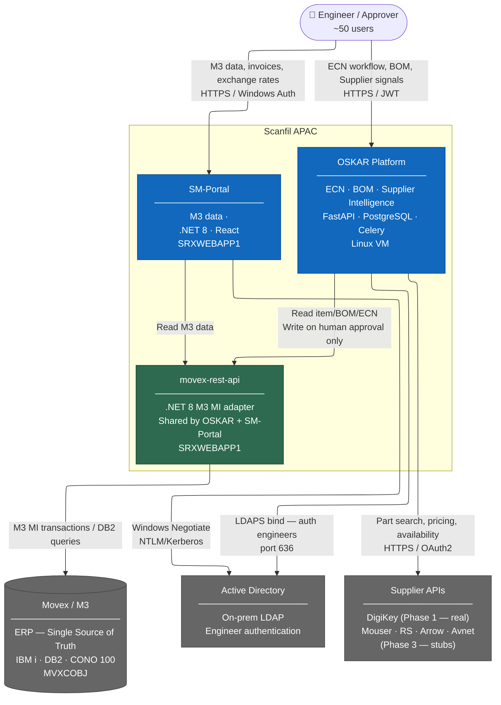

---

## 3. Infrastructure Deployment Diagram

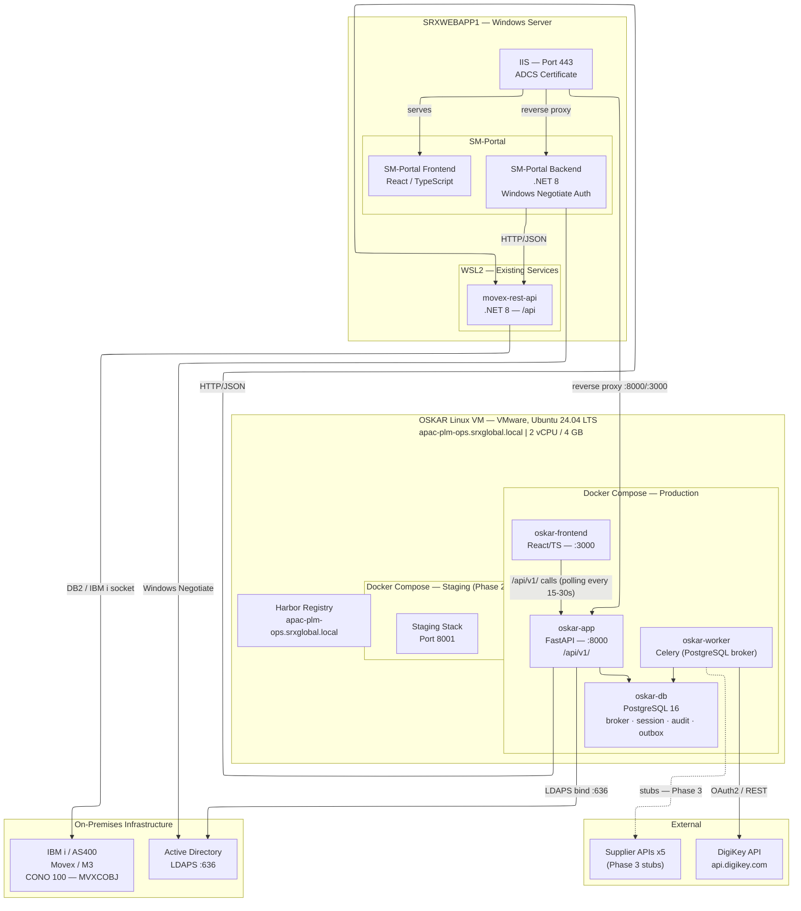

---

## 4. OSKAR ↔ Movex Data Flow

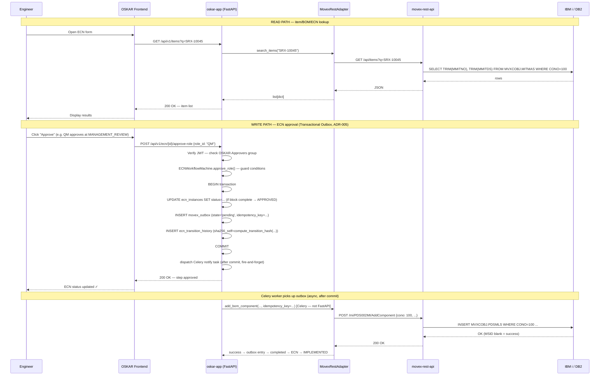

---

## 5. OSKAR ↔ SM-Portal Relationship (ADR-001)

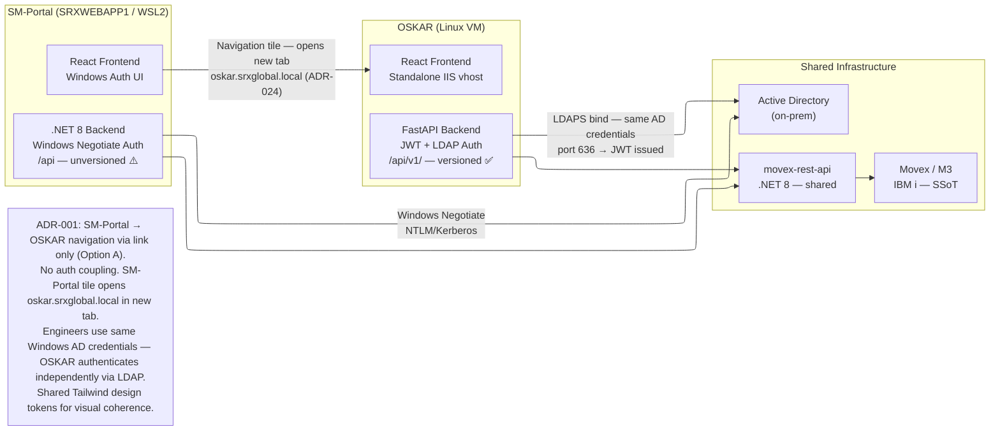

---

## 6. Authentication Flow

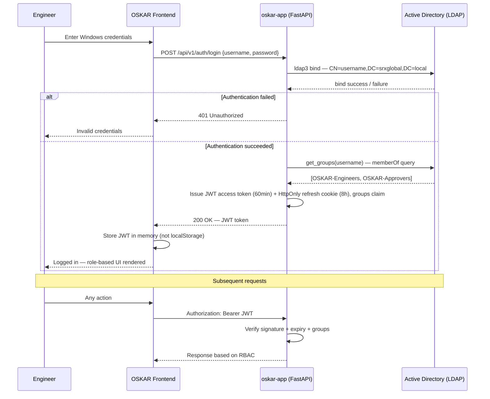

---

## 7. Event Notification (ADR-007 — Redis Eliminated)

> **ADR-007** (2026-04-17) removed Redis. The former Redis Streams design (F-6) is superseded.
> SSE endpoint `GET /api/v1/ecn/{id}/stream` implemented in Sprint 2 via PostgreSQL
> LISTEN/NOTIFY (migration 0007 trigger `trg_ecn_instances_notify`). Frontend polling
> (15–30s) retained as automatic fallback on SSE disconnect. See §19 for full SSE sequence.

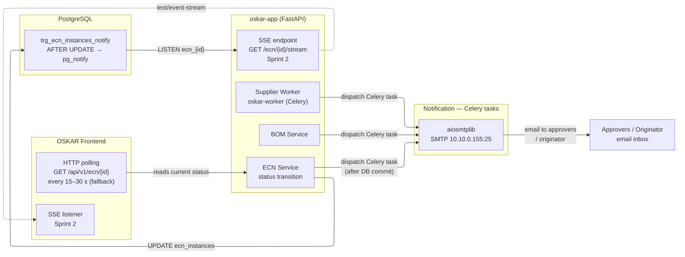

---

## 8. Supplier Intelligence Fan-out (Iteration 3)

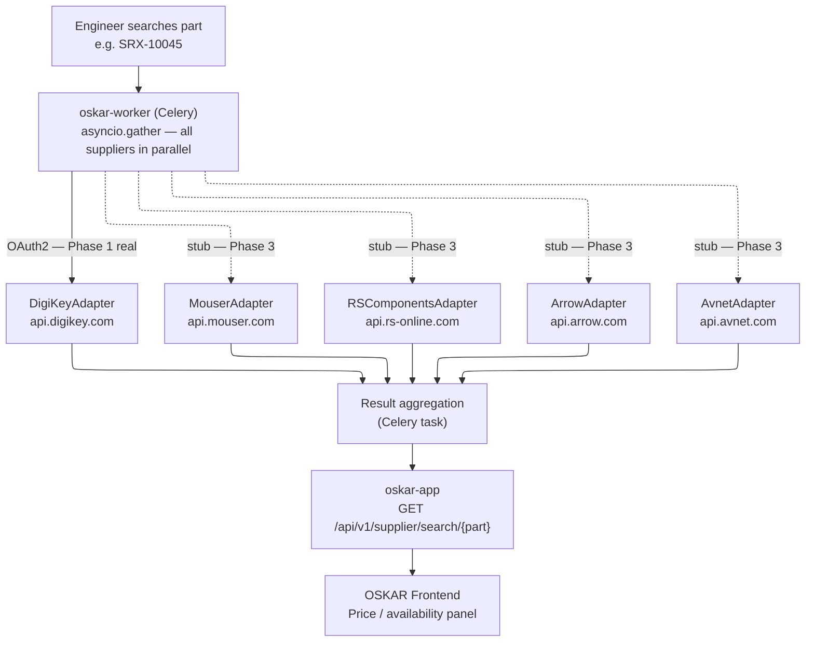

---

## 9. Technology Stack

| Layer | Technology | Key Decision |
|-------|-----------|-------------|
| Backend | Python 3.12 / FastAPI | Async-first; aligns with ML/AI direction |
| API versioning | `/api/v1/` prefix — Sprint 1 Day 1 | Non-Negotiable #13 — never omit |
| Database | PostgreSQL 16 | Enterprise-grade; future Data Warehouse integration |
| Session store | PostgreSQL — `jti_blocklist` + `refresh_tokens` tables | JTI blocklist + refresh token hashes; 50-user scale, PK lookup sub-ms |
| Event bus | HTTP polling on `GET /api/v1/ecn/{id}` | Human-paced workflow — steps take hours; polling adequate. `LISTEN/NOTIFY` reserved if live-push ever required |
| Task broker | Celery + PostgreSQL (`celery[sqlalchemy]`) | Supplier fan-out (6+ APIs), retry, aggregation — PostgreSQL broker adequate at this volume; Redis eliminated |
| Auth | JWT + `IdentityProvider` protocol | `LDAPIdentityProvider` (on-prem AD); `EntraIDProvider` stub |
| Frontend | React / TypeScript — **standalone** | Separate IIS vhost; incompatible auth with SM-Portal |
| Supplier adapters | `SupplierAdapter` ABC | Per-adapter circuit breaker; 1 real + 5 stubs in Phase 1 |
| ERP adapters | `ERPAdapter` ABC | `MovexRestAdapter` (prod); `IFSAdapter` (stub, v1 only) |
| Deployment | Docker Compose on Linux VM (VMware, Ubuntu 24.04 LTS) | VMware confirmed — 2 vCPU / 4 GB |
| Container registry | Harbor (self-hosted on OSKAR VM) — Manal owns | Provisioned by 2026-04-17 |
| Reverse proxy | IIS (HTTPS, ADCS certificate — Manal) | Windows Server standard |
| LLM context | `ai/` folder — provider-agnostic markdown | Non-Negotiable #12 |
| LLM adapters | `.providers/claude/`, `.providers/openai-compatible/` | Thin, swappable |

---

## 10. Redis Elimination (ADR-007)

> **Decision:** ADR-007 (`decisions/ADR-007-redis-elimination-postgresql-broker.md`) — accepted 2026-04-17.
> **Supersedes:** PRE-2 (Redis three-DB logical separation).

Redis has been removed from the OSKAR stack. All three former Redis jobs are served by PostgreSQL:

| Former Redis role | Replacement | Decision rationale |
|------------------|-------------|--------------------|
| Celery broker (DB0) | `celery[sqlalchemy]` — PostgreSQL transport | Tens of tasks/day; PG broker adequate at this volume |
| JTI blocklist + refresh tokens (DB1) | `jti_blocklist` + `refresh_tokens` tables | 50-user scale; UUID PK lookup sub-ms |
| Event stream (DB2) | HTTP polling (fallback) + **SSE via pg_notify** (`GET /api/v1/ecn/{id}/stream`, Sprint 2) | **SSE implemented** — migration 0007 trigger fires AFTER UPDATE on ecn_instances |

**Docker Compose stack (production):** `oskar-db` · `oskar-app` · `oskar-worker` · `oskar-frontend` — no `oskar-redis`.

---

## 11. SHA-256 Audit Chain

> **Decision:** ADR-004. **Implementation:** `ecn_transition_history` table (migration `0001_initial_schema.py`); hash computed in `ECNWorkflowMachine.compute_transition_hash()`.

Every ECN transition is recorded as an immutable row in `ecn_transition_history`. Rows form a per-ECN linked chain via `sha256_prev` — tamper-evident without a blockchain.

**Fields included in hash** (canonical JSON, sorted keys, SHA-256):

```json
{
  "id":               "uuid4 — row PK",
  "ecn_id":           "uuid — FK to ecn_instances",
  "from_status":      "integer | null (null for chain head)",
  "to_status":        "integer",
  "action":           "submit | approve_role | dc_approve | complete_management_review | role_assigned | ...",
  "actor_username":   "sAMAccountName (LDAP-verified) | 'system' for Celery transitions",
  "actor_role":       "DC | QM | ... | null",
  "notes":            "free text | null",
  "movex_payload":    "JSONB — MI call payloads (Sprint 2) | null",
  "agent_provenance": "JSONB — AI suggestion accepted by engineer | null",
  "sha256_prev":      "hex string | null (chain head)",
  "created_at":       "ISO 8601 UTC"
}
```

**Rules:**
- `sha256_self` is computed in Python (`hashlib.sha256`) before INSERT — never in a DB trigger
- `sha256_prev` is `NULL` for the first row per ECN (chain head); unique index enforces exactly one head per ECN
- `ecn_transition_history` is INSERT + SELECT only for `oskar_app` — RLS enforced in migration `0003_rls_policies.py`
- To verify chain integrity: see `ai/memory/12-data-model.md §6.4`

**Chain integrity check (returns 0 rows if intact):**
```sql
SELECT id, sha256_self
FROM ecn_transition_history t1
WHERE sha256_prev != (
    SELECT sha256_self FROM ecn_transition_history t2
    WHERE t2.ecn_id = t1.ecn_id
      AND t2.created_at < t1.created_at
    ORDER BY t2.created_at DESC LIMIT 1
);
```

---

## 12. ECN Workflow Engine Design

> **Decision:** Celery + PostgreSQL + `transitions` library. See `decisions/ADR-002-workflow-engine-celery-postgresql-transitions.md`.
> **Implementation:** `src/workflow/machine.py` — `ECNWorkflowMachine` + `ECNStatus` IntEnum (2026-04-16).

### Layered responsibility

| Layer | Technology | Location | Owns |
|---|---|---|---|
| State machine | `transitions` library (`ECNWorkflowMachine`) | `src/workflow/machine.py` | Legal transitions, guard conditions, SHA-256 hash computation |
| Workflow state | PostgreSQL (13 tables) | `ecn_instances.status` | All ECN state — single source of truth; never in Celery or Redis |
| Side-effect execution | Celery (async workers) | `src/workers/` (Sprint 2) | Movex MI calls, email dispatch, Redis stream publish |

**Critical rule:** Workflow state lives in PostgreSQL. Celery executes side effects only. A Redis restart or worker crash must never leave an ECN in an unknown state.

**Machine is DB-agnostic.** `ECNModel` and `TransitionContext` are plain dataclasses — no SQLAlchemy ORM objects enter the machine. The caller (FastAPI service layer) reads from DB, constructs the dataclasses, triggers the machine, then persists the result inside a DB transaction.

### Transactional Outbox Pattern (replaces Stargile LogicalUnitOfWork)

Every Movex write follows this sequence:

1. **Human confirms** (FastAPI, synchronous) → DB transaction commits atomically: `ecn_instances.status` advance + `movex_outbox` entry + `ecn_transition_history` record (SHA-256 chain)
2. **Celery picks up** outbox entry → executes MI calls in declared order, idempotent (`acks_late=True`, `idempotency_key` on outbox row)
3. **On MI failure** → exponential retry (30s → 5min → 30min); ECN stays at APPROVED (correct — Movex write pending); `ecn_movex_errors` updated; DC alerted via Celery email task at attempt 3; ABANDONED + EM alerted at attempt 10
4. **On success** → ECN advances to IMPLEMENTED via `movex_write_complete` trigger; Celery dispatches `ecn.implemented` email notification

This eliminates Stargile's stuck-ECN problem: APPROVED = Movex pending (correct), IMPLEMENTED = Movex confirmed (correct). The DC sees per-MI-call error state via the DC Recovery UI panel.

### PostgreSQL Schema — 13 Tables

**Migrations:** `alembic upgrade head` — three files in `alembic/versions/`.

**Core tables:**

| Table | Replaces (Stargile) | Purpose |
|---|---|---|
| `ecn_instances` | ZECNHEAD + ProcessInst | ECN header, 11 statuses, change scope flags, cost fields, `extra_data JSONB` safety valve |
| `ecn_role_assignments` | ProcessInstAssignment + System.rolemap XML | Per-ECN role assignments; INSERT-only; RLS enforced |
| `ecn_approval_steps` | WorkItem + WorkItemAssignment | Per-step approval records with `skipped` state for conditional roles; `at_status` column |
| `ecn_transition_history` | ProcessInstControl | SHA-256 audit chain; INSERT-only; RLS enforced |
| `ecn_rejections` | ZECNRJCT | Rejection records with restart/proceed resolution |
| `ecn_movex_errors` | ZECNMELG | Per-MI-call error log (MSID field); visible to DC recovery UI |
| `movex_outbox` | LogicalUnitOfWork | Transactional outbox; idempotency key; states: pending/processing/completed/failed/abandoned |

**ECN line tables:**

| Table | Replaces (Stargile) | Purpose |
|---|---|---|
| `ecn_items` | ZECNITMN | ECNItem equivalent; `drawing_created` flag; `alias_written` flag; `questionnaire_data JSONB` |
| `ecn_mpns` | ZECNMPNI | MPN aliases per item; normalised (no ecn_id — join via ecn_items) |
| `ecn_bom_changes` | ZECNBOMS | BOM add/change/delete records; `movex_snapshot_at_review JSONB` for concurrency detection |

**System tables:**

| Table | Replaces (Stargile) | Purpose |
|---|---|---|
| `system_role_users` | System.rolemap XML | Global role-to-user mapping; facility-scoped; source for auto-assignment |
| `ecn_step_conditions` | Hardcoded `isRoleChecked()` | Data-driven approval routing (7 seed rows for facility='L') |
| `ecn_training_acknowledgements` | — | ISO 13485 §6.2 training records; created on ECN CLOSED |

**Deferred (not Sprint 1):** `ecn_circuit_refs` (ZECNCIRF), threaded comments table, ZQ01–ZQ18 questionnaire UI (JSONB safety valve present).

---

## 13. RBAC Hybrid Model

> **Decision:** AD groups (coarse) + PostgreSQL per-ECN assignments (fine). See `decisions/ADR-003-rbac-hybrid.md`.

### Four-layer model

| Layer | Store | Question answered | Who manages |
|---|---|---|---|
| Authentication | Active Directory (LDAPS bind port 636) | Is this a valid Scanfil APAC user? | IT (Manal) |
| Platform access | AD groups (`OSKAR-Engineers`, `OSKAR-Approvers`) | Can this user log into OSKAR? | IT (Manal) |
| System role | `system_role_users` (PostgreSQL) | Is this user a DC / EM / QM system-wide? | OSKAR Admin |
| Per-ECN role | `ecn_role_assignments` (PostgreSQL) | Who is the DC for ECN-2026-0042? | Auto-assigned at creation; overrideable by Admin |

### Rules

- **JWT carries AD groups only** — never per-ECN roles (those are mutable; always query DB)
- **Every approval gate** checks both: JWT group (coarse, stateless) then `ecn_role_assignments` (fine, live DB query)
- **`ecn_step_conditions`** table drives which roles are required per ECN based on change scope flags — no conditionals in Python code
- **Role assignments are INSERT-only** — never UPDATE; assignment history is immutable
- **Self-approval is prohibited** at the application layer: originator cannot approve any stage of their own ECN regardless of role membership

### Auto-assignment logic

At ECN creation, for each required role: query `system_role_users` for active users in that role. If exactly 1 user → auto-assign with `is_auto_assigned=TRUE`. If 0 users → ECN creation fails (surface error before submission). If >1 users → assignment stays unallocated; DC assigns manually.

---

## 14. ECN Status Machine

> **Implementation:** `src/workflow/machine.py` — `ECNWorkflowMachine` + `ECNStatus` IntEnum.
> **Decision rationale:** `decisions/ADR-002-workflow-engine-celery-postgresql-transitions.md`.
> **ADR-009 (2026-05-01):** DC single gate. SUBMITTED(10) and DC_REVIEW(20) removed; DC_APPROVED(25) added
> between MANAGEMENT_REVIEW and APPROVED. IMPLEMENTED→CLOSED is now automatic (Celery). 10 active statuses.
> ARCHIVED is a flag (`is_archived=TRUE`), not a status — no state machine transition involved.

### 14.1 Status Reference

| Code | Name | Terminal? | Description |
|------|------|-----------|-------------|
| 0 | DRAFT | No | Being authored; not yet submitted |
| 25 | DC_APPROVED | No | DC final sign-off before Movex write; customer approval gate here |
| 30 | ENGINEERING_REVIEW | No | SE/CE technical review in progress |
| 40 | MANAGEMENT_REVIEW | No | Parallel approval block: EM + QM always; PM/SC/FN conditional |
| 50 | APPROVED | No | All human approvals complete; Movex writes queued in outbox |
| 60 | IMPLEMENTED | No | All Movex writes confirmed successful by Celery |
| 65 | REJECTED | No | Rejected at any stage; routed to originator with mandatory reason |
| 70 | CLOSED | **Yes** | Post-implementation complete; automatic via Celery (ADR-009) |
| 80 | CANCELLED | **Yes** | Withdrawn before approval; no Movex writes made |
| 90 | ON_HOLD | No | Suspended pending external input; pre_hold_status saves prior status |
| — | ARCHIVED | Flag only | `is_archived=TRUE` on CLOSED records; not a transition |

**Tombstoned integers:** 10 (SUBMITTED) and 20 (DC_REVIEW) removed by ADR-009. Must never be reused.

### 14.2 Full Transition Diagram

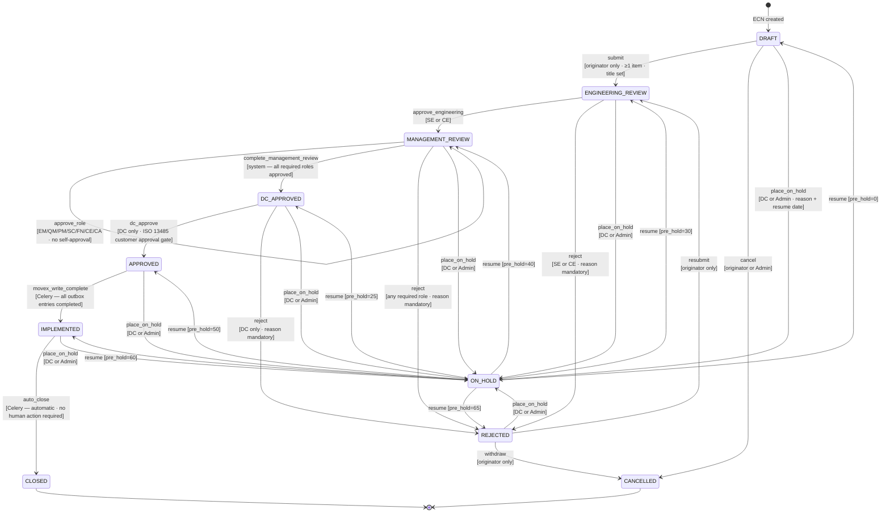

### 14.3 Normal Workflow (Happy Path)

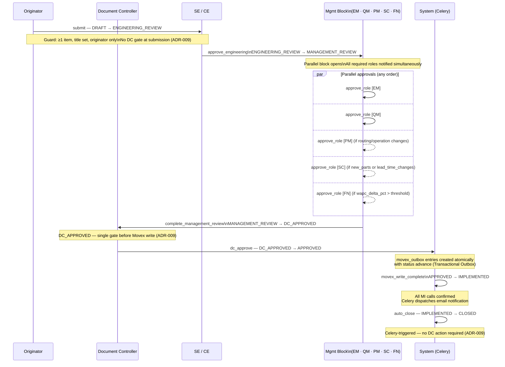

### 14.4 Rejection and Recovery Paths

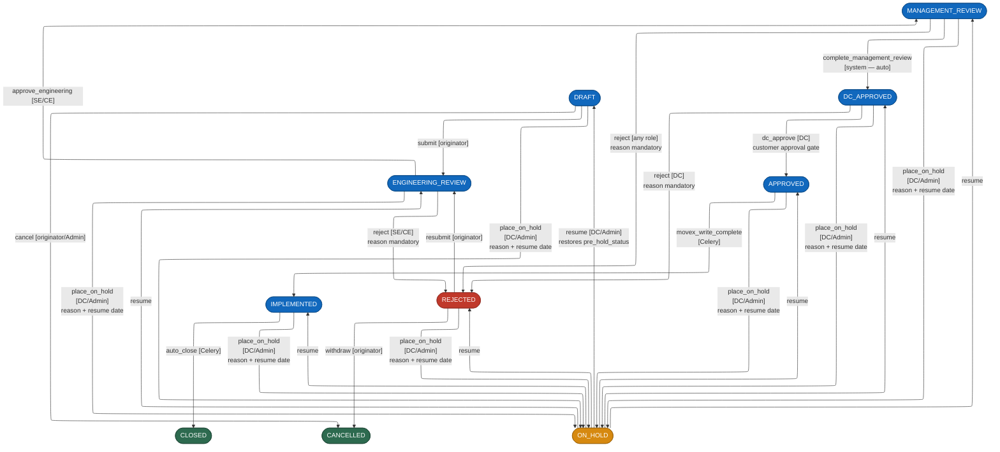

### 14.5 Parallel Approval Block — MANAGEMENT_REVIEW Detail

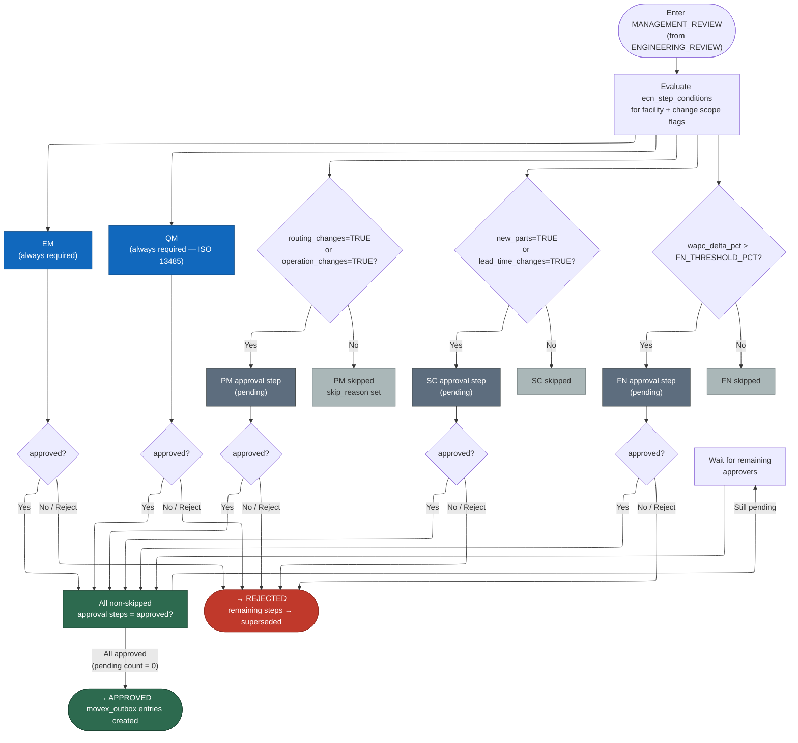

### 14.6 Movex Write State Machine (APPROVED → IMPLEMENTED)

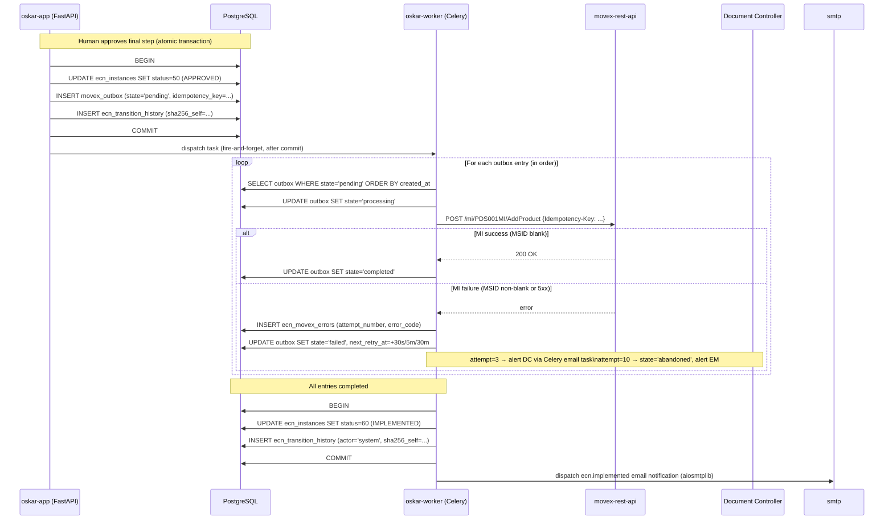

### 14.7 Guard Conditions Reference

| Trigger | Source | Guard | Who |
|---------|--------|-------|-----|
| `submit` | DRAFT | ≥1 item; title set; actor = originator | Originator |
| `approve_engineering` | ENGINEERING_REVIEW | actor_role ∈ {`SE`, `CE`} | SE or CE |
| `approve_role` | MANAGEMENT_REVIEW | actor_role ∈ valid mgmt roles; actor ≠ originator | EM/QM/PM/SC/FN/CE/CA |
| `complete_management_review` | MANAGEMENT_REVIEW | all non-skipped steps `approved`; `all_required_approved_fn` registered | System |
| `dc_approve` | DC_APPROVED | actor_role = `DC`; `customer_approved_at` set if `requires_customer_approval=TRUE` (ADR-009) | DC |
| `movex_write_complete` | APPROVED | _(no guard — Celery only)_ | Celery |
| `auto_close` | IMPLEMENTED | _(no guard — Celery only, ADR-009)_ | Celery |
| `reject` | ENGINEERING_REVIEW/MANAGEMENT_REVIEW/DC_APPROVED | rejection_reason non-empty | Role-appropriate |
| `resubmit` | REJECTED | actor = originator | Originator |
| `cancel` | DRAFT | actor = originator or actor_role = `AD` | Originator or Admin |
| `place_on_hold` | any non-terminal/non-hold | actor_role ∈ {`DC`, `AD`}; hold_reason set; expected_resume_date set | DC or Admin |
| `resume` | ON_HOLD | actor_role ∈ {`DC`, `AD`}; `pre_hold_status` not NULL | DC or Admin |
> **ADR-009:** `accept` (SUBMITTED→DC_REVIEW) and `pass_to_engineering` (DC_REVIEW→ENGINEERING_REVIEW) removed. Integers 10 and 20 tombstoned.

**Self-approval prohibition:** Enforced on `approve_role` — actor_username cannot equal ecn.originator_username at any stage, regardless of role membership.

---

## 15. ECN Event Notification (supersedes F-6 Redis Streams design)

> **ADR-007** (2026-04-17) eliminated Redis. The F-6 Redis Streams event schema is superseded.
> The `schema_version` envelope concept and event type taxonomy below are retained — applied to
> future `LISTEN/NOTIFY` payloads if that path is taken (see ADR-007).

### Current approach — Celery + direct SMTP

On each ECN status transition, the FastAPI service layer dispatches a Celery task
(`tasks.notify_ecn_transition`) after the DB transaction commits. The task calls
`aiosmtplib` directly (SMTP 10.10.0.155:25). No stream intermediary.

Frontend status updates: HTTP polling on `GET /api/v1/ecn/{id}` — 15–30s interval, adequate
for a workflow where steps take hours.

### ECN event taxonomy (retained for LISTEN/NOTIFY future path)

These event types are emitted by the service layer. Currently consumed by Celery notification
tasks only. If `LISTEN/NOTIFY` is introduced, this taxonomy becomes the `pg_notify` payload.

| event_type | Trigger | Key fields |
|------------|---------|-----------|
| `ecn.created` | ECN created (DRAFT) | `title`, `originator` |
| `ecn.submitted` | DRAFT → ENGINEERING_REVIEW | — |
| `ecn.approved_by_role` | Parallel approver completes | `role`, `remaining` |
| `ecn.dc_approved` | DC_APPROVED → APPROVED | — |
| `ecn.implemented` | APPROVED → IMPLEMENTED | `mi_calls` count |
| `ecn.closed` | IMPLEMENTED → CLOSED (auto_close) | — |
| `ecn.rejected` | Any stage → REJECTED | `rejection_number`, `reason` |
| `ecn.on_hold` | Any stage → ON_HOLD | `reason`, `resume_by` |
| `ecn.role_assigned` | Role reassigned by DC | `role_id`, `new_username`, `superseded_username` |
> **ADR-009:** `ecn.accepted` and `ecn.passed_to_engineering` events removed (SUBMITTED/DC_REVIEW statuses tombstoned).
| `ecn.resumed` | ON_HOLD → prior status | `resumed_status` |
| `ecn.cancelled` | → CANCELLED | — |
| `ecn.movex_write_failed` | Outbox attempt 3 | `mi_transaction`, `error_code` |
| `ecn.movex_write_abandoned` | Outbox attempt 10 | `mi_transaction` |

### Version history

| Version | Date | Change |
|---------|------|--------|
| 1 | 2026-04-15 | Initial schema — ECN lifecycle events |

---

## 16. Non-Negotiables

Full list of 13 non-negotiables: `context/OSKAR_Integrated_Plan_v5.1.md` Section 3.

Architecture-relevant summary:
1. Movex is SSoT — always, without exception
2. Human-in-the-loop — no Movex commit without explicit approval
3. Immutable SHA-256 audit chain — every engineering event
4. `/api/v1/` prefix from Sprint 1 Day 1
5. `ai/` context layer is LLM-agnostic — no tool syntax inside `ai/` files

---

## 17. AIProvider Abstraction (ADR-010)

`AIProvider` is a `typing.Protocol` in `src/adapters/ai/base.py`. Mirrors `IdentityProvider`,
`ERPAdapter`, and `SupplierAdapter` — swap providers via `AI_PROVIDER_CLASS` env var, no
caller code changes.

| Class | Stage | Trigger |
|-------|-------|---------|
| `NoOpAIProvider` | **1 — Active** | Default (no env var needed) |
| `OllamaProvider` | 2 | AI Lab provisioned on-prem |
| `AnthropicProvider` | 2 | Data boundary approved by Karen/Scanfil Group |
| `AzureOpenAIProvider` | 2 | Azure subscription confirmed with Maarit |

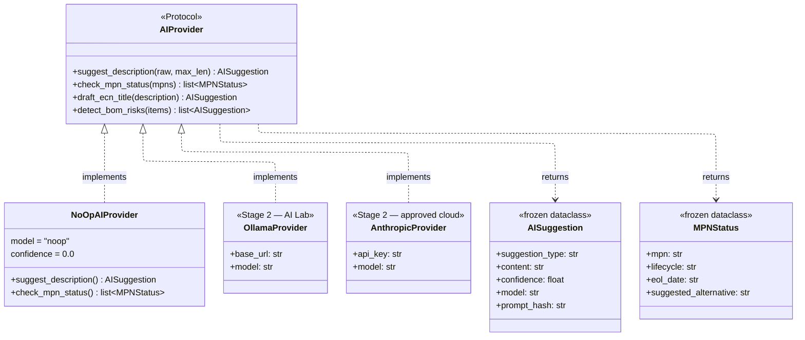

**Prompt injection defence:** All external text (BOM descriptions, MPN fields from customer
uploads) must be passed through `sanitize_for_prompt()` before inclusion in any AI prompt.
Mandatory for all Stage 2 provider implementations. See ADR-010 for threat model and
defence layers.

---

## 18. Agent Action Outbox

`agent_actions` extends the Transactional Outbox pattern (ADR-002) for AI-proposed write
actions. `requires_human BOOLEAN NOT NULL DEFAULT TRUE` enforces Non-Negotiable #2 at the
schema level — no AI action can bypass human review.

```mermaid
---
config:
  theme: light
  layout: elk
  look: classic
---
stateDiagram-v2
  note right of pending_approval
    Agent proposes action.
    Visible in approval UI (Stage 2).
    Human receives notification.
  end note

  [*] --> pending_approval : Agent proposes\n(authority_level = approval_required)
  [*] --> executing : Agent proposes\n(authority_level = autonomous)

  pending_approval --> approved : Engineer approves\n[reviewed_by set]
  pending_approval --> rejected : Engineer rejects\n[reviewed_by set]

  approved --> executing : Celery picks up
  executing --> completed : Action succeeds\n[result JSONB written]
  executing --> failed : Action fails\n[result JSONB with error]

  rejected --> [*]
  completed --> [*]
  failed --> [*]

  note right of executing
    Stage 1: no Celery task reads agent_actions.
    Table exists — state machine design is locked in.
    Stage 2 adds oskar-agent Celery worker.
  end note
```

| | `movex_outbox` | `agent_actions` |
|---|---|---|
| Who creates | FastAPI (after human approval) | AI agent / MCP tool call |
| Who executes | `oskar-worker` Celery | `oskar-agent` Celery (Stage 2) |
| Human gate | At MANAGEMENT_REVIEW / DC_APPROVED | `pending_approval` state |
| Non-Negotiable #2 | Enforced | Enforced (`requires_human=TRUE`) |
| Audit chain | `ecn_transition_history` | `agent_actions.result JSONB` |

---

## 19. SSE Event Flow

`GET /api/v1/ecn/{ecn_id}/stream` — implemented Sprint 2. Uses raw `asyncpg.connect()`
(SQLAlchemy `AsyncSession` is incompatible with `LISTEN/NOTIFY`). Semaphore cap: 20
concurrent connections. Keepalive ping every 25s (within IIS proxy idle timeout).

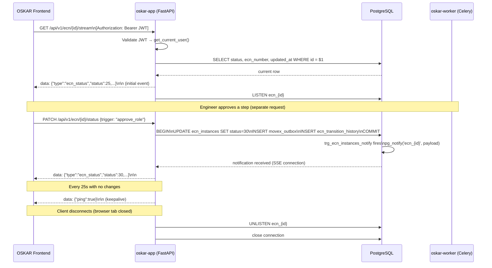

---

## 20. Extended Platform Architecture — Future State (Stage 2+)

Orientation diagram for Stage 2 developers. Blue = implemented (Stage 1). Green = Sprint 2.
Grey = Stage 2. Purple = Stage 3.

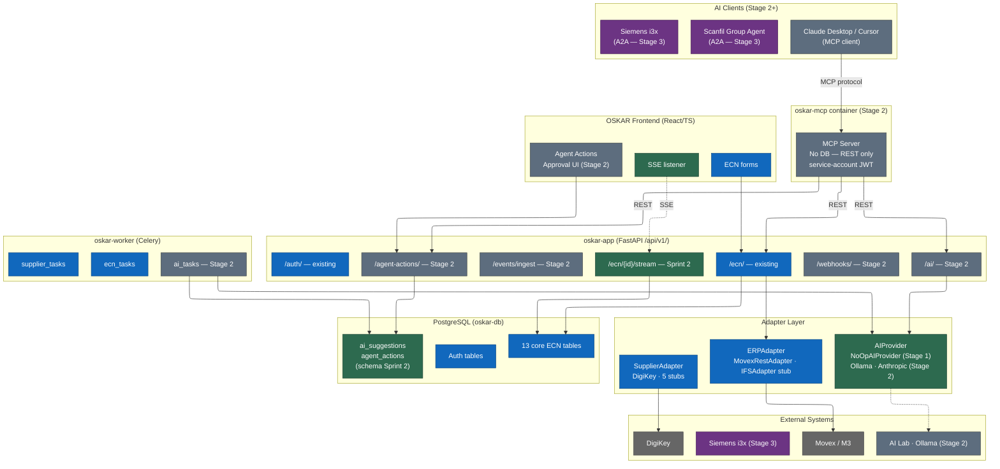
