# OSKAR — PostgreSQL Data Model

> **PROVIDER-AGNOSTIC — Non-Negotiable #12**
> No tool-specific syntax. Readable by any LLM tool or none.

**Version:** 1.4
**Date:** 2026-05-01
**Phase:** Sprint 1 — active implementation
**Status:** Authoritative — migrations applied via `alembic upgrade head`
**Reviewed by:** architect + security + manufacturing domain agents (2026-04-15)
**Last updated:** ER diagram added (§5); status table updated to reflect `ECNStatus` IntEnum; section numbering shifted

**Sources:**
- `ai/memory/03-oskar-architecture.md` §12 — 13-table schema overview
- `ai/memory/06-ecn-requirements.md` §5 — ECN item field spec
- `ai/memory/06-ecn-requirements.md` §6 — Emergency ECN data model reservation
- `ai/memory/06-ecn-requirements.md` §12 — Training acknowledgement (ISO 13485 §6.2)
- `ai/tasks/sprint-backlog.md` G-1 — `facility` column
- `decisions/ADR-003` — RBAC hybrid model
- `decisions/ADR-004` — SHA-256 audit chain
- `decisions/ADR-005` — ERP write gate / Transactional Outbox

---

## 1. Design Principles

1. **UUID PKs everywhere.** Movex item numbers, ECN IDs, usernames are VARCHAR fields — never primary keys. IFS migration will not break FK relationships.
2. **ECN state lives only in PostgreSQL.** `ecn_instances.status` is the single source of truth. Celery and Redis are side-effect executors only.
3. **`ecn_role_assignments` is INSERT-only.** Never UPDATE. Supersede by marking old row `superseded_at`, inserting new row, in one transaction.
4. **`ecn_transition_history` is INSERT-only with SHA-256 chain.** No UPDATE or DELETE — ever. RLS enforced at DB layer.
5. **All conditional approval routing is data-driven.** `ecn_step_conditions` maps change scope flags to required roles. No `if change_scope == X` logic in Python.
6. **Movex identifiers stored as VARCHAR.** `item_number`, `ecn_number`, `supplier_number` — never FK into a Movex table.
7. **`facility` is first-class.** Present on `ecn_instances`, `system_role_users`, `ecn_role_assignments`, and `ecn_step_conditions`. Default `'L'` (Melbourne). Adding a new plant requires only INSERTs — zero schema migration.
8. **`extra_data JSONB` safety valve on `ecn_instances`.** Any field discovered during POC/UAT goes here first; promoted to a proper column in the next sprint migration.
9. **JSONB fields are holding areas, not permanent homes (ADR-010).** Any JSONB field that is queried, filtered, or displayed in the UI must be promoted to a typed column. `extra_data JSONB` and `questionnaire_data JSONB` are reserved for ZQ01–ZQ18 pending Branko validation. `agent_provenance JSONB` on `ecn_transition_history` is the sole sanctioned AI metadata JSONB — contents are opaque audit metadata, not queryable. `payload` and `result` on `agent_actions` vary by action type and remain JSONB.

---

## 2. Facility Codes

| Code | Plant | Notes |
|------|-------|-------|
| `L` | Melbourne (Laverton) | **Default — all Sprint 1 ECNs** |
| `D` | Johor Bahru | Future — added when OSKAR is deployed there |

A `facilities` lookup table is deferred to Phase 2. For Sprint 1, `facility` is a `VARCHAR(10)` validated at the application layer against the known codes list.

---

## 3. Status Codes

Defined as `ECNStatus` IntEnum in `src/workflow/machine.py`. 10 active integer values; ARCHIVED is a flag.

> **ADR-009 (2026-05-01):** Status set reduced from 12 to 10. SUBMITTED (10) and DC_REVIEW (20)
> removed. DC_APPROVED (25) added between MANAGEMENT_REVIEW and APPROVED.
> Migration 0006 updates the `ecn_instances` CHECK constraint. IMPLEMENTED → CLOSED is now automatic.

| Integer | Name | Terminal? | `ECNStatus` member |
|---------|------|----------|--------------------|
| 0 | DRAFT | No | `ECNStatus.DRAFT` |
| 25 | DC_APPROVED | No | `ECNStatus.DC_APPROVED` |
| 30 | ENGINEERING_REVIEW | No | `ECNStatus.ENGINEERING_REVIEW` |
| 40 | MANAGEMENT_REVIEW | No | `ECNStatus.MANAGEMENT_REVIEW` |
| 50 | APPROVED | No | `ECNStatus.APPROVED` |
| 60 | IMPLEMENTED | No | `ECNStatus.IMPLEMENTED` |
| 65 | REJECTED | No | `ECNStatus.REJECTED` |
| 70 | CLOSED | **Yes** | `ECNStatus.CLOSED` |
| 80 | CANCELLED | **Yes** | `ECNStatus.CANCELLED` |
| 90 | ON_HOLD | No | `ECNStatus.ON_HOLD` |
| — | ARCHIVED | Flag only | `is_archived=TRUE` on ecn_instances |

**ARCHIVED is not a status.** It is the `is_archived=TRUE` flag, set only on CLOSED (70) records. No `ECNWorkflowMachine` transition; set directly by DC.
**Do not renumber these.** Status integers are baked into every existing row once written and baked into the `ecn_instances` CHECK constraint.

---

## 4. Table Creation Order

Tables must be created in this order to satisfy FK constraints:

1. `ecn_instances`
2. `ecn_role_assignments`
3. `ecn_approval_steps`
4. `ecn_transition_history`
5. `ecn_rejections`
6. `movex_outbox` ← must precede `ecn_movex_errors`
7. `ecn_movex_errors`
8. `ecn_items`
9. `ecn_mpns`
10. `ecn_bom_changes`
11. `system_role_users`
12. `ecn_step_conditions`
13. `ecn_training_acknowledgements`
14. `ai_suggestions` ← requires ecn_instances (FK) and ecn_items (FK)
15. `agent_actions` ← requires ecn_instances (FK)

---

## 5. Entity-Relationship Diagram

> Generated from the authoritative schema below. FK relationships are exact.
> `updated_at` trigger columns omitted from diagram for readability; present on `ecn_instances`, `ecn_items`, `movex_outbox`.
> Version: 1.4 — 2026-05-01 — ai_suggestions, agent_actions tables added; ecn_mpns extended (migration 0007).

```mermaid
---
config:
  theme: light
  layout: elk
  look: classic
---
erDiagram

    ecn_instances {
        UUID        id                          PK
        VARCHAR20   ecn_number                  UK
        VARCHAR10   facility
        VARCHAR200  title
        TEXT        description
        VARCHAR50   originator_username
        SMALLINT    status
        SMALLINT    pre_hold_status
        SMALLINT    revision_number
        BOOLEAN     is_new_item
        BOOLEAN     routing_changes
        BOOLEAN     operation_changes
        BOOLEAN     new_parts
        BOOLEAN     lead_time_changes
        BOOLEAN     change_to_documents
        DECIMAL74   wapc_delta_pct
        BOOLEAN     wapc_threshold_override
        BOOLEAN     is_emergency
        TEXT        emergency_reason
        VARCHAR50   emergency_approved_by
        TIMESTAMPTZ emergency_approved_at
        BOOLEAN     requires_customer_approval
        VARCHAR100  customer_approval_reference
        TIMESTAMPTZ customer_approved_at
        BOOLEAN     regulatory_impact
        JSONB       extra_data
        BOOLEAN     is_archived
        TIMESTAMPTZ archived_at
        VARCHAR50   archived_by
        TIMESTAMPTZ created_at
        TIMESTAMPTZ updated_at
    }

    ecn_role_assignments {
        UUID        id              PK
        UUID        ecn_id          FK
        VARCHAR10   facility
        VARCHAR2    role_id
        VARCHAR50   username
        BOOLEAN     is_auto_assigned
        BOOLEAN     is_active
        VARCHAR50   assigned_by
        TIMESTAMPTZ assigned_at
        TIMESTAMPTZ superseded_at
        TEXT        notes
    }

    ecn_approval_steps {
        UUID        id           PK
        UUID        ecn_id       FK
        SMALLINT    at_status
        VARCHAR2    role_id
        VARCHAR50   username
        VARCHAR20   status
        BOOLEAN     skipped
        VARCHAR100  skip_reason
        TIMESTAMPTZ assigned_at
        TIMESTAMPTZ completed_at
        TEXT        notes
        TIMESTAMPTZ created_at
    }

    ecn_transition_history {
        UUID        id               PK
        UUID        ecn_id           FK
        SMALLINT    from_status
        SMALLINT    to_status
        VARCHAR50   action
        VARCHAR50   actor_username
        VARCHAR2    actor_role
        TEXT        notes
        JSONB       movex_payload
        JSONB       agent_provenance
        CHAR64      sha256_self
        CHAR64      sha256_prev
        TIMESTAMPTZ created_at
    }

    ecn_rejections {
        UUID        id                 PK
        UUID        ecn_id             FK
        SMALLINT    rejection_number
        VARCHAR50   rejected_by
        SMALLINT    rejected_at_status
        VARCHAR2    role_id
        TEXT        description
        VARCHAR10   resolution
        TIMESTAMPTZ resolved_at
        VARCHAR50   resolved_by
        TIMESTAMPTZ created_at
    }

    movex_outbox {
        UUID        id              PK
        UUID        ecn_id          FK
        UUID        ecn_item_id     FK
        VARCHAR50   mi_transaction
        JSONB       mi_params
        VARCHAR100  idempotency_key UK
        VARCHAR20   state
        SMALLINT    attempt_count
        SMALLINT    max_attempts
        TIMESTAMPTZ next_retry_at
        TEXT        last_error
        TIMESTAMPTZ completed_at
        TIMESTAMPTZ created_at
        TIMESTAMPTZ updated_at
    }

    ecn_movex_errors {
        UUID        id             PK
        UUID        ecn_id         FK
        UUID        outbox_id      FK
        VARCHAR50   mi_transaction
        SMALLINT    attempt_number
        VARCHAR20   error_code
        TEXT        error_message
        SMALLINT    http_status
        TEXT        response_body
        TIMESTAMPTZ created_at
    }

    ecn_items {
        UUID        id                   PK
        UUID        ecn_id               FK
        INTEGER     line_number
        BOOLEAN     is_new_item
        VARCHAR15   item_number
        VARCHAR2    item_status
        VARCHAR30   item_name
        VARCHAR60   description_2
        VARCHAR20   drawing_number
        BOOLEAN     drawing_created
        VARCHAR3    procurement_group
        VARCHAR5    product_group
        VARCHAR3    item_group
        VARCHAR3    unit_of_measure
        VARCHAR4    revision_number
        VARCHAR15   item_template
        VARCHAR10   supplier_number
        VARCHAR10   responsible_engineer
        VARCHAR10   buyer
        DECIMAL176  purchase_price
        INTEGER     lead_time_days
        INTEGER     lead_time_internal
        INTEGER     safety_lead_time
        VARCHAR3    business_area
        DECIMAL176  wapc
        BOOLEAN     alias_written
        VARCHAR30   customer_alias
        VARCHAR10   effectivity_type
        DATE        effectivity_from
        JSONB       questionnaire_data
        TIMESTAMPTZ created_at
        TIMESTAMPTZ updated_at
    }

    ecn_mpns {
        UUID        id              PK
        UUID        ecn_item_id     FK
        VARCHAR30   mpn
        VARCHAR30   manufacturer
        BOOLEAN     is_default
        BOOLEAN     alias_written
        SMALLINT    msl_level
        VARCHAR20   lifecycle
        DATE        eol_date
        SMALLINT    lead_time_weeks
        VARCHAR50   packaging_type
        BOOLEAN     do_not_buy
        TIMESTAMPTZ supplier_data_at
        VARCHAR100  alt_mpn
        TIMESTAMPTZ created_at
    }

    ecn_bom_changes {
        UUID        id                       PK
        UUID        ecn_item_id              FK
        VARCHAR6    change_type
        VARCHAR15   component_number
        DECIMAL176  quantity
        VARCHAR3    unit_of_measure
        INTEGER     operation_number
        INTEGER     from_date
        INTEGER     to_date
        VARCHAR1    bom_type
        TEXT        notes
        JSONB       movex_snapshot_at_review
        TIMESTAMPTZ snapshot_captured_at
        TIMESTAMPTZ created_at
    }

    system_role_users {
        UUID        id           PK
        VARCHAR10   facility
        VARCHAR2    role_id
        VARCHAR50   username
        VARCHAR100  display_name
        VARCHAR200  email
        BOOLEAN     is_active
        VARCHAR50   added_by
        TIMESTAMPTZ added_at
        VARCHAR50   removed_by
        TIMESTAMPTZ removed_at
        TEXT        notes
    }

    ecn_step_conditions {
        UUID        id              PK
        VARCHAR10   facility
        SMALLINT    stage
        VARCHAR2    role_id
        VARCHAR50   condition_field
        VARCHAR15   condition_op
        VARCHAR50   condition_value
        BOOLEAN     is_active
        TEXT        description
        TIMESTAMPTZ created_at
    }

    ecn_training_acknowledgements {
        UUID        id              PK
        UUID        ecn_id          FK
        VARCHAR50   username
        TIMESTAMPTZ acknowledged_at
        TIMESTAMPTZ created_at
    }

    ai_suggestions {
        UUID        id              PK
        UUID        ecn_id          FK
        UUID        item_id         FK
        VARCHAR50   suggestion_type
        VARCHAR100  provider
        CHAR64      prompt_hash
        TEXT        suggestion
        DECIMAL43   confidence
        TIMESTAMPTZ created_at
        VARCHAR50   accepted_by
        TIMESTAMPTZ accepted_at
        TIMESTAMPTZ rejected_at
    }

    agent_actions {
        UUID        id              PK
        UUID        ecn_id          FK
        VARCHAR100  agent_id
        VARCHAR100  action_type
        TEXT        description
        JSONB       payload
        VARCHAR20   status
        VARCHAR20   authority_level
        BOOLEAN     requires_human
        VARCHAR100  proposed_by
        VARCHAR50   reviewed_by
        TIMESTAMPTZ reviewed_at
        TIMESTAMPTZ executed_at
        JSONB       result
        TIMESTAMPTZ created_at
    }

    %% ── Relationships ───────────────────────────────────────────────────
    %%   Left side = parent (one), right side = child (many)

    ecn_instances           ||--o{ ecn_role_assignments         : "has role assignments"
    ecn_instances           ||--o{ ecn_approval_steps           : "has approval steps"
    ecn_instances           ||--o{ ecn_transition_history       : "has audit chain"
    ecn_instances           ||--o{ ecn_rejections               : "has rejections"
    ecn_instances           ||--o{ movex_outbox                 : "has outbox entries"
    ecn_instances           ||--o{ ecn_movex_errors             : "has MI errors"
    ecn_instances           ||--o{ ecn_items                    : "has line items"
    ecn_instances           ||--o{ ecn_training_acknowledgements : "has training acks"
    ecn_instances           ||--o{ ai_suggestions               : "has AI suggestions"
    ecn_instances           ||--o{ agent_actions                : "has agent actions"

    ecn_items               |o--o{ ai_suggestions               : "item AI suggestions (nullable)"
    ecn_items               ||--o{ ecn_mpns                     : "has MPN aliases"
    ecn_items               ||--o{ ecn_bom_changes              : "has BOM changes"
    ecn_items               |o--o{ movex_outbox                 : "targeted by outbox (nullable)"

    movex_outbox            ||--o{ ecn_movex_errors             : "logged in errors"
```



### Relationship Notes

| Relationship | Cardinality | Key constraint |
|---|---|---|
| `ecn_instances` → `ecn_role_assignments` | 1:N | `superseded_at IS NULL` partial unique index limits to one active assignment per (ecn_id, role_id, username) |
| `ecn_instances` → `ecn_approval_steps` | 1:N | Unique index on (ecn_id, at_status, role_id) — one step per role per stage |
| `ecn_instances` → `ecn_transition_history` | 1:N | Unique index on ecn_id WHERE sha256_prev IS NULL — exactly one chain head |
| `ecn_instances` → `ecn_rejections` | 1:N | Unique index on (ecn_id, rejection_number) |
| `ecn_instances` → `movex_outbox` | 1:N | `idempotency_key` UNIQUE across whole table |
| `ecn_instances` → `ecn_items` | 1:N | Unique on (ecn_id, line_number) |
| `ecn_items` → `ecn_mpns` | 1:N | Unique on (ecn_item_id, mpn); partial unique on ecn_item_id WHERE is_default=TRUE |
| `ecn_items` → `ecn_bom_changes` | 1:N | No duplicate constraint — multiple change types per component allowed |
| `ecn_items` → `movex_outbox` | 0..1:N | `ecn_item_id` nullable — header-level ops have NULL |
| `movex_outbox` → `ecn_movex_errors` | 1:N | One error row per retry attempt |
| `system_role_users` | standalone | Unique on (facility, role_id, username) — no FK into ecn_instances |
| `ecn_step_conditions` | standalone | Unique on (facility, stage, role_id, condition_field) — no FK into ecn_instances |

### Tables with No FK to ecn_instances

`system_role_users` and `ecn_step_conditions` are **system configuration tables** — they define platform-level roles and approval routing rules. They are not linked per-ECN; they are queried at ECN creation and stage entry to drive auto-assignment and condition evaluation.

---

## 6. Shared Trigger Function

Applied to all tables with `updated_at`. Defined once, reused.

```sql
CREATE OR REPLACE FUNCTION set_updated_at()
RETURNS TRIGGER AS $$
BEGIN
    NEW.updated_at = now();
    RETURN NEW;
END;
$$ LANGUAGE plpgsql;
```

---

## 7. Core Tables

### 7.1 `ecn_instances`

Primary ECN record. One row per ECN.

```sql
CREATE TABLE ecn_instances (
    id                         UUID        PRIMARY KEY DEFAULT gen_random_uuid(),
    ecn_number                 VARCHAR(20) NOT NULL UNIQUE,   -- e.g. ECN-2026-L-0001
    facility                   VARCHAR(10) NOT NULL DEFAULT 'L',
    title                      VARCHAR(200) NOT NULL,
    description                TEXT,
    originator_username        VARCHAR(50) NOT NULL,          -- AD sAMAccountName, lowercase-normalised
    status                     SMALLINT    NOT NULL DEFAULT 0,
    pre_hold_status            SMALLINT,                      -- Saved on ON_HOLD entry; restored on resume
    revision_number            SMALLINT    NOT NULL DEFAULT 1, -- Incremented on restart-path resubmit

    -- Change scope flags — drive ecn_step_conditions evaluation
    is_new_item                BOOLEAN NOT NULL DEFAULT FALSE,
    routing_changes            BOOLEAN NOT NULL DEFAULT FALSE,
    operation_changes          BOOLEAN NOT NULL DEFAULT FALSE,
    new_parts                  BOOLEAN NOT NULL DEFAULT FALSE,
    lead_time_changes          BOOLEAN NOT NULL DEFAULT FALSE,
    change_to_documents        BOOLEAN NOT NULL DEFAULT FALSE, -- Triggers TE observer notification

    -- Cost fields — Finance gate input
    wapc_delta_pct             DECIMAL(7,4),                  -- % WAPC change; FN gate trigger
    wapc_threshold_override    BOOLEAN NOT NULL DEFAULT FALSE, -- Admin override for FN gate

    -- Emergency ECN — data model reserved; workflow Sprint 2+
    is_emergency               BOOLEAN NOT NULL DEFAULT FALSE,
    emergency_reason           TEXT,                          -- Mandatory if is_emergency=TRUE
    emergency_approved_by      VARCHAR(50),
    emergency_approved_at      TIMESTAMPTZ,

    -- Customer/regulatory — ISO 13485 §7.3.9
    requires_customer_approval BOOLEAN NOT NULL DEFAULT FALSE,
    customer_approval_reference VARCHAR(100),
    customer_approved_at       TIMESTAMPTZ,                   -- Gate: APPROVED→IMPLEMENTED blocked if NULL when flag=TRUE
    regulatory_impact          BOOLEAN NOT NULL DEFAULT FALSE, -- Triggers additional QM gate before CLOSED

    -- POC safety valve — any UAT-discovered fields go here first
    extra_data                 JSONB,

    -- Lifecycle
    is_archived                BOOLEAN NOT NULL DEFAULT FALSE,
    archived_at                TIMESTAMPTZ,
    archived_by                VARCHAR(50),
    created_at                 TIMESTAMPTZ NOT NULL DEFAULT now(),
    updated_at                 TIMESTAMPTZ NOT NULL DEFAULT now(),

    CONSTRAINT chk_status CHECK (
        status IN (0,10,20,30,40,50,60,65,70,80,90)
    ),
    CONSTRAINT chk_pre_hold_status CHECK (
        pre_hold_status IS NULL OR pre_hold_status IN (0,10,20,30,40,50,60,65,70,80,90)
    ),
    CONSTRAINT chk_archived_only_on_closed CHECK (
        NOT is_archived OR status = 70
    )
);

CREATE INDEX idx_ecn_status                ON ecn_instances(status);
CREATE INDEX idx_ecn_facility_status       ON ecn_instances(facility, status);
CREATE INDEX idx_ecn_originator            ON ecn_instances(originator_username);
CREATE INDEX idx_ecn_created               ON ecn_instances(created_at);
CREATE INDEX idx_ecn_open                  ON ecn_instances(status, facility, created_at DESC)
    WHERE is_archived = FALSE;

CREATE TRIGGER trg_ecn_instances_updated_at
BEFORE UPDATE ON ecn_instances
FOR EACH ROW EXECUTE FUNCTION set_updated_at();
```

**Notes:**
- `customer_approved_at` is the ISO 13485 §7.3.9 gate field. When `requires_customer_approval=TRUE`, the APPROVED → IMPLEMENTED transition is blocked until this is populated. Enforced at the application layer.
- `regulatory_impact=TRUE` triggers an additional QM review gate before CLOSED. Enforced at the application layer.
- `is_archived` may only be set when `status=70` (CLOSED) — enforced by the CHECK constraint above.
- Status integers: **do not renumber**. Baked into every existing row.

---

### 7.2 `ecn_role_assignments`

Per-ECN role assignments. INSERT-only — never UPDATE.

```sql
CREATE TABLE ecn_role_assignments (
    id               UUID        PRIMARY KEY DEFAULT gen_random_uuid(),
    ecn_id           UUID        NOT NULL REFERENCES ecn_instances(id) ON DELETE RESTRICT,
    facility         VARCHAR(10) NOT NULL DEFAULT 'L',        -- Inherited from ecn_instances.facility
    role_id          VARCHAR(2)  NOT NULL,
    username         VARCHAR(50) NOT NULL,
    is_auto_assigned BOOLEAN     NOT NULL DEFAULT FALSE,
    is_active        BOOLEAN     NOT NULL DEFAULT TRUE,
    assigned_by      VARCHAR(50) NOT NULL,                    -- username or 'system'
    assigned_at      TIMESTAMPTZ NOT NULL DEFAULT now(),
    superseded_at    TIMESTAMPTZ,
    notes            TEXT,

    CONSTRAINT chk_era_role_id CHECK (
        role_id IN ('DC','OR','SE','CE','EM','QM','PM','SC','FN','AD','CA','RD','TE','MQ')
    )
);

-- Only one active assignment per (ecn_id, role_id, username) at any time
CREATE UNIQUE INDEX uq_ecn_role_active
    ON ecn_role_assignments(ecn_id, role_id, username)
    WHERE superseded_at IS NULL;

CREATE INDEX idx_era_ecn_role
    ON ecn_role_assignments(ecn_id, role_id)
    WHERE superseded_at IS NULL;

CREATE INDEX idx_era_username
    ON ecn_role_assignments(username)
    WHERE superseded_at IS NULL;

CREATE INDEX idx_era_facility_role
    ON ecn_role_assignments(facility, role_id)
    WHERE superseded_at IS NULL;
```

**To reassign a role:** In a single transaction — set `superseded_at=now()` on the old row, INSERT the new row. Never UPDATE `username` on an existing row.

---

### 7.3 `ecn_approval_steps`

One row per required role per ECN stage. Created on stage entry.

```sql
CREATE TABLE ecn_approval_steps (
    id           UUID        PRIMARY KEY DEFAULT gen_random_uuid(),
    ecn_id       UUID        NOT NULL REFERENCES ecn_instances(id) ON DELETE RESTRICT,
    at_status    SMALLINT    NOT NULL,     -- ECN status code when this step is active (20, 30, 40)
    role_id      VARCHAR(2)  NOT NULL,
    username     VARCHAR(50),              -- NULL until DC assigns (when multiple candidates)
    status       VARCHAR(20) NOT NULL DEFAULT 'pending',
    skipped      BOOLEAN     NOT NULL DEFAULT FALSE,
    skip_reason  VARCHAR(100),             -- e.g. 'routing_changes=FALSE — PM not required'
    assigned_at  TIMESTAMPTZ,              -- When this step became active
    completed_at TIMESTAMPTZ,
    notes        TEXT,
    created_at   TIMESTAMPTZ NOT NULL DEFAULT now(),

    CONSTRAINT chk_eas_role_id CHECK (
        role_id IN ('DC','OR','SE','CE','EM','QM','PM','SC','FN','AD','CA','RD','TE','MQ')
    ),
    CONSTRAINT chk_eas_status CHECK (
        status IN ('pending','approved','rejected','skipped','superseded')
    )
);

-- Prevent duplicate steps for the same role at the same stage on the same ECN
CREATE UNIQUE INDEX uq_ecn_approval_step
    ON ecn_approval_steps(ecn_id, at_status, role_id);

CREATE INDEX idx_eas_ecn_stage_status
    ON ecn_approval_steps(ecn_id, at_status, status);

CREATE INDEX idx_eas_username
    ON ecn_approval_steps(username, status);
```

**Parallel block (MANAGEMENT_REVIEW, `at_status=40`):**
- On entry: required roles get `status='pending'`; conditional roles whose flag evaluates FALSE get `skipped=TRUE`.
- Auto-advance to APPROVED (50) fires when `COUNT(*) WHERE at_status=40 AND status='pending' AND skipped=FALSE = 0`.
- Any rejection at stage 40 immediately transitions ECN to REJECTED (65); remaining pending steps set to `status='superseded'`.

**Column renamed from `stage` to `at_status`** to eliminate ambiguity with sequence numbering.

---

### 7.4 `ecn_transition_history`

Append-only SHA-256 audit chain. **No UPDATE or DELETE — ever.**

```sql
CREATE TABLE ecn_transition_history (
    id               UUID        PRIMARY KEY DEFAULT gen_random_uuid(),
    ecn_id           UUID        NOT NULL REFERENCES ecn_instances(id) ON DELETE RESTRICT,
    from_status      SMALLINT,             -- NULL for the initial DRAFT creation event
    to_status        SMALLINT    NOT NULL,
    action           VARCHAR(50) NOT NULL, -- submit | accept | pass_to_engineering | approve |
                                           -- reject | resubmit | close | cancel | place_on_hold |
                                           -- resume | movex_write_complete | movex_write_failed
    actor_username   VARCHAR(50) NOT NULL, -- 'system' for Celery-triggered transitions
    actor_role       VARCHAR(2),           -- Role at the time of action
    notes            TEXT,
    movex_payload    JSONB,                -- MI call payloads stored for audit (Sprint 2)
    agent_provenance JSONB,                -- AI agent suggestion accepted by engineer (security controls §7)
    sha256_self      CHAR(64)    NOT NULL,
    sha256_prev      CHAR(64),             -- NULL for the first row per ecn_id (chain head)
    created_at       TIMESTAMPTZ NOT NULL DEFAULT now()
);

-- sha256_self = SHA-256 over all fields except sha256_self, computed in Python before INSERT.
-- Fields included in hash: id, ecn_id, from_status, to_status, action, actor_username,
--   actor_role, notes, movex_payload, agent_provenance, sha256_prev, created_at.
-- Do NOT hash sha256_self itself. Do NOT use DB triggers to compute — Python only.

-- Enforce exactly one chain head (sha256_prev IS NULL) per ECN
CREATE UNIQUE INDEX uq_eth_chain_head
    ON ecn_transition_history(ecn_id)
    WHERE sha256_prev IS NULL;

CREATE INDEX idx_eth_ecn_created
    ON ecn_transition_history(ecn_id, created_at);
```

**RLS — applied in migration `0003_rls_policies`:**
```sql
ALTER TABLE ecn_transition_history ENABLE ROW LEVEL SECURITY;
REVOKE ALL ON ecn_transition_history FROM oskar_app;
GRANT INSERT, SELECT ON ecn_transition_history TO oskar_app;
-- No UPDATE or DELETE policy created — any attempt raises permission denied.
```

**Chain integrity check (from incident runbook — returns 0 rows if intact):**
```sql
SELECT id, sha256_self
FROM ecn_transition_history t1
WHERE sha256_prev != (
    SELECT sha256_self FROM ecn_transition_history t2
    WHERE t2.ecn_id = t1.ecn_id
      AND t2.created_at < t1.created_at
    ORDER BY t2.created_at DESC LIMIT 1
);
```

---

### 7.5 `ecn_rejections`

One row per rejection event.

```sql
CREATE TABLE ecn_rejections (
    id                 UUID        PRIMARY KEY DEFAULT gen_random_uuid(),
    ecn_id             UUID        NOT NULL REFERENCES ecn_instances(id) ON DELETE RESTRICT,
    rejection_number   SMALLINT    NOT NULL,   -- 1-based per ECN
    rejected_by        VARCHAR(50) NOT NULL,
    rejected_at_status SMALLINT    NOT NULL,   -- Status code where rejection occurred
    role_id            VARCHAR(2)  NOT NULL,
    description        TEXT        NOT NULL,   -- Mandatory rejection reason
    resolution         VARCHAR(10),            -- 'restart' | 'proceed' — set on resubmit
    resolved_at        TIMESTAMPTZ,
    resolved_by        VARCHAR(50),
    created_at         TIMESTAMPTZ NOT NULL DEFAULT now(),

    CONSTRAINT chk_rejection_resolution CHECK (
        resolution IS NULL OR resolution IN ('restart','proceed')
    ),
    CONSTRAINT chk_rejection_role_id CHECK (
        role_id IN ('DC','OR','SE','CE','EM','QM','PM','SC','FN','AD','CA','RD','TE','MQ')
    )
);

CREATE UNIQUE INDEX uq_ecn_rejection_number ON ecn_rejections(ecn_id, rejection_number);
CREATE INDEX idx_ecn_rejections_ecn ON ecn_rejections(ecn_id);
```

---

### 7.6 `movex_outbox`

Transactional Outbox (ADR-005). Defined **before** `ecn_movex_errors` to satisfy FK ordering.

```sql
CREATE TABLE movex_outbox (
    id              UUID        PRIMARY KEY DEFAULT gen_random_uuid(),
    ecn_id          UUID        NOT NULL REFERENCES ecn_instances(id) ON DELETE RESTRICT,
    ecn_item_id     UUID,                      -- NULL for header-level ops; FK added after ecn_items
    mi_transaction  VARCHAR(50) NOT NULL,       -- 'PDS001MI.AddProduct', 'MMS025MI.AddAlias', ...
    mi_params       JSONB       NOT NULL,
    idempotency_key VARCHAR(100) NOT NULL UNIQUE,
    state           VARCHAR(20) NOT NULL DEFAULT 'pending',
    attempt_count   SMALLINT    NOT NULL DEFAULT 0,
    max_attempts    SMALLINT    NOT NULL DEFAULT 10,
    next_retry_at   TIMESTAMPTZ,
    last_error      TEXT,
    completed_at    TIMESTAMPTZ,
    created_at      TIMESTAMPTZ NOT NULL DEFAULT now(),
    updated_at      TIMESTAMPTZ NOT NULL DEFAULT now(),

    CONSTRAINT chk_outbox_state CHECK (
        state IN ('pending','processing','completed','failed','abandoned')
    ),
    CONSTRAINT chk_outbox_not_requeued CHECK (
        NOT (state = 'pending' AND attempt_count >= max_attempts)
    )
);

-- FK to ecn_items added via ALTER after ecn_items is created:
-- ALTER TABLE movex_outbox
--   ADD CONSTRAINT fk_outbox_item FOREIGN KEY (ecn_item_id) REFERENCES ecn_items(id) ON DELETE RESTRICT;

-- Retry state machine (Sprint 2 Celery logic):
--   Attempt 1: +30s | Attempt 2: +5min | Attempt 3: +30min → state='failed', DC alerted
--   Attempts 4-10: +30min each         → state='abandoned' at attempt 10, EM alerted

CREATE INDEX idx_outbox_state_retry
    ON movex_outbox(state, next_retry_at)
    WHERE state IN ('pending','failed');

CREATE INDEX idx_outbox_ecn_state
    ON movex_outbox(ecn_id, state);

CREATE TRIGGER trg_movex_outbox_updated_at
BEFORE UPDATE ON movex_outbox
FOR EACH ROW EXECUTE FUNCTION set_updated_at();
```

---

### 7.7 `ecn_movex_errors`

Per-MI-call error log. Visible to DC in the Movex Write Status Panel (Sprint 2).

```sql
CREATE TABLE ecn_movex_errors (
    id             UUID        PRIMARY KEY DEFAULT gen_random_uuid(),
    ecn_id         UUID        NOT NULL REFERENCES ecn_instances(id) ON DELETE RESTRICT,
    outbox_id      UUID        NOT NULL REFERENCES movex_outbox(id) ON DELETE RESTRICT,
    mi_transaction VARCHAR(50) NOT NULL,
    attempt_number SMALLINT    NOT NULL,
    error_code     VARCHAR(20),   -- MSID field from MI response; non-blank = error even when http_status=200
    error_message  TEXT,
    http_status    SMALLINT,
    response_body  TEXT,          -- Full response body for DC diagnostics
    created_at     TIMESTAMPTZ NOT NULL DEFAULT now()
);

COMMENT ON COLUMN ecn_movex_errors.error_code IS
    'MSID field from Movex MI response body. Non-blank indicates error even when http_status=200. See ai/memory/09 §4.';

CREATE INDEX idx_eme_ecn_id    ON ecn_movex_errors(ecn_id);
CREATE INDEX idx_eme_outbox_id ON ecn_movex_errors(outbox_id);
```

---

## 8. Line Tables

### 8.1 `ecn_items`

ECNItem equivalent (ZECNITMN + ECNItem.java DTO). One row per item line on an ECN.

```sql
CREATE TABLE ecn_items (
    id                   UUID        PRIMARY KEY DEFAULT gen_random_uuid(),
    ecn_id               UUID        NOT NULL REFERENCES ecn_instances(id) ON DELETE RESTRICT,
    line_number          INTEGER     NOT NULL,

    -- Item identity
    is_new_item          BOOLEAN     NOT NULL DEFAULT FALSE,
    item_number          VARCHAR(15) NOT NULL,   -- MITMAS.MMITNO
    item_status          VARCHAR(2),             -- 20=active, 90=inactive
    item_name            VARCHAR(30),            -- MITMAS.MMITDS
    description_2        VARCHAR(60),            -- MITMAS.MMFUDS

    -- Drawing
    drawing_number       VARCHAR(20),            -- Auto-created via MPDDOC when is_new_item=TRUE
    drawing_created      BOOLEAN     NOT NULL DEFAULT FALSE,

    -- Classification
    procurement_group    VARCHAR(3),             -- MITMAS.MMPRGP
    product_group        VARCHAR(5),             -- MITMAS.MMITCL
    unit_of_measure      VARCHAR(3),             -- MITMAS.MMUNMS
    revision_number      VARCHAR(4),             -- MITMAS.MMECVE
    item_template        VARCHAR(15),            -- MITMAS.MMATPL

    -- Supply chain
    supplier_number      VARCHAR(10),            -- MITMAS.MMSUNO
    responsible_engineer VARCHAR(10),            -- MITMAS.MMRESP
    buyer                VARCHAR(10),            -- MITMAS.MMBUYE
    purchase_price       DECIMAL(17,6),          -- MITMAS.MMPUPR
    lead_time_days       INTEGER,                -- MITMAS.MMLEA1
    lead_time_internal   INTEGER,                -- MITMAS.MMLEA4
    safety_lead_time     INTEGER,                -- MITMAS.MMSATD
    business_area        VARCHAR(3),             -- MITMAS.MMBUAR

    -- Cost (Finance gate input)
    wapc                 DECIMAL(17,6),

    -- Movex write tracking
    alias_written        BOOLEAN     NOT NULL DEFAULT FALSE,

    -- Effectivity — ISO 13485 mandatory (ai/memory/06 §5)
    effectivity_type     VARCHAR(10) NOT NULL,   -- 'DATE' | 'ECN' | 'IMMEDIATE'
    effectivity_from     DATE,                   -- Required when effectivity_type='DATE'

    -- Questionnaire safety valve (ZQ01-ZQ18; UI deferred post-POC)
    questionnaire_data   JSONB,

    created_at           TIMESTAMPTZ NOT NULL DEFAULT now(),
    updated_at           TIMESTAMPTZ NOT NULL DEFAULT now(),

    CONSTRAINT uq_ecn_items_line UNIQUE (ecn_id, line_number),
    CONSTRAINT chk_effectivity CHECK (
        effectivity_type IN ('DATE', 'ECN', 'IMMEDIATE')
        AND (effectivity_type != 'DATE' OR effectivity_from IS NOT NULL)
    )
);

CREATE INDEX idx_ecn_items_ecn_id      ON ecn_items(ecn_id);
CREATE INDEX idx_ecn_items_item_number ON ecn_items(item_number);

CREATE TRIGGER trg_ecn_items_updated_at
BEFORE UPDATE ON ecn_items
FOR EACH ROW EXECUTE FUNCTION set_updated_at();

-- Add FK from movex_outbox now that ecn_items exists
ALTER TABLE movex_outbox
    ADD CONSTRAINT fk_outbox_item
    FOREIGN KEY (ecn_item_id) REFERENCES ecn_items(id) ON DELETE RESTRICT;
```

---

### 8.2 `ecn_mpns`

MPN aliases. Multiple MPNs per ECN item. `ecn_id` removed — join through `ecn_items` instead.

```sql
CREATE TABLE ecn_mpns (
    id            UUID        PRIMARY KEY DEFAULT gen_random_uuid(),
    ecn_item_id   UUID        NOT NULL REFERENCES ecn_items(id) ON DELETE RESTRICT,
    mpn           VARCHAR(30) NOT NULL,       -- Manufacturer part number (CMZMPNN)
    manufacturer  VARCHAR(30),               -- Manufacturer name (CMZMFNM)
    is_default    BOOLEAN     NOT NULL DEFAULT FALSE,  -- CMZDEFFL equivalent; surfaced in UI
    alias_written BOOLEAN     NOT NULL DEFAULT FALSE,
    created_at    TIMESTAMPTZ NOT NULL DEFAULT now()
);

-- No duplicate MPNs per item
CREATE UNIQUE INDEX uq_ecn_mpn ON ecn_mpns(ecn_item_id, mpn);

-- At most one default MPN per item
CREATE UNIQUE INDEX uq_ecn_mpn_default ON ecn_mpns(ecn_item_id) WHERE is_default = TRUE;

CREATE INDEX idx_ecn_mpns_item ON ecn_mpns(ecn_item_id);
```

To query all MPNs for an ECN: `JOIN ecn_mpns m ON m.ecn_item_id = i.id JOIN ecn_items i ON i.ecn_id = $ecn_id`.

---

### 8.3 `ecn_bom_changes`

BOM add/change/delete records. `ecn_id` removed — join through `ecn_items`. Includes BOM snapshot for concurrency detection.

```sql
CREATE TABLE ecn_bom_changes (
    id                      UUID        PRIMARY KEY DEFAULT gen_random_uuid(),
    ecn_item_id             UUID        NOT NULL REFERENCES ecn_items(id) ON DELETE RESTRICT,
    change_type             VARCHAR(6)  NOT NULL,   -- 'ADD' | 'CHANGE' | 'DELETE'
    component_number        VARCHAR(15) NOT NULL,    -- MITMAS.MMITNO of component
    quantity                DECIMAL(17,6),
    unit_of_measure         VARCHAR(3),
    operation_number        INTEGER,
    from_date               INTEGER,                -- YYYYMMDD integer — Movex DB2 numeric date format
    to_date                 INTEGER,                -- YYYYMMDD integer
    bom_type                VARCHAR(1)  NOT NULL DEFAULT 'M',
    notes                   TEXT,

    -- BOM concurrency detection (ai/memory/06 §10)
    -- Snapshot of the live Movex BOM captured at DC_REVIEW entry.
    -- Pre-validate from_date against this before the APPROVED write.
    movex_snapshot_at_review JSONB,                -- Full BOM component list from movex-rest-api at DC_REVIEW
    snapshot_captured_at     TIMESTAMPTZ,          -- When the snapshot was taken

    created_at              TIMESTAMPTZ NOT NULL DEFAULT now(),

    CONSTRAINT chk_bom_change_type CHECK (change_type IN ('ADD', 'CHANGE', 'DELETE'))
);

COMMENT ON COLUMN ecn_bom_changes.from_date IS 'YYYYMMDD integer — Movex DB2 numeric date format. Pre-validate against movex_snapshot_at_review before APPROVED write.';
COMMENT ON COLUMN ecn_bom_changes.to_date IS 'YYYYMMDD integer — Movex DB2 numeric date format.';

CREATE INDEX idx_ecn_bom_changes_item ON ecn_bom_changes(ecn_item_id);
```

---

## 9. System Tables

### 9.1 `system_role_users`

Global role-to-user mapping, scoped by `facility`. Source for auto-assignment at ECN creation. Soft-delete only.

```sql
CREATE TABLE system_role_users (
    id           UUID        PRIMARY KEY DEFAULT gen_random_uuid(),
    facility     VARCHAR(10) NOT NULL DEFAULT 'L',
    role_id      VARCHAR(2)  NOT NULL,
    username     VARCHAR(50) NOT NULL,   -- AD sAMAccountName, lowercase-normalised
    display_name VARCHAR(100),           -- From LDAP cn
    email        VARCHAR(200),           -- From LDAP mail; used by get_email()
    is_active    BOOLEAN     NOT NULL DEFAULT TRUE,
    added_by     VARCHAR(50) NOT NULL,
    added_at     TIMESTAMPTZ NOT NULL DEFAULT now(),
    removed_by   VARCHAR(50),
    removed_at   TIMESTAMPTZ,
    notes        TEXT,

    CONSTRAINT uq_system_role_users UNIQUE (facility, role_id, username),
    CONSTRAINT chk_sru_role_id CHECK (
        role_id IN ('DC','OR','SE','CE','EM','QM','PM','SC','FN','AD','CA','RD','TE','MQ')
    )
);

CREATE INDEX idx_sru_facility_role
    ON system_role_users(facility, role_id)
    WHERE removed_at IS NULL;

CREATE INDEX idx_sru_username
    ON system_role_users(username)
    WHERE removed_at IS NULL;
```

**Auto-assignment at ECN creation (scoped to `ecn_instances.facility`):**
- 0 active users for required role + facility → ECN creation fails with descriptive error
- 1 active user → auto-assign (`is_auto_assigned=TRUE`)
- >1 active users → assignment row created without username; DC assigns manually before submission

**Multi-plant:** Adding a new plant requires only INSERTs for the new `facility` code — zero schema migration.

---

### 9.2 `ecn_step_conditions`

Data-driven approval routing. Maps ECN change scope flags to required roles per stage, per facility. No conditional logic in Python.

```sql
CREATE TABLE ecn_step_conditions (
    id              UUID        PRIMARY KEY DEFAULT gen_random_uuid(),
    facility        VARCHAR(10) NOT NULL DEFAULT 'L',   -- Allows per-plant approval rule differences
    stage           SMALLINT    NOT NULL,               -- Status code: 20, 30, 40
    role_id         VARCHAR(2)  NOT NULL,
    condition_field VARCHAR(50) NOT NULL,               -- Column name on ecn_instances, or '_always'
    condition_op    VARCHAR(15) NOT NULL,               -- See valid values below
    condition_value VARCHAR(50),                        -- For 'gt': env var name (e.g. 'FN_THRESHOLD_PCT')
    is_active       BOOLEAN     NOT NULL DEFAULT TRUE,
    description     TEXT,
    created_at      TIMESTAMPTZ NOT NULL DEFAULT now(),

    CONSTRAINT uq_step_condition UNIQUE (facility, stage, role_id, condition_field),
    CONSTRAINT chk_scc_role_id CHECK (
        role_id IN ('DC','OR','SE','CE','EM','QM','PM','SC','FN','AD','CA','RD','TE','MQ')
    ),
    CONSTRAINT chk_condition_op CHECK (
        condition_op IN ('always','eq_true','eq_false','gt','gte','lt','lte','is_null','is_not_null')
    )
);
```

**Seed data (migration `0002_seed_step_conditions`) — facility `'L'` (Melbourne):**

| facility | stage | role_id | condition_field | condition_op | condition_value | description |
|----------|-------|---------|-----------------|--------------|-----------------|-------------|
| L | 40 | EM | _always | always | — | EM always required at MANAGEMENT_REVIEW |
| L | 40 | QM | _always | always | — | QM always required (ISO 13485) |
| L | 40 | PM | routing_changes | eq_true | — | PM required if routing changes |
| L | 40 | PM | operation_changes | eq_true | — | PM required if operation changes |
| L | 40 | SC | new_parts | eq_true | — | SC required if new parts added |
| L | 40 | SC | lead_time_changes | eq_true | — | SC required if lead time changes |
| L | 40 | FN | wapc_delta_pct | gt | FN_THRESHOLD_PCT | FN required if WAPC delta exceeds threshold |

`FN_THRESHOLD_PCT` read from environment at runtime (default `5.0` percent).
Adding a new plant: INSERT rows for the new `facility` code — no schema change.

---

### 9.3 `ecn_training_acknowledgements`

ISO 13485 §6.2 — training records triggered on ECN CLOSED. Schema reserved Sprint 1; UI Sprint 2+.

```sql
CREATE TABLE ecn_training_acknowledgements (
    id              UUID        PRIMARY KEY DEFAULT gen_random_uuid(),
    ecn_id          UUID        NOT NULL REFERENCES ecn_instances(id) ON DELETE RESTRICT,
    username        VARCHAR(50) NOT NULL,
    acknowledged_at TIMESTAMPTZ,           -- NULL until user acknowledges; NULL = outstanding
    created_at      TIMESTAMPTZ NOT NULL DEFAULT now(),

    CONSTRAINT uq_training_ack UNIQUE (ecn_id, username)
);

CREATE INDEX idx_training_ack_ecn  ON ecn_training_acknowledgements(ecn_id);
CREATE INDEX idx_training_ack_user ON ecn_training_acknowledgements(username)
    WHERE acknowledged_at IS NULL;
```

On ECN CLOSED (70): system INSERTs rows for all active `OSKAR-Engineers` members. Users acknowledge via UI (Sprint 2). Outstanding acknowledgements visible to DC/QM.

---

## 10. Session Management Tables (ADR-007)

> **Added:** ADR-007 (2026-04-17) — Redis elimination. Replaces Redis DB1 (JTI blocklist + refresh token hashes).
> **Migration:** `0004_auth_tables.py`

### `jti_blocklist`

Every JWT access token has a `jti` (UUID v4) claim. On logout, the JTI is inserted here with
`expires_at` equal to the token's remaining lifetime. Every authenticated request checks for
the JTI — a primary key lookup. Rows auto-expire; a cleanup task removes stale rows at startup
and hourly.

```sql
CREATE TABLE jti_blocklist (
    jti        UUID        PRIMARY KEY,
    expires_at TIMESTAMPTZ NOT NULL
);

CREATE INDEX idx_jti_expires ON jti_blocklist(expires_at);
```

**Cleanup (runs at FastAPI startup + hourly background task):**
```sql
DELETE FROM jti_blocklist WHERE expires_at < now();
```

---

### `refresh_tokens`

Stores the SHA-256 hash of each issued refresh token (never the raw token). Supports:
- Logout: set `revoked_at` on the token's hash row
- Family detection: on reuse of a revoked refresh token, set `revoked_at` on all rows for that `username`
- Expiry cleanup: delete rows where `expires_at < now()`

```sql
CREATE TABLE refresh_tokens (
    token_hash VARCHAR(64)  PRIMARY KEY,   -- SHA-256 hex of the raw refresh token
    username   VARCHAR(50)  NOT NULL,
    expires_at TIMESTAMPTZ  NOT NULL,
    revoked_at TIMESTAMPTZ,                -- NULL = active; set on logout or family revocation
    created_at TIMESTAMPTZ  NOT NULL DEFAULT now()
);

CREATE INDEX idx_rt_username ON refresh_tokens(username) WHERE revoked_at IS NULL;
CREATE INDEX idx_rt_expires  ON refresh_tokens(expires_at);
```

**Grants (applied in migration `0004_auth_tables`):**
```sql
GRANT SELECT, INSERT, UPDATE ON jti_blocklist   TO oskar_app;
GRANT SELECT, INSERT, UPDATE ON refresh_tokens  TO oskar_app;
```

---

## 11. Row-Level Security

Applied in migration `0003_rls_policies`. Two audit tables are INSERT+SELECT only for `oskar_app`.

```sql
-- ecn_role_assignments — INSERT-only for oskar_app
ALTER TABLE ecn_role_assignments ENABLE ROW LEVEL SECURITY;
REVOKE UPDATE, DELETE ON ecn_role_assignments FROM oskar_app;

-- ecn_transition_history — INSERT-only for oskar_app
ALTER TABLE ecn_transition_history ENABLE ROW LEVEL SECURITY;
REVOKE ALL ON ecn_transition_history FROM oskar_app;
GRANT INSERT, SELECT ON ecn_transition_history TO oskar_app;
```

---

## 12. Database Roles and Grants

Applied in infrastructure provisioning (not Alembic — runs before first migration).

```sql
CREATE ROLE oskar_app      LOGIN PASSWORD '<from secrets.env>';
CREATE ROLE oskar_migration LOGIN PASSWORD '<from secrets.env>';
CREATE ROLE oskar_readonly  NOLOGIN;

GRANT CONNECT ON DATABASE oskar TO oskar_app, oskar_migration, oskar_readonly;
GRANT ALL ON SCHEMA public TO oskar_migration;
GRANT USAGE ON SCHEMA public TO oskar_app, oskar_readonly;

-- oskar_app: full access except on INSERT-only audit tables (handled by RLS above)
GRANT SELECT, INSERT, UPDATE ON ecn_instances TO oskar_app;
GRANT SELECT, INSERT         ON ecn_role_assignments TO oskar_app;
GRANT SELECT, INSERT, UPDATE ON ecn_approval_steps TO oskar_app;
GRANT SELECT, INSERT         ON ecn_transition_history TO oskar_app;
GRANT SELECT, INSERT         ON ecn_rejections TO oskar_app;
GRANT SELECT, INSERT, UPDATE ON movex_outbox TO oskar_app;
GRANT SELECT, INSERT         ON ecn_movex_errors TO oskar_app;
GRANT SELECT, INSERT, UPDATE ON ecn_items TO oskar_app;
GRANT SELECT, INSERT         ON ecn_mpns TO oskar_app;
GRANT SELECT, INSERT         ON ecn_bom_changes TO oskar_app;
GRANT SELECT, INSERT, UPDATE ON system_role_users TO oskar_app;
GRANT SELECT, INSERT         ON ecn_step_conditions TO oskar_app;
GRANT SELECT, INSERT, UPDATE ON ecn_training_acknowledgements TO oskar_app;
GRANT SELECT, INSERT, UPDATE ON jti_blocklist                TO oskar_app;
GRANT SELECT, INSERT, UPDATE ON refresh_tokens               TO oskar_app;

-- oskar_readonly: SELECT only (for reporting)
GRANT SELECT ON ALL TABLES IN SCHEMA public TO oskar_readonly;
```

---

## 13. Migration Plan

| File | Contents |
|------|---------|
| `0001_initial_schema.py` | `set_updated_at()` function; all 13 ECN tables in FK-safe order; indexes; CHECK constraints; triggers |
| `0002_seed_step_conditions.py` | 7 seed rows in `ecn_step_conditions` for facility `'L'` |
| `0003_rls_policies.py` | RLS + REVOKE on `ecn_role_assignments` and `ecn_transition_history` |
| `0004_auth_tables.py` | `jti_blocklist` + `refresh_tokens` tables; indexes; grants (ADR-007) |

- **Tool:** Alembic with `asyncpg`
- **Convention:** `NNNN_snake_case_description.py`
- **Runtime user:** `oskar_app`. Migrations run as `oskar_migration`.
- **Rollback:** Each migration has a `downgrade()`. No rollback after first production data.

---

## 14. What Is Hard to Change Post-Go-Live

| Item | Risk | Mitigation already in place |
|------|------|----------------------------|
| Status integer values | High — baked into every row | Values finalised; CHECK constraint prevents invalid values |
| SHA-256 chain algorithm | High — existing rows become unverifiable | Get hash input fields right before first ECN; document in code |
| UUID PK strategy | High — catastrophic to change | Already UUID |
| `at_status` values in `ecn_approval_steps` | High — existing steps become mis-staged | Values match status table; finalised |
| Column renames | Medium — coordinated migration + code change | Only rename in same sprint as the code change |
| Adding a nullable column | Low | One migration; safe any time |
| Adding a new table | Low | Standard sprint work |
| `facility` codes | Low — additive only | New plant = new INSERT rows, no schema change |
| Fields missing from POC | Low | `extra_data JSONB` on `ecn_instances`; `questionnaire_data JSONB` on `ecn_items` |

---

## 15. Deferred (Not Sprint 1)

| Item | Deferred to | Notes |
|------|------------|-------|
| `ecn_circuit_refs` table | Sprint 2+ | ZECNCIRF equivalent |
| Threaded comments table | Sprint 2+ | Discussion per ECN |
| `questionnaire_data` UI | Post-POC | JSONB column present; UI rendering deferred |
| `facilities` lookup table | Phase 2 | `facility` is free VARCHAR(10) for Sprint 1 |
| Per-facility RLS on `ecn_instances` | Phase 2 | Sprint 1: application-layer `facility` filter |
| Training acknowledgement UI | Sprint 2 | Table present; UI deferred |
| JTI blocklist DB table | Sprint 2 | Redis DB1 sufficient for Sprint 1 if AOF persistence enabled |
| WebSocket / SSE consumer | Sprint 2 | Redis stream wired producer-side (R-15) |
