# [PLATFORM NAME] — ENGINEERING INTELLIGENCE PLATFORM
## Modernisation and Build Strategy v2.0

**Version:** 2.0
**Status:** Draft for Management Review
**Prepared by:** Engineering / IT Modernisation Programme — Scanfil APAC
**Changes from v1.0:**
- Corrected data authority model — Movex remains source of truth for committed BOMs; platform manages change workflow and draft state
- Corrected Stargile ERP integration — Stargile has its own Java MI interface, not movex-rest-api; Phase 1 Track A must produce an MI gap analysis
- Added two-site deployment architecture — site-aware ERP adapter configuration for Site A (Movex permanent) and Site B (Movex now, IFS later); future country split handled by deployment configuration, not platform changes
- Added Mermaid diagrams throughout
- Platform name decision section retained from v1.0

---

## Section 1 — Platform Naming Decision

*For management to decide before the document is finalised. Replace `[PLATFORM]` throughout with the chosen name.*

| Name | Meaning | Recommendation |
|---|---|---|
| **DELTA** | The universal symbol for change — Δ. Every ECN is literally a delta to a BOM. Works identically in all European languages. The only candidate that directly describes what the platform does rather than offering a metaphor. | ⭐ Recommended |
| **OSKAR** | The connection point through which ECN, BOM, supplier intelligence, routes, and both ERPs connect. Technically precise, Latin root works cross-language. | Strong candidate |
| **HELIX** | The upward spiral / DNA structure. A BOM is the genetic code of a product; an ECN is the revision mechanism. Scientific, internationally neutral. | Strong candidate |
| **MERIDIAN** | The reference line from which all measurements are taken. Precise architectural metaphor for the platform's role as the engineering change authority. | Strong candidate |
| **VERTEX** | The meeting point of multiple lines — ECN, BOM, supplier intelligence, routes, MES all converge here. Mathematical, clean, no translation problems. | Solid candidate |
| **VEGA** | The brightest star in the northern sky, visible from Scandinavia. Short, modern, internationally recognised. | Solid candidate |
| **LUMEN** | Light and clarity — the unit of useful output. Latin root works across all European languages. | Solid candidate |
| **FORGE** | Where raw materials become finished products. Strong manufacturing metaphor. Anglo-industrial connotation may feel less natural in a Scandinavian group context. | Lower preference |
| **KLAR** | Swedish/Norwegian for clear or ready. Extremely clean but may be opaque in English-language documentation. | Lower preference |

---

## Executive Summary

Scanfil APAC operates two independent legacy systems — Stargile (Java ECN) and PLMServer (PHP BOM and supplier intelligence) — to manage what is fundamentally a single, interconnected workflow. The [PLATFORM] Engineering Intelligence Platform replaces both systems with a unified, AI-ready platform that adds a rich engineering change and intelligence layer on top of Movex, while preserving Movex as the source of truth for committed production BOMs.

**Three key facts confirmed for v2.0:**

First, **Stargile has its own Java MI interface** that calls the Movex MI API directly — it does not use `movex-rest-api`. Phase 1 Track A must map Stargile's Java MI call inventory and produce a gap analysis against `movex-rest-api`'s current coverage. Any missing MI endpoints must be added to `movex-rest-api` before Sprint 3 begins.

Second, **Movex remains the source of truth for committed production BOMs**. The platform manages the change workflow and draft state. When an ECN is approved, the platform pushes the committed revision to Movex via the ERP Adapter. Movex updates its production BOM record and remains authoritative. The platform holds the rich history of every change, every approval, and every supplier evaluation — a layer of intelligence that Movex cannot provide — but it does not replace Movex as the system of record for what is in production.

Third, **SRX operates two sites under the same entity**, both currently in one country. Site A will keep Movex permanently. Site B uses Movex now but will migrate to IFS, and will later split across two countries. This is handled by **site-aware configuration** — not multi-tenancy. The same platform codebase runs at both sites; environment variables control which ERP adapter each site uses. When Site B splits across two countries, that is a deployment configuration change, not an architectural one.

**Iteration 1 — three modules, built together:**

- **ECN Module** — replaces Stargile
- **BOM Module** — replaces PLMServer BOM management
- **Supplier Intelligence Module** — replaces PLMServer APIManager

**Future iterations:** Route Management → MSP → MES

---

## 2. Current Situation — Two Systems, One Problem

### 2.1 Current Architecture

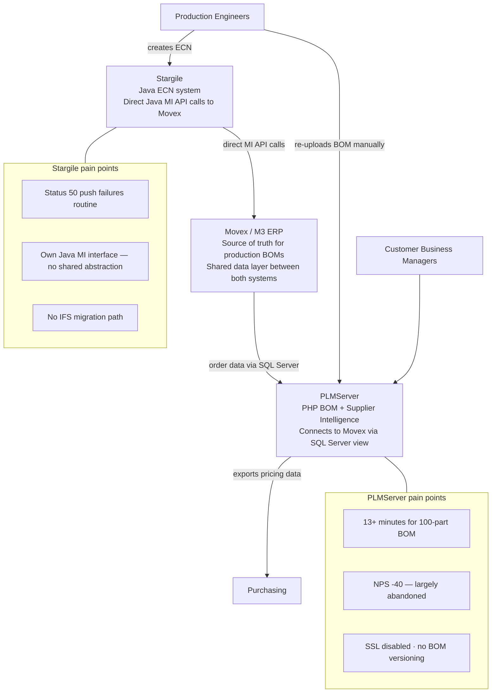

The critical gap: there is no direct integration between Stargile and PLMServer. Engineers manually re-upload BOM data from Movex into PLMServer after completing an ECN. Two systems, two re-entry points, no shared event stream.

### 2.2 What Stargile's ERP Interface Actually Is

Stargile connects to Movex through its own Java classes that call the Movex MI API (M3 Business Engine API) directly. This is a Java-native MI integration, not the `movex-rest-api` service. This has two implications for the programme:

**Phase 1 Track A implication:** When mapping Stargile's ERP integration, the team must document each MI program called by Stargile's Java classes — the program name, the transaction type, the input fields used, the output fields consumed, and any known quirks. This MI call inventory is then cross-referenced against what `movex-rest-api` already implements. The delta becomes a list of new endpoints that must be added to `movex-rest-api` before the ECN module's Sprint 3 ERP integration work begins.

**Architecture implication:** The new ECN module will call `movex-rest-api` over HTTP — not MI directly. This is the correct design. It keeps one ERP boundary for the entire platform. But it means `movex-rest-api` must be extended to cover all ECN-relevant MI operations before the ECN module can be fully functional. This extension work is a Phase 1 → Phase 2 dependency that must be tracked explicitly.

### 2.3 The Engineer Workflow Today

| Step | System | Pain |
|---|---|---|
| Create ECN, assign approvers | Stargile | Manual Excel upload. Status 50 push failures are routine — date conflicts require workaround. |
| Approval routing | Stargile | Manual — no automated reminders. Password confirmation per approver. |
| Commit BOM to Movex | Stargile (Java MI → Movex) | Manual revision update in Movex PDS screen after Status 60. |
| Re-upload BOM to PLMServer | PLMServer | Manual re-entry or file upload — no automatic sync. |
| Run supplier pricing | PLMServer | 13+ minutes for 100-part BOM. No progress feedback. |
| Review and export | PLMServer | Manual Excel export. No BOM comparison. NPS -40. |

---

## 3. Data Authority Model — The Correct Architecture

### 3.1 The Key Distinction

The v1.0 strategy used the phrase "the platform owns the BOM." This was imprecise and warrants correction before it shapes design decisions.

In a manufacturing operation — particularly one under ISO 13485 — Movex drives MRP, production orders, purchasing, and inventory. Other departments update BOMs in Movex outside the ECN process. If the platform claimed to own the BOM and Movex was downstream, the platform would immediately face a bidirectional synchronisation problem: Movex changes something, the platform does not know, and the platform's copy becomes stale.

The correct model is **layered authority**:

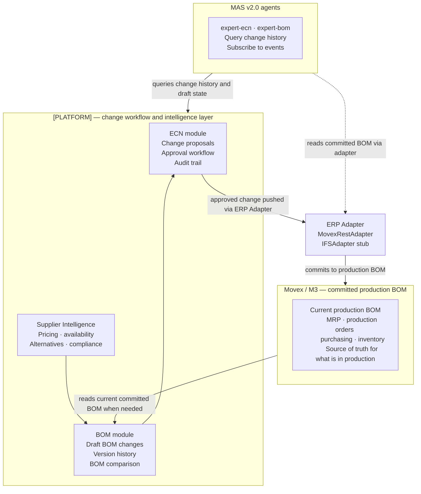

### 3.2 What Each Layer Owns

| Data | Authority | Lives in | Why |
|---|---|---|---|
| Committed production BOM — what is currently in production | **Movex** | Movex | MRP, production orders, purchasing all depend on Movex being authoritative. Auditors expect it. |
| Proposed BOM change — the ECN draft | **Platform** | Platform database | Change workflow and approval management is the platform's core function. |
| ECN history — every change ever raised | **Platform** | Platform database | ISO 13485 audit trail. Immutable. Agents query this. |
| BOM version chain — history of revisions | **Platform** | Platform database | Rich history the platform accumulates from each ECN commit. Not available in Movex. |
| Supplier intelligence — pricing, availability | **Platform** | Platform database (Redis cache + PostgreSQL) | Movex has no supplier API integration. |
| Compliance flags — RoHS/REACH/WEEE | **Platform** | Platform database | Populated from Octopart and manual entry. |

### 3.3 Arguments for This Model

**No synchronisation risk.** Movex can be updated by other processes — purchasing corrections, direct BOM edits by other users — without breaking the platform's integrity. The platform records what it pushed; it does not claim to know the current Movex state beyond its own commits.

**ISO 13485 aligned.** The validated system of record for the medical device BOM is Movex. ISO 13485 auditors expect Movex to be authoritative for the production BOM. The platform provides the change traceability layer on top of it — which is exactly what the standard requires.

**Multi-site safe.** Both Site A and Site B keep Movex as their production authority. The ERP Adapter controls where each site commits. When Site B migrates to IFS, its production authority changes to IFS, but the model is unchanged — the platform still pushes approved changes through the adapter; it simply pushes to a different target.

**AI platform value is unchanged.** The change history, draft proposals, supplier intelligence, approval records, and BOM version chain all live in the platform. MAS v2.0 agents query the platform for engineering intelligence. They read the committed BOM from Movex via the adapter only when the current production state is needed — which is a minority of agent queries.

---

## 4. Two-Site Deployment Architecture

### 4.1 The Requirement

SRX currently operates two sites, both in the same country, both under the same SRX entity beneath the Scandinavian parent. Their ERP futures differ:

- **Site A:** Movex permanently. No planned IFS migration.
- **Site B:** Movex now, IFS migration planned. Site B will also split across two countries in future.

### 4.2 Why This Is a Configuration Problem, Not an Architecture Problem

Because both sites are the same SRX entity, the platform does not need multi-tenancy — separate databases, separate schemas, separate authentication domains. It needs **site-aware ERP adapter configuration**. The same platform codebase determines which ERP adapter to use based on environment variables set at deployment time.

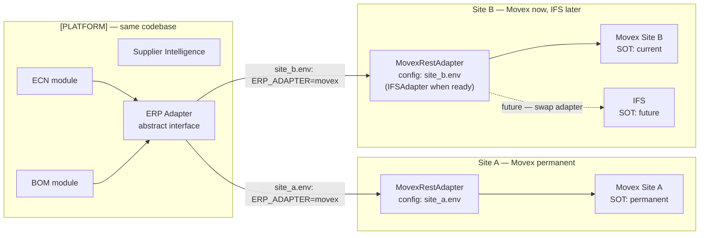

### 4.3 Deployment Options

The two sites can run as:

**Option 1 — Two instances, shared codebase (recommended):** Each site runs its own Docker Compose stack pointing to its own PostgreSQL instance and its own ERP adapter configuration. Data is separated at the instance level. The codebase is identical — deployed from the same Git repository, same Docker images, different environment files. This is the cleanest separation for ISO 13485 purposes — each site has an independent Software Validation record.

**Option 2 — Single instance, shared database with site partition:** Both sites share one platform deployment. A `site_id` column partitions data. A single Software Validation record covers both sites. More operationally efficient but carries higher risk — a deployment issue affects both sites simultaneously.

Option 1 is recommended. The operational overhead of two instances is low given Docker's deployment repeatability, and the ISO 13485 independence is valuable.

### 4.4 When Site B Splits Across Two Countries

When Site B eventually becomes two separate country operations, the response is:

1. Clone the Site B Docker deployment into two instances — Site B-Country 1 and Site B-Country 2
2. Each gets its own environment file with its own ERP target configuration
3. Historical data migration: a point-in-time copy of Site B's database is made; each new instance starts from that copy; historical records are read-only
4. No platform code changes required

The platform architecture accommodates this entirely through configuration and deployment. The IFS adapter stub built in Sprint 4 validates that the interface is complete for both Movex and IFS operations — including any differences in how IFS handles the MI operations that were previously done via Stargile's Java interface.

### 4.5 Site B IFS Migration Sequence

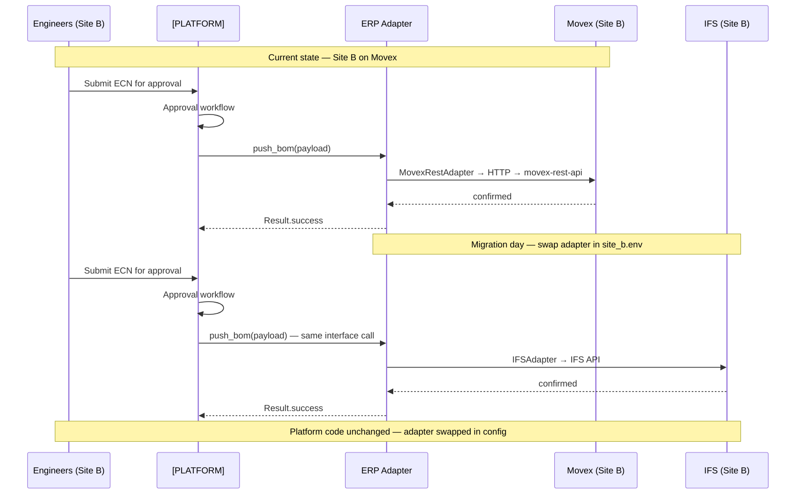

---

## 5. Why One Unified Platform — Not Two Separate Replacements

### 5.1 The Data Model Argument

The BOM is the central entity in both Stargile and PLMServer. An ECN proposes a change to a BOM. PLMServer evaluates a BOM against supplier availability. Both need to work on the same draft BOM record. Today they cannot — they communicate only through the committed Movex BOM, which means engineers must manually re-upload after completing an ECN.

In the platform, an ECN works on a draft BOM record in the same database. The supplier intelligence module reads the same draft BOM. When the ECN is approved, the adapter pushes the committed revision to Movex. This design only works if ECN, BOM, and Supplier Intelligence share one data model.

### 5.2 The Supplier Intelligence Argument

When an engineer is creating an ECN to add a new component, the most useful thing the system can do is show — immediately, in the same screen — whether that component is available, at what price and lead time, and whether an alternative exists if it is not. This is only possible if the ECN editor and the Supplier Intelligence module share the same session, the same draft BOM, and the same UI.

### 5.3 The IFS Migration Argument

Building ECN and BOM as separate replacements would mean each system needs its own ERP integration. When Site B migrates to IFS, both systems must be updated. Building them as one platform with one ERP Adapter means the migration work happens once — in one adapter implementation.

---

## 6. Platform Architecture

### 6.1 Architecture Overview

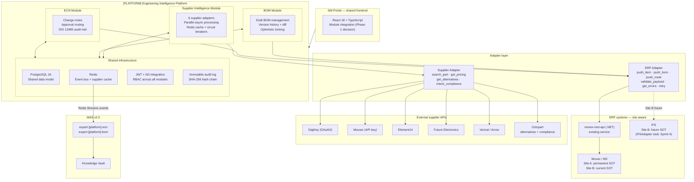

### 6.2 The ERP Adapter — Corrected for Stargile's MI Interface

The ERP Adapter sits between the platform's ECN and BOM modules and any ERP system. In v2.0, the implementation path is clarified:

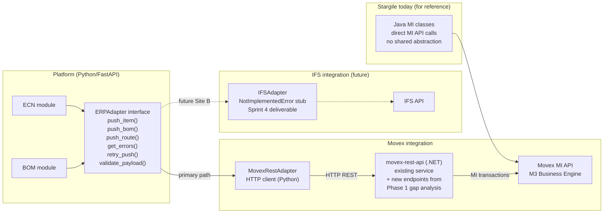

**The critical Phase 1 Track A deliverable:** Stargile's Java MI classes must be analysed to extract the complete MI program call inventory — every MI program, transaction type, input fields, and output fields used. This inventory is cross-referenced against `movex-rest-api`'s existing endpoints. The gap — MI operations Stargile uses that `movex-rest-api` does not currently expose — becomes a list of new endpoints that the `.NET` team must add to `movex-rest-api` before Sprint 3. This gap analysis is a Phase 1 gate deliverable, and the endpoint additions are a Phase 2-to-Sprint 3 dependency.

### 6.3 The Supplier Adapter

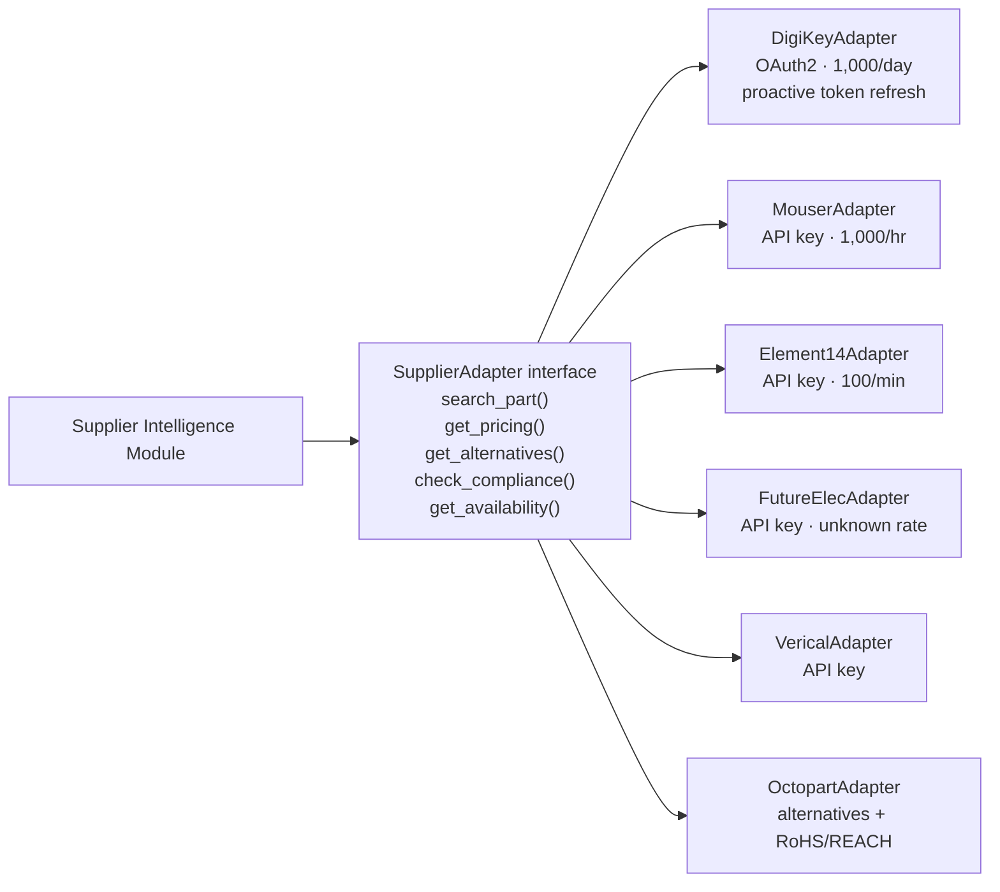

Each adapter is independently circuit-breakered. If DigiKey is unavailable, the remaining five adapters continue. Stale cached results are returned with a staleness warning rather than an error. OAuth tokens for DigiKey are refreshed proactively by the Celery worker — eliminating PLMServer's crash-on-token-expiry failure mode.

### 6.4 Async Parallel Processing — The Core Performance Fix

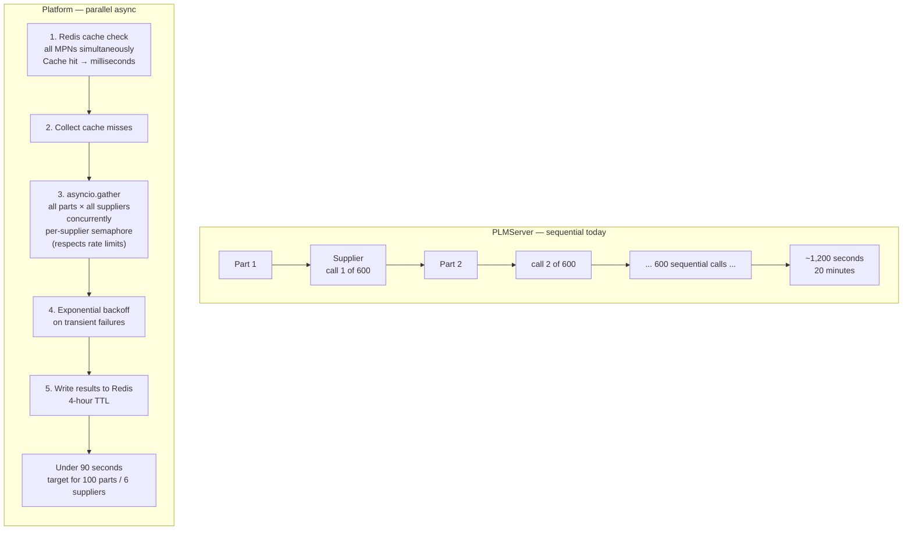

Redis serves dual purpose: event bus (Redis Streams for MAS v2.0) and supplier cache (Redis key-value with 4-hour TTL). A Celery worker handles the long-running supplier API fan-out in the background — publishing real-time progress per part via WebSocket to the engineer's browser. This directly solves PLMServer's "system appears frozen" problem.

---

## 7. Four-Phase Programme — 24 Weeks

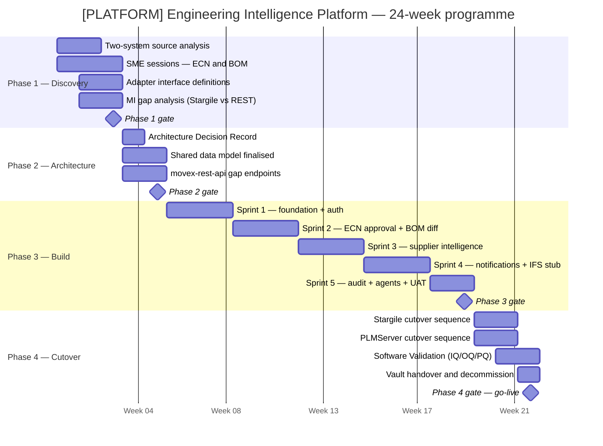

### 7.1 Phase 1 — Discovery (Weeks 1–4)

Phase 1 covers two legacy systems and three adapter interfaces. The `movex-rest-api` gap analysis is a new Phase 1 deliverable that did not exist in v1.0.

**Track A — Source Code and System Analysis**

For PLMServer (source available): the January 2025 analysis at `analysis/PLMServer_Complete_Analysis.md` and `analysis/plm-tables.sql` are the primary inputs. Validate the analysis against live system behaviour. Confirm all six supplier integrations, OAuth token lifecycle, rate limits, and price break algorithms.

For Stargile (source pending — permission being sought for extraction from server): once source access is confirmed, execute the following specific analysis:

1. Extract the complete list of MI programs called by Stargile's Java classes — program name, transaction type, all input and output fields used, any hardcoded values or quirks
2. Cross-reference this inventory against `movex-rest-api`'s existing endpoint coverage
3. Document the gap: MI operations Stargile uses that `movex-rest-api` does not expose
4. Produce a specification of new endpoints required in `movex-rest-api` — this spec goes to the `.NET` team as a Phase 2 dependency

If Stargile source access is not confirmed by end of Week 2, the gap analysis proceeds via SME sessions (Track B) and direct MI API documentation — the source accelerates this but does not gate it.

Before any source file is opened, run `/m3-lookup` in the Knowledge Vault. The vault's `m3-knowledge/transactions/` directory documents MI programs from real production experience. This is the starting point.

**Track B — SME Behavioural Sessions**

Stargile sessions (Production Engineers, Document Control, SMT Engineers): complete ECN state machine — specifically resolving the Status 60 exit mechanism; all exception paths; Excel template decision; SMT programme workflow.

PLMServer sessions (Engineers, CBMs, Purchasing): confirm which workflows are genuinely used (20% adoption — understand why the others stopped); full supplier list and regional requirements; RoHS/REACH/WEEE reporting requirements; BOM approval and export workflow.

Shared sessions: data retention decisions for both systems; SM-Portal integration architecture review; two-site deployment confirmation with IT.

**Track C — Three Adapter Interface Definitions**

- ERP Adapter: `push_item`, `push_bom`, `push_route`, `get_errors`, `retry_push`, `validate_payload` — calls `movex-rest-api` over HTTP
- Supplier Adapter: `search_part`, `get_pricing`, `get_alternatives`, `check_compliance`, `get_availability` — one implementation per supplier
- BOM Comparison Service: `compare(bom_a_id, bom_b_id) → DiffResult`

**Phase 1 Gate Deliverables**

| Deliverable | Owner | Sign-off |
|---|---|---|
| ECN Behavioural Specification (full state machine, all roles, exception paths) | Developer + SMEs | Production Engineer, Document Control |
| BOM/Supplier Behavioural Specification | Developer + SMEs | Engineer, CBM, Purchasing |
| ERP Adapter Interface | Developer | IT / Architecture |
| Supplier Adapter Interface (all six suppliers) | Developer | IT / Architecture |
| BOM Comparison Service Interface | Developer | IT / Architecture |
| **Stargile MI gap analysis + movex-rest-api extension spec** | Developer | IT / .NET team |
| Retired Functionality Lists (one per legacy system) | Developer + SMEs | Manager + SMEs |
| Excel template decision | SMEs | Production Engineer |
| SM-Portal integration decision | Developer + IT | IT, Manager |
| Data retention decisions (both systems) | Developer + QA | QA sign-off |
| Two-site deployment model confirmed | Developer + IT | IT, Manager |
| Vault entries (both projects, compliance notes, ADRs) | Developer | Vault commit |

### 7.2 Phase 2 — Architecture Decision and Build Plan (Weeks 5–6)

**Phase 2 gate conditions — all must be met before Phase 3 begins:**

| Gate Condition | Owner | If Not Met |
|---|---|---|
| Architecture Decision Record complete | Developer | Extend Phase 2 |
| Shared data model finalised | Developer | Extend Phase 2 |
| NFRs baselined | Developer + IT | Extend Phase 2 |
| movex-rest-api gap endpoints specified and work scheduled | .NET team + Developer | Sprint 3 ERP integration cannot begin |
| Movex test/sandbox environment confirmed | IT | Phase 3 cannot begin |
| Docker on Windows Server confirmed | IT | Phase 3 cannot begin |
| Supplier API test credentials confirmed (all 6) | IT | Sprint 3 supplier work cannot begin |
| Two-site deployment model agreed | IT + Manager | Sprint 1 environment setup cannot be finalised |
| All data retention decisions signed | QA | Phase 3 cannot begin |

### 7.3 Phase 3 — Build (Weeks 7–20)

```mermaid
flowchart LR
    subgraph S1["Sprint 1 — Wks 7–9"]
        direction TB
        S1A["Platform scaffolding\nc:/Projects/[Platform]/"]
        S1B["Docker on Windows Server\ncommit hook → vault"]
        S1C["AD authentication\nrole model all user types"]
        S1D["ECN creation UI\nBOM creation UI\nSM-Portal module or standalone"]
    end

    subgraph S2["Sprint 2 — Wks 10–12"]
        direction TB
        S2A["ECN approval routing\nnotifications (SMTP + WebSocket)"]
        S2B["BOM version history\noptimistic locking"]
        S2C["BOM comparison feature\n(top PLMServer gap — built early)"]
        S2D["Item upload\n(Excel or native form)"]
    end

    subgraph S3["Sprint 3 — Wks 13–15"]
        direction TB
        S3A["All 6 SupplierAdapters\nparallel async + Redis cache"]
        S3B["Circuit breakers\nOAuth proactive refresh"]
        S3C["ERP Adapter\nMovexRestAdapter implementation\nvs Movex sandbox"]
        S3D["validate_payload\npre-validation for date conflicts"]
    end

    subgraph S4["Sprint 4 — Wks 16–18"]
        direction TB
        S4A["Status 50 error recovery\nECN ERP push end-to-end"]
        S4B["RoHS/REACH flags\nalt. component search"]
        S4C["IFS adapter stub\nfeature-flagged off"]
        S4D["Site B config\nenvironment variables"]
    end

    subgraph S5["Sprint 5 — Wks 19–20"]
        direction TB
        S5A["Immutable audit log\nSHA-256 hash chain"]
        S5B["ISO 13485 compliance reports\nBOM pricing reports"]
        S5C["MAS v2.0 agents\nexpert-ecn + expert-bom"]
        S5D["Sprint 3 perf demo to engineers\nUAT both modules"]
    end

    S1 --> S2 --> S3 --> S4 --> S5
```

**Sprint 3 mandatory milestone — performance demonstration:** Before Sprint 5 UAT, demonstrate 100-part BOM processing to engineers with real data. PLMServer's NPS is -40 because engineers were burned by 13-minute processing. Show the sub-90-second result before asking engineers to trust the new system. This is a Sprint 3 definition of done item, not an optional communication activity.

**Sprint 4 deliverable — IFS Adapter Stub:** Implements all `ERPAdapter` interface methods with `NotImplementedError` and a descriptive message. Deployed behind a feature flag, disabled in production. Purpose: validate the interface contract is complete and sufficient for IFS operations before any IFS integration work begins. Any interface gaps found during stub design are fixed in Sprint 4. Site B environment configuration (pointing to the stub for testing) is also a Sprint 4 deliverable.

### 7.4 Phase 4 — Cutover (Weeks 21–24)

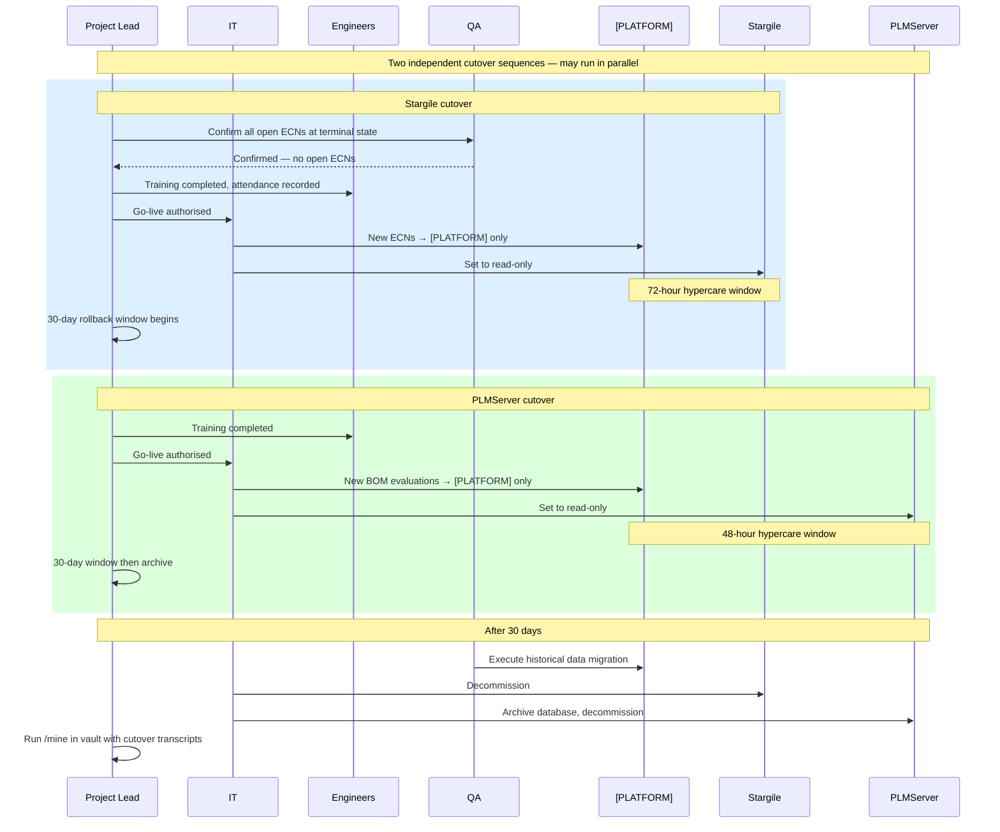

---

## 8. ECN State Machine

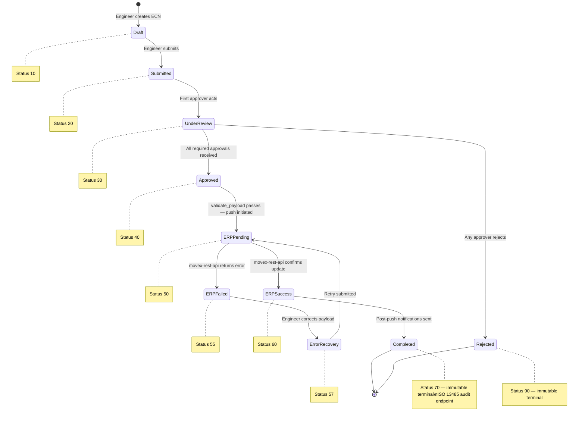

**Status 70 — Completed** is a new explicit terminal state confirmed in v2.0. The April 2018 transcript showed Status 60 as the apparent endpoint, but did not confirm whether a further terminal state existed. Phase 1 Track A must resolve this from Stargile's Java source. If Stargile already has an equivalent terminal state, Status 70 maps to it. If Status 60 was de facto terminal, the state machine collapses Status 60 and 70 into one state with the immutability semantics of Status 70.

**validate_payload** is called before the ERP push is initiated — before the ECN reaches Status 50. It pre-checks effective date conflicts (the known date-conflict class of Status 50 failures) and any payload validation the `movex-rest-api` endpoint enforces. If validation fails, the engineer receives a clear, actionable error message before any MI transaction is attempted.

---

## 9. Non-Functional Requirements

### 9.1 Performance

| Requirement | Target | Source |
|---|---|---|
| Page load time | < 3 seconds on local network | Workstation standard |
| API response (standard operations) | < 500ms at 95th percentile | Workflow productivity |
| API response (ERP push) | < 30 seconds | movex-rest-api SLA |
| BOM processing — 100 parts / 6 suppliers | **< 90 seconds** | vs 13+ minutes today |
| BOM processing — 50 parts / 6 suppliers | **< 45 seconds** | Typical customer order |
| Supplier cache hit rate | > 70% for repeat MPNs | Redis 4-hour TTL |
| BOM comparison (500-line BOM) | < 3 seconds | Diff algorithm target |
| Audit log query (12 months) | < 10 seconds | ISO 13485 review |
| Concurrent users | 20 simultaneous without degradation | 7–8 engineers + CBMs + Purchasing |

### 9.2 Availability and Reliability

| Requirement | Target |
|---|---|
| Uptime (production) | 99% Mon–Fri 07:00–18:00 |
| Planned downtime | Off-shift — weekends and overnight |
| RTO | 4 hours |
| RPO | Maximum 1 hour |
| Supplier degraded mode | System usable if 1–2 suppliers unavailable — per-supplier circuit breaker |

### 9.3 Scalability

| Requirement | Target |
|---|---|
| User growth | 100 users without architectural change — accommodates group rollout |
| BOM record volume | 50,000 BOMs with full version history |
| Part (MPN) catalogue | 500,000 parts without query degradation |
| Site instances | Designed for 2 instances; extendable to additional SRX sites by configuration |

---

## 10. Infrastructure and Hosting

### 10.1 Deployment Model

On-premise, Windows Server. Docker on Windows Server via WSL2. Consistent with `movex-rest-api`, SM-Portal, and MyInvois-Service. Two instances — one per site — deployed from the same Docker images with different environment files.

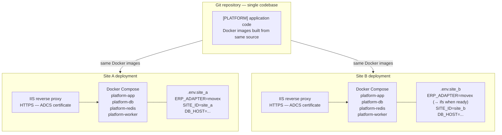

### 10.2 Docker Compose Services

| Service | Image | Purpose |
|---|---|---|
| platform-app | Python/FastAPI (custom) | All three Iteration 1 modules via FastAPI routers |
| platform-db | PostgreSQL 16 | Shared data model per site instance |
| platform-redis | Redis 7 | Event bus (Redis Streams) + supplier cache (key-value) |
| platform-worker | Python Celery + Redis | Background supplier API tasks, OAuth token refresh |

### 10.3 Server Architecture

| Server | Role | Minimum Spec |
|---|---|---|
| App Server (per site) | Docker host — app, redis, worker; IIS reverse proxy on host | Windows Server 2019+, 16 cores, 32 GB RAM, 200 GB SSD |
| DB Server (per site) | PostgreSQL 16 | Windows Server 2019+, 8 cores, 32 GB RAM, 1 TB SSD |

### 10.4 Backup and Recovery

| Backup Type | Schedule | Retention |
|---|---|---|
| PostgreSQL full backup | Nightly at 01:00 | 30 days |
| PostgreSQL WAL archive | Continuous / hourly | 7 days |
| Redis snapshot (RDB) | Every 4 hours | 7 days (rebuildable) |
| Docker images | On every deployment | Last 5 per service |
| Application code | Continuous | Full Git history + vault commit hooks |

---

## 11. Security Design

### 11.1 PLMServer Security Issues — All Corrected by Design

| PLMServer Issue | Severity | Resolution |
|---|---|---|
| HTTPS disabled | Critical | IIS enforces HTTPS with ADCS certificate |
| SSL verification disabled (`verify: false`) | Critical | All Python HTTP clients use `verify=True` |
| Raw SQL queries — injection risk | High | SQLAlchemy ORM parameterised statements |
| OAuth tokens not refreshed proactively | High | Celery worker refreshes DigiKey tokens 5 min before expiry |
| No rate limiting | Medium | Per-supplier semaphore with configurable limits |
| No input validation | High | Pydantic models validate all inputs server-side |

### 11.2 Authentication

JWT tokens in HTTP-only cookies. Access tokens: 15 minutes. Refresh tokens: 8 hours with server-side revocation. Active Directory integration recommended — engineers use Windows credentials; leavers automatically locked out.

Approval actions require password re-confirmation at the moment of approval — ISO 13485 non-repudiation.

### 11.3 Role-Based Access Control

| Permission | Production Engineer | Document Control | CBM | Purchasing | SMT/Test | Admin |
|---|---|---|---|---|---|---|
| Create / edit ECN | ✓ | — | — | — | — | — |
| Approve ECN | — | ✓ | — | — | ✓ | — |
| Create / edit BOM | ✓ | — | — | — | — | — |
| Upload BOM | ✓ | — | ✓ | — | — | — |
| Run supplier pricing | ✓ | — | ✓ | ✓ | — | — |
| Approve BOM for Purchasing | — | — | ✓ | — | — | — |
| Export BOM for ordering | — | — | — | ✓ | — | — |
| View compliance reports | — | ✓ | — | ✓ | — | ✓ |
| View audit log | — | ✓ | — | — | — | ✓ |
| Manage users / roles | — | — | — | — | — | ✓ |
| Configure supplier APIs | — | — | — | — | — | ✓ |

### 11.4 Audit Trail Security

```sql
-- Application user has INSERT + SELECT on audit_log only
REVOKE UPDATE, DELETE ON audit_log FROM platform_app_user;
```

SHA-256 hash chain across all rows — any post-write modification breaks the chain. Validation query runs nightly as part of backup verification.

---

## 12. MAS v2.0 and Knowledge Vault Integration

### 12.1 Agent Registrations — Sprint 5 Deliverables

Two agents registered in `c:/Projects/.github/agents/manifest.json` before Phase 3 ends:

**`expert-[platform]-ecn`**

| Capability | Endpoint |
|---|---|
| Query ECN status by ID or customer ref | GET /ecns/{id} |
| Query approval state | GET /ecns/{id}/approvals |
| Subscribe to ECN events | Redis Streams `ecn.*` |
| Pre-validate a BOM change | POST /validate/bom |

**`expert-[platform]-bom`**

| Capability | Endpoint |
|---|---|
| Query BOM draft and version history | GET /boms/{id}/history |
| Compare two BOM revisions | GET /boms/compare?a={id}&b={id} |
| Query supplier availability | GET /parts/{mpn}/availability |
| Query compliance flags | GET /parts/{mpn}/compliance |
| Subscribe to BOM events | Redis Streams `bom.*` |

### 12.2 Knowledge Vault Integration Points

| Phase | Action | Vault Skill |
|---|---|---|
| Phase 1 — before Track A | `/m3-lookup` for all known Stargile MI programs | `/m3-lookup` |
| Phase 1 — Track A output | Add PLMServer + Stargile project entries to `vault/projects/` | Manual |
| Phase 1 — Track A output | Add ECN (ISO 13485) + BOM (RoHS/REACH) compliance notes | Manual |
| Phase 1 — decisions | Record all adapter interface decisions as ADRs | `/adr` |
| Phase 1 — MI gap analysis | Record Stargile MI inventory and gap as ADR | `/adr` |
| Phase 2 | Record full Architecture Decision Record | `/adr` |
| Phase 3 — Sprint 1 | Install commit hook at `c:/Projects/[Platform]/` | `install-hooks.sh` |
| Phase 3 — Sprint 5 | Register both agents in agent manifest | Manual |
| Phase 4 | `/mine` both cutover transcripts; `/runbook` rollback procedures | `/mine` `/runbook` |
| Phase 4 — month 1 | `/review` to capture early operational patterns | `/review` |

---

## 13. Compliance

### 13.1 Two Compliance Regimes

| Regime | Scope | Primary Module | Key Requirements |
|---|---|---|---|
| ISO 13485 | Medical device manufacturing | ECN Module | Immutable audit trail; non-repudiable approvals; IQ/OQ/PQ Software Validation; record retention for device lifetime |
| RoHS / REACH / WEEE | EU and APAC environmental | BOM + Supplier | Compliance flags per component; enforced at BOM edit; reportable per BOM line |
| ISO 9001 | General quality management | Platform-wide | Audit trail; document control; corrective action |

### 13.2 Software Validation Documentation (ISO 13485 — ECN Module)

| Document | Content | Evidence Source |
|---|---|---|
| IQ | System installed and configured correctly | Deployment runbook; Docker image digest |
| OQ | System performs as specified | ECN Behavioural Specification + ECN UAT Report |
| PQ | System performs correctly in production | Pilot period monitoring data |

---

## 14. Change Management

### 14.1 Risk by System

| System | Change Risk | Primary Driver | Key Action |
|---|---|---|---|
| Stargile replacement | LOW | Management mandate + user frustration | Track B involvement builds ownership |
| PLMServer replacement | MEDIUM | System abandoned — engineers gave up | Sprint 3 performance demo before UAT. Show 90-second processing with real data. |

### 14.2 Stakeholder Map

| Stakeholder | Role | Primary Interest | Key Engagement |
|---|---|---|---|
| Manager / Sponsor | Decision owner | Delivery, ROI, engineer retention | Phase gate reviews, bi-weekly updates |
| Production Engineers (7–8) | ECN + BOM primary users | Faster, less manual, less friction | Track B sessions, Sprint 3 demo, UAT |
| CBMs | BOM approvers | Clear approval interface | PLMServer Track B, UAT |
| Purchasing | BOM consumers | Accurate supplier export | Track B, UAT |
| Document Control / QA | Compliance owners | ISO 13485, RoHS/REACH audit trail | SME sessions, Software Validation |
| IT | Infrastructure | Docker-deployable, two-site supportable | Phase 2 architecture, provisioning |

---

## 15. Risk Register

| Risk | Impact | Likelihood | Mitigation |
|---|---|---|---|
| Stargile MI gap analysis reveals large extension scope for movex-rest-api | High | Possible | Phase 1 Track A produces the spec. .NET team scopes extension in Phase 2. If scope is large, Sprint 3 ERP integration is sequenced after extensions are deployed to staging. |
| Stargile source code not obtained before Phase 2 | High | Possible | SME sessions + MI API documentation cover Behavioural Spec without source. MI gap analysis proceeds via SME and direct MI documentation. |
| PLMServer engineer adoption low despite improvements | Medium | Medium | Sprint 3 performance demo before UAT. Show 90-second BOM processing with real data. |
| Supplier API test credentials not confirmed before Sprint 3 | High | Possible | Phase 2 hard gate for all six suppliers. Sprint 3 cannot begin without them. |
| DigiKey OAuth token lifecycle issues persist | Medium | Possible | Celery worker proactive refresh. Tested against DigiKey sandbox in Sprint 3. PLMServer crash logs already document the failure mode. |
| Site B IFS migration timing overlaps platform build | High | Possible | IFS adapter stub in Sprint 4 validates interface completeness. Migration can begin from a confirmed contract. |
| Two-site deployment introduces configuration drift | Medium | Low | Environment files version-controlled in Git (secrets excluded). Deployment runbooks per site in vault. |
| SM-Portal integration introduces Sprint 1 scope risk | Medium | Possible | Phase 1 Track C surfaces this early. Standalone fallback defined. Sprint 1 is not blocked. |
| Historical PLMServer data quality too poor to migrate | Medium | Possible | Phase 1 Track A validates data quality. If not viable, archive PLMServer DB read-only. |
| ISO 13485 audit during build programme | Critical | Low | Software Validation plan starts Phase 2. Behavioural Spec and UAT designed as dual-purpose evidence from Phase 1. |

---

## 16. Business Case Summary

| Benefit | Annual Value | Source |
|---|---|---|
| Time savings — BOM processing (13 min → 90 sec) | ~$225,000/year | PLMServer analysis: ~3,000 engineer-hours/year |
| Better supplier pricing — automated best-price | ~$100,000/year | PLMServer analysis: 2% on $5M parts spend |
| Reduced rework from BOM errors | ~$24,000/year | PLMServer analysis |
| Engineer retention | ~$30,000/year | PLMServer analysis: 2 fewer replacements |
| ECN efficiency — approval time reduction | Unquantified | Stargile friction eliminated |
| IFS migration risk reduction | Unquantified — strategic insurance | ERP Adapter pattern |
| Two-site deployment from one codebase | Unquantified — operational saving | Configuration, not code |
| **Total quantified annual benefit** | **~$379,000/year** | PLMServer analysis baseline |

---

## 17. Platform Evolution Roadmap

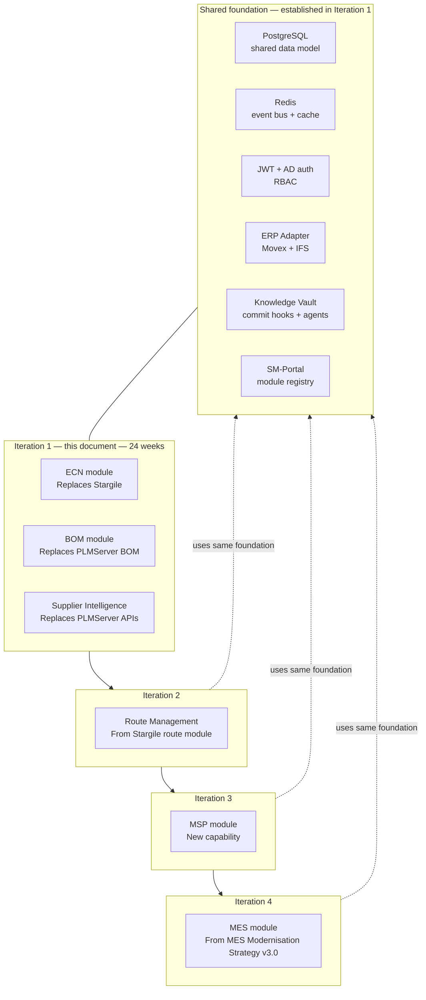

Each future module adds capabilities to the same platform. No new databases, no new authentication systems, no new event buses. The ERP Adapter established in Iteration 1 serves every module — when Site B migrates to IFS, all modules migrate simultaneously by changing one environment variable.

---

## Appendix A: Phase Timeline Summary

| Phase | Weeks | Gate Deliverables |
|---|---|---|
| Phase 1 — Discovery | 1–4 | ECN Spec + BOM/Supplier Spec + All adapter interfaces + **Stargile MI gap analysis + movex-rest-api extension spec** + Retired lists + SM-Portal decision + Retention decisions + Two-site model confirmed + Vault entries |
| Phase 2 — Architecture | 5–6 | ADR + Shared data model + NFRs + Docker confirmed + Movex sandbox confirmed + Supplier test credentials + **movex-rest-api gap endpoints scheduled** + Build plan |
| Phase 3 — Build | 7–20 | Working platform (3 modules) + IFS adapter stub + Site B config + Both MAS agents registered + Sprint 3 performance demo + UAT both modules + Training materials |
| Phase 4 — Cutover | 21–24 | Go-live (both sites, both modules) + Software Validation (IQ/OQ/PQ — ECN) + Training records + Both rollback procedures rehearsed + Both legacy systems decommissioned + Vault handover |

---

## Appendix B: Legacy System Summary

### Stargile — ECN (Java)

| Attribute | Detail |
|---|---|
| Location | Internal server — source extraction pending permission |
| Function | ECN workflow, approval routing, Movex BOM/route commit |
| ERP integration | **Own Java classes calling Movex MI API directly — not movex-rest-api** |
| Users | Production Engineers, Document Control, SMT Engineers, Test Engineers |
| Compliance | ISO 13485 audit trail and approval records |
| Key gap | Status 60 exit mechanism unconfirmed — Phase 1 Track A |
| Key Phase 1 output | MI program inventory + gap analysis vs movex-rest-api |

### PLMServer — BOM / Supplier Intelligence (PHP/MySQL/Apache)

| Attribute | Detail |
|---|---|
| Location | `c:/Projects/PLM/PLMServer` |
| Function | BOM upload, multi-supplier pricing and availability, BOM approval for Purchasing |
| ERP integration | Movex via SQL Server view (read-only order data) |
| Users | Engineers/Planners (2 of 8 active), CBMs, Purchasing |
| Status | Largely abandoned — NPS -40 — due to 13-minute BOM processing |
| Security issues | SSL disabled; raw SQL queries; OAuth tokens not refreshed proactively |
| Analysis assets | `analysis/PLMServer_Complete_Analysis.md` + `analysis/plm-tables.sql` |

---

## Appendix C: Supplier Integration Reference

| Supplier | Auth | Rate Limit | Reliability | Key Notes |
|---|---|---|---|---|
| DigiKey | OAuth2 | 1,000 req/day | High | Token refresh failures in PLMServer — Celery proactive refresh in platform |
| Mouser | API Key | 1,000 req/hour | High | Occasional timeouts — retry with exponential backoff |
| Future Electronics | API Key | Unknown | Medium | Inconsistent response format — adapter normalises |
| Element14 | API Key | 100 req/min | Medium | Frequent stock mismatches — staleness warning in UI |
| Verical / Arrow | API Key | Unknown | Medium | |
| Octopart | API Key | Unknown | High | Primary source for alternatives + RoHS/REACH compliance data |

---

## Appendix D: Architectural Decision Log

All decisions must be recorded in `vault/decisions/` using `/adr`.

| Decision | Decision Made | Rationale |
|---|---|---|
| Unified platform vs two separate replacements | Unified platform | Shared data model; supplier intelligence needed during ECN; compliance requires joined data; single ERP Adapter for both migrations |
| Data authority model | Movex SOT for committed BOMs; platform manages change workflow and draft state | Avoids bidirectional sync risk; ISO 13485 auditor expectation; multi-site safe; AI value is in the change history, not the committed state |
| Two-site deployment | Multi-configuration, not multi-tenancy | Same SRX entity; configuration handles ERP adapter per site; country split handled by deployment, not architecture |
| Stargile ERP interface | MovexRestAdapter calls movex-rest-api (HTTP); Phase 1 Track A produces MI gap analysis for movex-rest-api extension | One ERP boundary for the whole platform; .NET team extends movex-rest-api once; cleaner than Python calling MI directly |
| Backend language | Python/FastAPI | AI/agent integration native; async architecture solves sequential API bottleneck; deviation from .NET standard justified by AI platform roadmap |
| Supplier concurrency | Parallel async (asyncio) + Celery worker | asyncio.gather with per-supplier semaphores; 13 min → under 90 sec; Celery for background tasks without blocking API responses |
| Database | PostgreSQL 16 | Replaces MySQL (PLMServer); removes SQL Server dependency; JSONB; ISO 13485 audit support; no licence cost |
| Deployment | Docker on Windows Server (IT has Docker familiarity) | Reproducible (IQ evidence); environment parity (OQ evidence); rollback by image tag; two-site deployment from same images |
| Frontend | SM-Portal module (recommended) | Shared auth, consistent UX, platform module pattern. Standalone is the documented fallback pending Phase 1 review. |
| Platform name | To be decided by management — see Section 1 | DELTA recommended |

---

## Appendix E: Project Ecosystem Map

| Project | Path | Role |
|---|---|---|
| Stargile (ECN — Java) | Internal server — source pending | System being replaced. Phase 1 Track A: MI program inventory + gap analysis. |
| PLMServer (BOM/Supplier — PHP) | `c:/Projects/PLM/PLMServer` | System being replaced. Full analysis available. |
| [PLATFORM] (new) | `c:/Projects/[Platform]/` | Unified platform. Commit hook Sprint 1. Both agents Sprint 5. |
| movex-rest-api | `c:/Projects/MOVEX/API-Integration/movex-rest-api` | ERP surface. MovexRestAdapter calls this over HTTP. Extended in Phase 2 to cover Stargile MI gap. |
| SM-Portal | `c:/Projects/SM-Portal` | Frontend host candidate. Phase 1 review confirms integration approach. |
| Knowledge Vault | `c:/Projects/Knowledge-Management` | Organisational memory. Used from Phase 1 onward. |
| MyInvois-Service | `c:/Projects/MyInvois-Service` | Different compliance domain. Demonstrates deployment pattern. |
| WMS | `c:/Projects/WMS` | Future. Subscriber to `bom.revised` and `ecn.completed` events. |
| MES | Future | Iteration 4. ECN + BOM architecture is the template. |

---

*[PLATFORM NAME] Engineering Intelligence Platform — Strategy v2.0 — For Management Review*
*Platform name to be decided by management — see Section 1 — replace [PLATFORM] throughout once decided*
*v2.0 corrections: data authority model; Stargile MI interface; two-site deployment; Mermaid diagrams added throughout*
