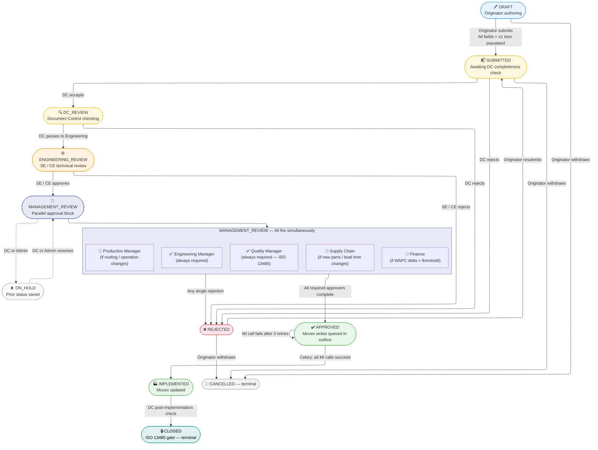
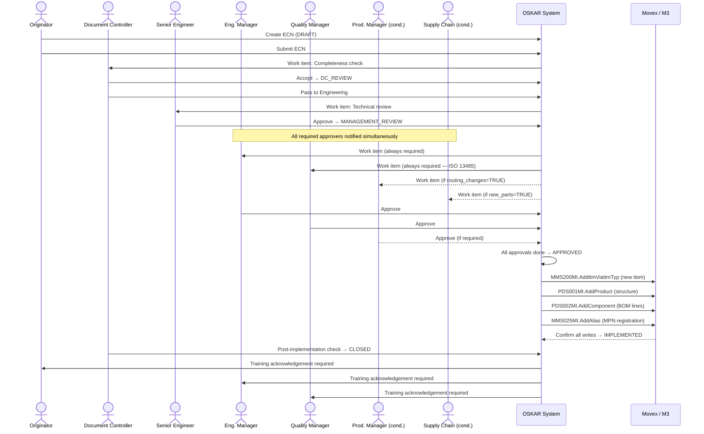
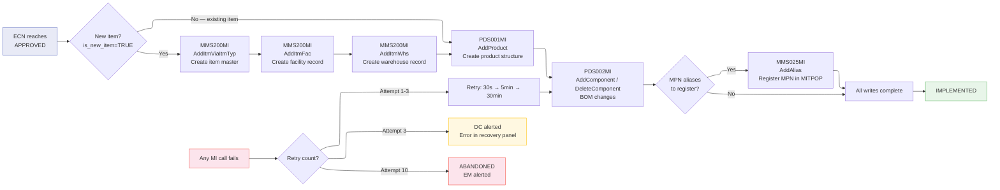

# OSKAR — ECN Workflow Diagrams
**For use in:** 2026-04-29 stakeholder meeting — Segment 4

---

## Diagram 1 — ECN State Machine (Full)

> Show this first. Walk through the main path (top), then show the side paths.

---

## Diagram 2 — Stargile vs OSKAR Status Mapping

> Use this to show Branko how the Stargile statuses map to OSKAR. Key message: Status 50 and 60 ("MOVEX_UPDATED_PENDING", "ACTION_NOTIFICATION_PENDING") disappear as user-visible states — they become infrastructure.

| Stargile Code | Stargile Name | OSKAR Equivalent | Why collapsed |
|---|---|---|---|
| 5 | PRELIMINARY | DRAFT (0) | No separate preliminary step needed |
| 10 | INITIATION | DRAFT (0) | Originator fills header in DRAFT |
| 15 | PRELIMINARY_REVIEW_PENDING | SUBMITTED (10) | DC completeness queue |
| 20 | PRE_APPROVAL_PENDING | DC_REVIEW (20) | DC acts |
| 25 | DC_CHECK_PENDING | DC_REVIEW (20) | Collapsed — single DC_REVIEW status |
| 30 | APPROVAL_PENDING | MANAGEMENT_REVIEW (40) | Parallel block |
| 35 | DC_APPROVAL_PENDING | DC_REVIEW / ENGINEERING_REVIEW | Sequential DC → SE gate |
| **50** | **MOVEX_UPDATED_PENDING** | **Infrastructure only — not user-visible** | Celery async task; users see APPROVED while it runs |
| 55 | COST_REVIEW_PENDING | MANAGEMENT_REVIEW (40) — FN role | Cost review is parallel not sequential |
| **60** | **ACTION_NOTIFICATION_PENDING** | **Infrastructure only** | Notifications fire automatically on transition |
| 65 | FINAL_APPROVAL_PENDING | MANAGEMENT_REVIEW (40) — CE endorsement | CE is part of the parallel block |
| 90 | ECN_COMPLETE | CLOSED (70) | — |
| 99 | ECN_CANCELLED | CANCELLED (80) | — |

**Key engineering insight:** In Stargile, Status 50 was a blocking synchronous Movex call with no feedback. If it timed out, the ECN stayed stuck with no error visible. In OSKAR, the Movex write is a Celery async task — it retries automatically, the DC sees every error with the exact Movex message, and the retry button is in the UI. No more stuck ECNs.

---

## Diagram 3 — Approval Chain (Sequential + Parallel)

---

## Diagram 4 — Movex Write Gate (What happens at APPROVED)

> Use this when someone asks "when does it actually write to Movex?" This is the biggest Stargile improvement.

**Key talking point for Nick:** Every MI call is in the audit log. If a BOM write fails — for any reason — Nick and DC see the exact Movex error message, not a mystery stuck state. The retry button is in the DC recovery panel. No more calling IT to manually rerun a Stargile push.

---

## Role Reference Card

> Print this for the meeting or paste into the role validation discussion.

| Role | Code | Required when | In parallel block? |
|------|------|--------------|-------------------|
| Document Controller | DC | Every ECN — all gates | Sequential gatekeeper |
| Originator | OR | Every ECN | Submits / resubmits / cancels |
| Senior Engineer | SE | ENGINEERING_REVIEW | Sequential reviewer |
| Chief Engineer | CE | ENGINEERING_REVIEW (escalation) | Co-reviews with SE |
| Engineering Manager | EM | MANAGEMENT_REVIEW | ✅ Always |
| Quality Manager | QM | MANAGEMENT_REVIEW | ✅ Always (ISO 13485) |
| Production Manager | PM | MANAGEMENT_REVIEW | ✅ If routing_changes or operation_changes |
| Supply Chain | SC | MANAGEMENT_REVIEW | ✅ If new_parts or lead_time_changes |
| Finance | FN | MANAGEMENT_REVIEW | ✅ If WAPC delta > threshold |
| Admin | AD | Platform admin only | — |
| Cost Accountant | CA | MANAGEMENT_REVIEW | Observer-plus (no veto) |

**Observer roles (notified but no approval):**

| Role | Code | When notified |
|------|------|--------------|
| R&D / Product Engineering | RD | ECN affects their product family |
| Test Engineering | TE | ECN includes document changes |
| Manufacturing Quality | MQ | ECN reaches CLOSED |
