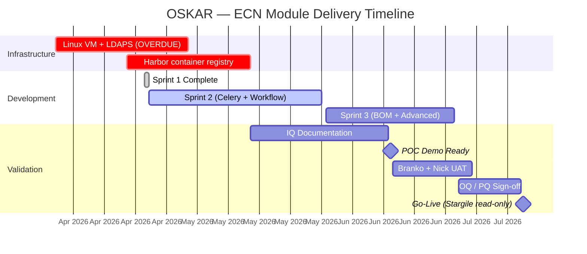

# OSKAR Platform — Executive Brief & POC Scope
**For:** Karen (IT General Manager)
**Date:** 2026-04-29
**Prepared by:** Hector Salazar, Development & Integration Lead

---

## What Is Being Built

OSKAR is replacing two legacy engineering systems that have been running since 2016:

| Legacy System | Problem | OSKAR Replacement |
|---|---|---|
| **Stargile** (Java, ECN management) | IE9 browser only; no audit trail; silent Movex failures; 4 separate ECNs required for one product launch; no error checking | **OSKAR ECN Module** — Iteration 1, June/July 2026 |
| **PLMServer** (PHP, MySQL, BOM + Supplier) | PHP platform, aging infrastructure | **OSKAR BOM Module** — Iteration 2, post-ECN go-live |

---

## QSDC Framing — Why This Matters

| QSDC | OSKAR Contribution |
|------|-------------------|
| **Quality** | ISO 13485 SHA-256 immutable audit chain on every ECN transition; BOM duplicate sequence validation eliminates silent data corruption; no post-completion edits possible |
| **Satisfaction** | Engineers work in one system instead of logging into Movex + Stargile + Excel; no IE9 dependency; Movex item creation automated on approval |
| **Delivery** | Parallel approval block eliminates the sequential bottleneck; 48h/96h overdue escalation prevents stuck ECNs; "true next action person" on the open ECN dashboard |
| **Cost** | Replaces two legacy systems on a single modern platform; estimated 2–4 hours saved per new product BOM upload (current: 12 manual steps, 4 separate ECN submissions) |

---

## Sprint Status (as of 2026-04-28)

```
Phase 0 (Harness + Architecture)     ████████████████████ 100%  ✅ Complete
Sprint 1 (Platform Foundation)        ████████████████████ 100%  ✅ Complete
Sprint 2 (ECN Workflow + Movex)        ████░░░░░░░░░░░░░░░░  20%  🔵 In progress
Sprint 3 (BOM + Advanced Features)    ░░░░░░░░░░░░░░░░░░░░   0%  ⏳ Planned
```

**Sprint 1 deliverables (complete):**
- JWT authentication via Active Directory (LDAPS)
- ECN create, read, update, list — all API endpoints working
- 11-status workflow state machine with full guard conditions
- SHA-256 immutable audit chain
- 48 automated tests passing (100%)

**Sprint 2 scope (June 2026):**
- Celery async Movex write automation (MMS200MI, PDS001MI, PDS002MI, MMS025MI)
- Parallel Management Review approval block (EM + QM mandatory; PM/SC/FN conditional)
- Email notifications (SMTP 10.10.0.155)
- Rejection flows with mandatory reason recording
- File attachment support on ECN records
- MPN extended fields: MSL, shelf life, EOL, packaging, Do Not Buy
- DC recovery panel for failed Movex writes

---

## POC Scope — What Branko and Nick Will Validate

The POC is a working system that the engineering team UATs before go-live approval. It must demonstrate 7 capabilities:

| # | Feature | Stargile Today | OSKAR POC |
|---|---|---|---|
| 1 | **End-to-end ECN with live Movex write** | Manual: engineer creates item in M3 first, then references in Stargile | Automated: approve ECN → system writes to Movex automatically (MMS200MI → PDS001MI → PDS002MI → MMS025MI) |
| 2 | **Parallel Management Review** | Sequential: each approver waits for the previous one | Simultaneous: all required approvers notified at once; conditional roles auto-skipped |
| 3 | **Rejection flows** | Free-text email; no mandatory reason; no restart vs proceed decision record | Structured rejection: mandatory reason, restart/proceed choice, full audit entry |
| 4 | **Open ECN dashboard** | Nightly SQL Server email (DBCHK_OpenECN) with known bugs; shows originator not actual approver | Live web dashboard; true "Next Action Person" from `ecn_approval_steps`; overdue highlighted |
| 5 | **File attachments** | Engineers type a DMR path; cannot attach files directly | Upload directly to ECN; stored and retrievable from the ECN record |
| 6 | **MPN extended fields** | Engineers maintain separate Excel for MSL, EOL, shelf life | MSL, shelf life, packaging, EOL, Do Not Buy captured inside the MPN record on the ECN |
| 7 | **View Items screen** | No single screen showing PN + Manufacturer + MPN + Stock on Hand | Unified view: OSKAR data + live Movex CITMAS stock read |

---

## Go-Live Criteria — For Discussion

*What does Karen need to see to approve production go-live?*

**Proposed criteria (confirm or amend today):**

| Gate | Criterion | Target |
|------|-----------|--------|
| **Technical** | All 7 POC must-haves demonstrated working on staging environment | June 2026 |
| **Quality** | IQ completed (infrastructure validated); OQ test cases passing | June 2026 |
| **Process** | Branko + Nick sign-off after UAT | July 2026 |
| **Compliance** | ISO 13485 audit trail evidence package prepared | July 2026 |
| **Cutover** | 2-week ECN drain period; zero open Stargile ECNs on go-live day | July 2026 |
| **Infrastructure** | Linux VM provisioned; LDAPS confirmed; Docker deployment tested | **Required now — blocking** |

---

## IQ / OQ / PQ Sign-Off Chain

*Confirm today — this drives the validation documentation schedule.*

| Document | Author | Approver | Subject matter |
|----------|--------|---------|----------------|
| IQ (Installation Qualification) | Manal | Hector | Server, Docker, network, secrets management |
| OQ (Operational Qualification) | Mihai | Hector | System behaviour to specification |
| PQ (Performance Qualification) | Mihai | Hector | Real-world process performance |
| **Final sign-off** | — | **Karen** | System/process owner |
| **Quality sign-off** | — | **Divya (Melbourne)** | Quality management |

---

## Timeline



---

## Infrastructure Blockers — Escalation Required

Two items are overdue and are blocking Sprint 2 deployment on the server:

| Item | Expected | Status | Impact |
|------|---------|--------|--------|
| Linux VM provisioned | 2026-04-17 | ❌ **OVERDUE** | Cannot deploy to server; demo runs developer-local only |
| LDAPS confirmed | ~2026-04-24 | ❌ **OVERDUE** | Cannot test AD authentication against live directory |
| Harbor hostname (container registry) | 2026-04-17 | ❌ **OVERDUE** | Cannot push Docker images to registry |

**Request:** Karen escalates these to Manal with a hard deadline of May 1 2026.

---

## Post-Go-Live Roadmap (For Awareness — Not Today's Scope)

| Iteration | Scope | Target |
|-----------|-------|--------|
| Iteration 1 | ECN Module (replacing Stargile) | July 2026 |
| Iteration 2 | BOM Module + Supplier Intelligence (replacing PLMServer) | Q4 2026 |
| Iteration 3 | Advanced Supplier Intelligence | 2027 |
| Post-go-live | OpenBao secrets vault (replaces file-based secrets) | 30 days post-production stable |

---

## Decisions Needed from Karen Today

| # | Decision | Why needed now |
|---|----------|---------------|
| 1 | Confirm go-live criteria (the table above or amended) | Sets the UAT exit conditions for Branko/Nick |
| 2 | Confirm IQ/OQ/PQ sign-off chain (table above) | Drives documentation schedule |
| 3 | Escalate Linux VM + LDAPS + Harbor to Manal — hard deadline May 1 | Sprint 2 cannot deploy without it |
| 4 | Confirm who manages DBCHK_OpenECN SQL Server Agent job on DBSRV | Must be disabled on go-live day |
