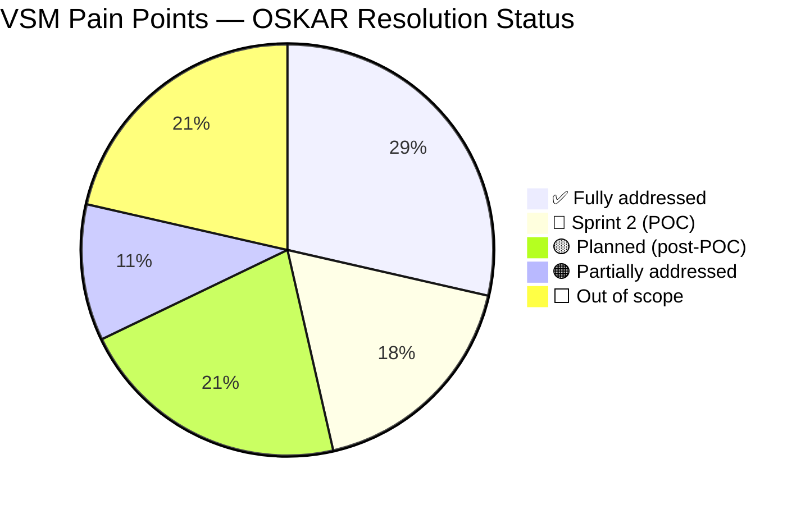

# VSM Resolution Map — Melbourne Engineers BOM Upload Process
**Source:** VSM Rev 1.1, 12/08/2019 — Melbourne Engineering Team
**Against:** OSKAR Platform, Sprint 1 Complete (2026-04-28)

> This document maps every VSM step and pain point to its current OSKAR resolution status.
> Use in Segment 3 of the 2026-04-29 meeting to walk Branko and Nick through the gap analysis.

---

## Status Legend

| Symbol | Meaning |
|--------|---------|
| ✅ **Closed** | Fully addressed |
| 🔵 **Sprint 2** | In active development — available at POC demo |
| 🟡 **Planned** | In OSKAR scope; post-POC |
| 🟠 **Partial** | Core addressed; some detail still open |
| ⬜ **Out of scope** | Different system / process decision required |

---

## The 12 VSM Steps

### Step 1 — Get the Data (BOM and QCW)

**Current pain:**
- BOM and QCW received by email from PM — manual handoff, waiting time
- Risk of retrieving wrong revisions from S:\PRODENG folder or multiple department folders
- PE should have direct access: QCW from RFQ DB, BOM from NPI DB

**OSKAR status:** ⬜ **Out of scope**

> OSKAR is the engineering change workflow engine. It cannot change upstream data sources or eliminate the email-based handoff from PM without a separate NPI/RFQ database system decision. This is an upstream process/system gap.
>
> **At the meeting, ask:** "Is there still no NPI database in use today? Has anything changed on the S-drive situation since 2019?"

---

### Step 2 — BOM Data Check (Customer BOM vs QCW)

**Current pain:**
- BOM comparison done manually in Excel — not standardised
- Each PE has their own method — inconsistent quality, risk of missing discrepancies
- Time consuming

**OSKAR status:** 🟡 **Iteration 2 — BOM Module**

> A BOM comparison tool is the natural first feature of the BOM Module (Iteration 2, post-ECN go-live).
>
> **At the meeting, ask:** "How long does a BOM comparison take today on a typical new product? 30 minutes? 2 hours? This is the data we need to build the business case for Iteration 2."

---

### Step 3 — Movex PN Duplicate Check

**Current pain:**
- "Customer Part Mapping" report downloaded from Movex, reformatted in Excel, then compared manually
- Check based on Customer Part Number (Alias) or MPN + Manufacturer
- Not standardised; time consuming
- Partial Match requires further work and customer approval

**OSKAR status:** 🔵 **Sprint 2**

> OSKAR will call the Movex CITMAS API before ECN submission to check for:
> - Exact MPN + Manufacturer match → PN already exists; do not create duplicate
> - Customer Alias match → partial match flagged for PE decision
> - No match → new PN creation confirmed
>
> The Customer Part Mapping Excel download is eliminated.

---

### Step 4 — Create SRX PN and Stock Code

**Current pain:**
- PE manually finds the right commodity code from MPN description or datasheet
- PE manually finds the last PN for that customer + commodity and picks next available number
- PN format: `LF + {customer_code:2} + {commodity_code:2} + {4-digit-seq}` e.g. `LFRM120008`
- Description maximum 30 characters (Movex limit — rejection with no useful error)
- Template sent by email to Procurement to add procurement parameters
- UOM cannot be changed after creation — wrong UOM = new PN required (costly)
- Stargile has zero error checking

**OSKAR status:** 🟠 **Partially addressed**

| Sub-pain | OSKAR status |
|----------|-------------|
| 30-char description limit | ✅ **Closed** — `VARCHAR(30)` enforced at DB; UI shows character counter |
| UOM validated before creation | ✅ **Closed** — `unit_of_measure` required and validated at DRAFT submission |
| PN auto-numbering (LF format + sequence) | 🟡 **Stretch goal** — requires `pn_sequences` table and commodity code lookup |
| Commodity code lookup | 🟡 **Stretch goal** — requires `commodity_codes` reference table |
| Template email to Procurement | 🔵 **Sprint 2** — MPN extended fields (purchase_price, buyer, supplier_number) captured in OSKAR; Procurement adds fields directly in the ECN |

> **At the meeting, confirm:** "Is Step 4 still the single most time-consuming manual step in a new product launch?"
>
> If yes, auto-numbering and commodity code lookup should be elevated from stretch goal to POC must-have.

---

### Step 5 — ECN Routing Upload

**Current pain:**
- PE needs batch quantity from PM before routings can be loaded
- Movex does not support multiple routings for the same BOM
- If batch quantity changes, all routings need updating

**OSKAR status:** 🟡 **Iteration 2 — Routing Module**

> OSKAR's `ecn_bom_changes` table has the `operation_number` field (50=SMT, 100=TH, 160=Mechanical, 190=Packing) but the full routing module is Iteration 2 scope. The Movex limitation (no multiple routings per BOM) is an ERP constraint OSKAR cannot change.
>
> **At the meeting, ask:** "Nick — how often does batch quantity change after routings are loaded? Is this a monthly problem or an occasional one?"

---

### Step 6 — ECN BOM Upload

**Current pain:**
- Operation number classification (SMT/TH/Mechanical/Packing) is manual — no scripts or automation
- Reference Designators only available in Movex reports next day (update scripts at 10AM/2PM/6PM)
- BOM Rev Data added manually in Movex after upload
- Quantities for consumables (glue, conformal coating) difficult to determine at upload
- All templates must be saved as Text(Tab Delimited) — upload fails otherwise
- Stargile has zero error checking

**OSKAR status:** 🟠 **Partially addressed**

| Sub-pain | OSKAR status |
|----------|-------------|
| Tab-delimited template requirement | ✅ **Closed** — OSKAR uses API + React form; no templates |
| Stargile zero error checking | ✅ **Closed** — validation at every transition gate |
| BOM Rev Data manual Movex update | 🟠 **Partially addressed** — PDS001MI header write at APPROVED includes revision; confirm mapping |
| Operation number auto-classification | 🟡 **Stretch goal** — rules table maps component type → operation number |
| Reference Designator lag | ⬜ **Movex limitation** — OSKAR cannot change when Movex updates scripts |

---

### Step 7 — ECN MPN Uploads

**Current pain:**
- Manufacturer and Manufacturer Code both required — manually searched
- Currency field mandatory even though not used — waste of time
- Tab-delimited template requirement

**OSKAR status:** ✅ **Closed**

> Currency field: not in schema — gone entirely.
> Manufacturer Code: not required — manufacturer name only, with optional Movex lookup.
> Templates: eliminated — API + React form.

---

### Step 8 — Verify Movex BOM Against Customer BOM

**Current pain:**
- BOM downloaded from Movex, compared against customer BOM manually in Excel
- Not standardised; time consuming
- Requested: Crystal report with PN + multiple MPNs on multiple lines
- BOM sent to customer for verification — some customers have advanced BOM check tools

**OSKAR status:** 🟡 **Iteration 2 — BOM Module**

> Same tooling as Step 2 — the BOM comparison module is Iteration 2.
>
> **Crystal report equivalent:** The "View Items" screen (Sprint 2 POC feature) shows PN + multiple MPNs — this is the direct equivalent. Show this at the demo.

---

### Step 9 — Purge (MPN End-Dates)

**Current pain:**
- Purge is done on paper — time consuming
- Purge Template end-date for MPN field doesn't work — escalated to Karen/John B, unresolved

**OSKAR status:** ⬜ **Out of scope v1 — but should be scoped**

> Purge is a Movex API call (end-date an MPN alias in `MITPOP`). This is architecturally identical to the MPN Delete capability OSKAR already has for ECNs. A Purge feature is a natural extension — but it is not in the June/July POC.
>
> **At the meeting, ask:** "Is the paper-based purge process still active today? How many purges per month? This is a candidate for OSKAR Iteration 2."

---

### Step 10 — Transmittal for PCB and Mechanical Parts

**Current pain:**
- All Gerbers and drawings uploaded in DMR
- Signed transmittals kept on S Drive — no database, no tracking
- Manual search for Supplier Number on transmittal
- No way to check what was sent, when, to whom

**OSKAR status:** ⬜ **Out of scope — requires DMR integration decision**

> Transmittal tracking requires integration with the DMR (Document Management Repository) or a standalone transmittal database. This is outside OSKAR scope for v1 but is an ISO 13485 §7.3.6 design output control gap.
>
> **At the meeting:** Flag this as a risk for Karen if the ISO audit includes design output traceability.

---

### Step 11 — Upload BOM to MTS

**Current pain:**
- BOM downloaded from Movex and re-uploaded to MTS manually — not automatic

**OSKAR status:** ⬜ **Out of scope**

> MTS is a separate production planning system. OSKAR ensures the BOM in Movex is accurate and traceable — that is the input to MTS. The MTS integration boundary is a separate decision.

---

### Step 12 — Create Routings and Process Flow in MTS

**Current pain:**
- Manual process in MTS

**OSKAR status:** ⬜ **Out of scope**

> Same boundary as Step 11.

---

## Summary Scorecard

---

## Questions to Ask in the Meeting

These questions are designed to update the analysis and surface anything the 2019 VSM missed:

| Question | Why it matters |
|----------|---------------|
| Is Step 4 (PN creation) still the single biggest time sink? | Determines if auto-numbering should be elevated to POC must-have |
| How often does batch quantity change after routings are loaded? | Scopes the routing module priority |
| Is the paper-based purge process still active? How many per month? | Candidate for Iteration 2 scoping |
| Has the S-drive / NPI database situation changed since 2019? | May unblock Step 1 data access |
| What else breaks regularly that wasn't in the 2019 VSM? | Open floor for new pain points |
| Are there pain points specific to JB that aren't in the Melbourne VSM? | Multi-facility awareness |
