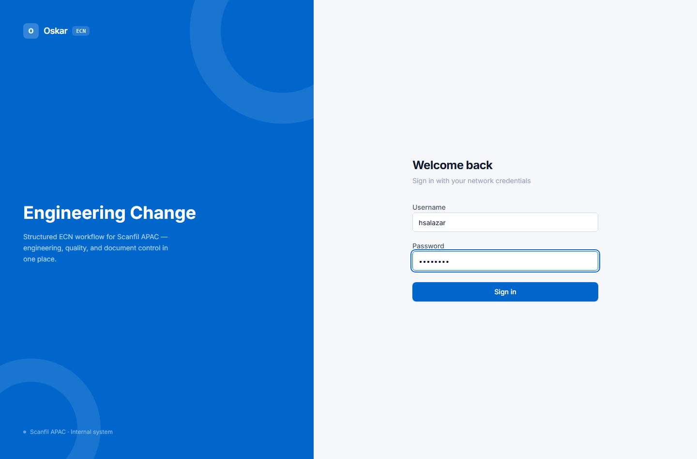
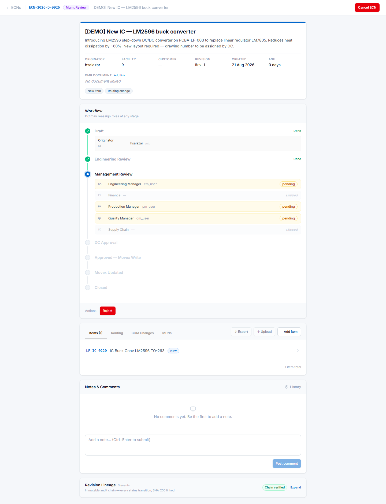

# Getting started

## Signing in

Open Oskar in your browser and sign in with your **normal network username and password** — the
same ones you use for Windows. There is no separate Oskar password to remember or reset.

If your credentials are rejected, see [When things go wrong](10-troubleshooting.md) — the message
"Invalid username or password" does not always mean what it says.

---

## Your worklist

Signing in lands you on the ECN list. This is the screen you will spend most of your time on.

*(Customer names are blurred in this manual, not in the real screen.)*

### The three cards

The cards across the top are **filters, not just counters**. Click one and the list below narrows
to match; click again to clear it.

| Card | Shows |
|---|---|
| **Active ECNs** | Everything still in progress — excludes Closed and Cancelled |
| **Require my action** | ECNs waiting on *you*, right now. **This is the one that matters.** |
| **Overdue (>7 days)** | Open more than seven days, whoever they're waiting on |

If you read nothing else on this screen, read **Require my action**. It answers "what do I need to
do today?" without opening a single ECN.

### The table

| Column | What it tells you |
|---|---|
| **Number** | The ECN's reference, e.g. `ECN-2026-D-0026`. `D` is Melbourne, `L` is Johor Bahru. |
| **Customer** | Who the change is for, if it's customer-driven |
| **Title** | What the change is |
| **Cust. ECN** | The customer's own reference, when they have one |
| **Status** | Where it is in the workflow — see the [Glossary](02-glossary.md) |
| **Originator** | Who raised it |
| **Next action** | **Who it is waiting on.** Blank means nobody — it's finished or paused. |
| **Entry date / Age** | When it was raised, and how long it's been open. Ages over a week turn red. |

Click any column header with an arrow to sort by it. Click an ECN number to open it.

### Finding a specific ECN

Four dropdowns sit above the table — status, customer, originator and next action — plus a search
box that matches on number and title. They combine, so you can ask for "everything at Management
Review waiting on the Quality Manager" in two clicks.

More on this in [Finding ECNs](09-finding-ecns.md).

---

## Opening an ECN

Clicking an ECN opens its detail screen. Every ECN looks the same regardless of status; what
changes is which buttons you see.

Four things are stacked down the page:

**1. The header** — title, description, originator, facility, customer, revision and age. The
grey pills at the bottom are the **change scope**: what this ECN affects, and therefore who has
to approve it.

**2. Workflow** — the approval timeline. Green ticks are done, the blue ring is where it is now,
grey circles are still to come. At Management Review you will see several roles listed together
because **they are asked in parallel, not in sequence** — the screenshot above shows Engineering
Manager, Production Manager and Quality Manager all `pending` at once, while Finance and Supply
Chain are marked `skipped` because this change didn't affect them.

Your action buttons, if you have any, are at the bottom of this panel.

**3. The tabs** — Items, Routing, BOM Changes and MPNs: the actual content of the change. Each
has **Export ↓** and **Upload ↑** buttons. See [Bulk uploads](07-bulk-uploads.md).

**4. Notes & Comments, and Revision Lineage** — the discussion thread, and the tamper-evident
audit trail of every status change. The "Chain verified" badge means the audit record is intact.

---

## What you can do depends on three things

If a button you expect isn't there, it is almost always one of these:

- **The ECN's status.** You cannot edit items on an ECN that has already been approved.
- **Your role on *this* ECN.** Being a Quality Manager doesn't mean you're the QM on every ECN —
  role assignment is per ECN and per plant.
- **Your access groups.** Set by IT, separately from the above. See
  [Access and onboarding](12-access-and-onboarding.md).

Oskar hides actions you cannot take rather than showing them greyed out, so an empty Actions row
means there is genuinely nothing for you to do right now.

---

## Where to go next

| You are | Read |
|---|---|
| Raising changes | [Raising an ECN](03-raising-an-ecn.md) |
| Reviewing and approving | [Approving an ECN](04-approving-an-ecn.md) |
| A Document Controller | [The Document Controller](05-document-controller.md) |
| Coming from Stargile | [Coming from Stargile](11-coming-from-stargile.md) |
