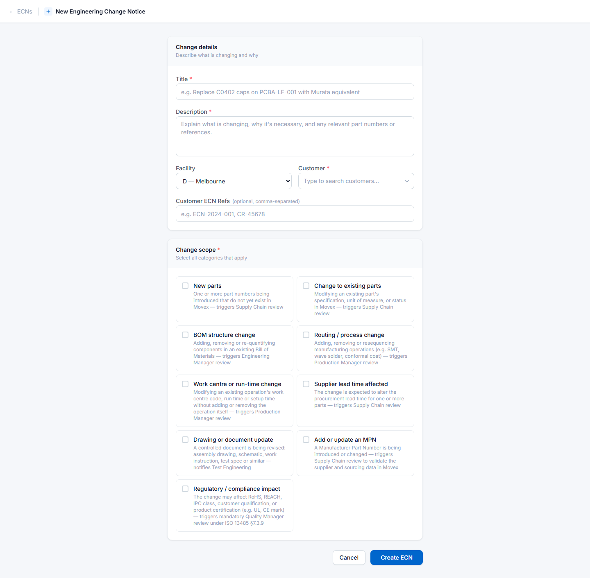
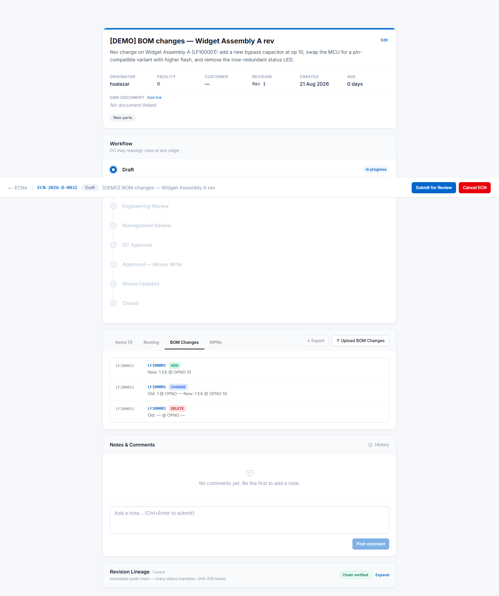

# Raising an ECN

For engineers, designers and anyone who needs a change made to a product, its bill of materials,
or the way it is manufactured.

This is the longest chapter in the manual, because raising the ECN is where most of the thinking
happens. Everything after it is review.

---

## Before you start

Have ready:

- **What is changing, and why.** You will be asked to write this in plain language for people who
  are not you.
- **The item numbers involved.** If parts are new, they do not need to exist in Movex yet — Oskar
  creates them. **Do not create them in Movex first.**
- **Which plant** the change is for: Melbourne (D) or Johor Bahru (L).

You do **not** need to work out who has to approve it. Oskar does that from the change scope.

---

## Step 1 — Create the ECN

Click **+ New ECN** from the ECN list.

### Change details

| Field | Notes |
|---|---|
| **Title** | Required. One line, specific. *"Replace C0402 caps on PCBA-LF-001 with Murata equivalent"* beats *"Cap change"* — it is what everyone sees in their worklist. |
| **Description** | Required. What is changing, why it is necessary, and any part numbers or references. Reviewers judge the change from this. |
| **Facility** | Melbourne (D) is the default. **This decides who reviews it** — role assignment is per plant. |
| **Customer** | Type to search. Leave blank if the change is not customer-driven. |
| **Customer ECN Refs** | Optional. The customer's own reference, if they raised the change. Comma-separated for several. |

### Change scope — the part that matters

The nine tick-boxes are **not** documentation. They decide who has to approve your ECN.

| Tick this | If | It summons |
|---|---|---|
| **New parts** | Part numbers are being introduced that do not exist in Movex yet | Supply Chain |
| **Change to existing parts** | An existing part's specification, unit of measure or status is changing | Supply Chain |
| **BOM structure change** | Components are being added, removed or re-quantified | Engineering Manager |
| **Routing / process change** | Manufacturing operations are being added, removed or resequenced | Production Manager |
| **Work centre or run-time change** | An existing operation's work centre, run time or setup time changes | Production Manager |
| **Supplier lead time affected** | Procurement lead time will change | Supply Chain |
| **Drawing or document update** | A controlled document is being revised | Test Engineering *(notified)* |
| **Add or update an MPN** | A manufacturer part number is being introduced or changed | Supply Chain |
| **Regulatory / compliance impact** | RoHS, REACH, IPC class, customer qualification or certification may be affected | Quality Manager *(mandatory)* |

**Tick everything that genuinely applies.** Under-ticking is the more common mistake and the more
damaging one: a routing change that does not summon the Production Manager gets approved by people
who never saw the part that matters to them.

Over-ticking wastes a colleague's time. Under-ticking puts an unreviewed change into production.

Click **Create ECN**. It is now in **Draft**, and only you can see it as work in progress.

---

## Step 2 — Add the content

A Draft ECN with a title and description is not yet a change — you need to say what actually
changes. That happens on the four tabs.

| Tab | What goes here |
|---|---|
| **Items** | The parts themselves — new items to create, or existing items whose master data changes |
| **Routing** | Manufacturing operations: work centre, run time, setup time |
| **BOM Changes** | Components going into an assembly, or coming out of it |
| **MPNs** | Manufacturer part numbers against your items |

Each tab has **+ Add** for one row at a time, and **Upload ↑** for a spreadsheet. For more than a
handful of rows, use the upload — see [Bulk uploads](07-bulk-uploads.md).

### Order matters

**Add items before routing, BOM changes or MPNs.** Those three all reference an item number, and
they will be rejected if the item is not already on the ECN. Routing upload in particular does not
create items.

### Effectivity — the field that catches people out

Every item needs an **effectivity type**, which says *when* the change takes effect:

| Type | Meaning |
|---|---|
| **IMMEDIATE** | Takes effect as soon as the ECN is implemented |
| **DATE** | Takes effect on a specific date — **you must also give the date** |
| **ECN** | Takes effect when tied to another ECN |

Choosing **DATE** without filling in the date is the single most common reason an item will not
save.

### BOM change types

On the BOM Changes tab each row is one of three kinds, shown as coloured badges in the screenshot
above:

- **ADD** — a component going into the assembly
- **CHANGE** — an existing line being modified. Needs the *old* values so Oskar knows which line
  you mean.
- **DELETE** — a component coming out

---

## Step 3 — Submit

When the ECN is complete, click **Submit for Review**.

Oskar checks two things, and only two:

- You are the originator — **only you can submit your own ECN**
- The title is not empty

> **Oskar does not check that you have added any items.** An ECN with no content will submit
> quite happily and waste a reviewer's time. Check the tabs before you submit — nothing else will.

Once submitted the ECN moves to **Engineering Review** and **you can no longer edit it**. That is
deliberate: reviewers must be able to trust that what they approved is what gets built.

---

## What happens next

1. **Engineering Review** — a Senior or Chief Engineer checks the technical content.
2. **Management Review** — everyone required by your change scope reviews **in parallel**.
3. **DC Approval** — the Document Controller does the final check.
4. **Movex write** — Oskar writes your change into the ERP automatically.
5. **Closed** — the Document Controller closes it.

You are emailed if anything needs you. You do not need to chase it.

---

## If your ECN is rejected

Rejection is normal and not a black mark. You will get an email with the reviewer's reason, and
the ECN returns to you.

1. Read the reason. It is mandatory, so there will always be one.
2. Open the ECN — **you can edit it again** now that it is back with you.
3. Fix what was raised. Use **Notes & Comments** if you need to discuss it.
4. Click **Resubmit**.

The ECN goes back to **Engineering Review**, not to whoever rejected it. The whole technical
review runs again, because your changes may affect things that were already approved.

**Only you can resubmit.** If you are away, the Document Controller can reassign the originator
role.

---

## Cancelling

If a change is abandoned, click **Cancel ECN** and give a reason. Cancelling is **permanent** —
a cancelled ECN cannot be reopened, so raise a new one if the change comes back.

Originators, Document Controllers and Administrators can cancel.

---

## Common mistakes

| Mistake | What happens |
|---|---|
| Creating the item in Movex first | Duplicate items. Oskar writes to Movex for you — let it. |
| Under-ticking the change scope | The right reviewers are never asked |
| Uploading routing before items | Every row rejected: the items do not exist on the ECN yet |
| **DATE** effectivity with no date | The item will not save |
| Raising separate ECNs for items, routing and BOM | Unnecessary. One ECN covers all four — that is the point of the tabs. |
| Submitting an empty ECN | Nothing stops you. A reviewer's time is wasted. |
