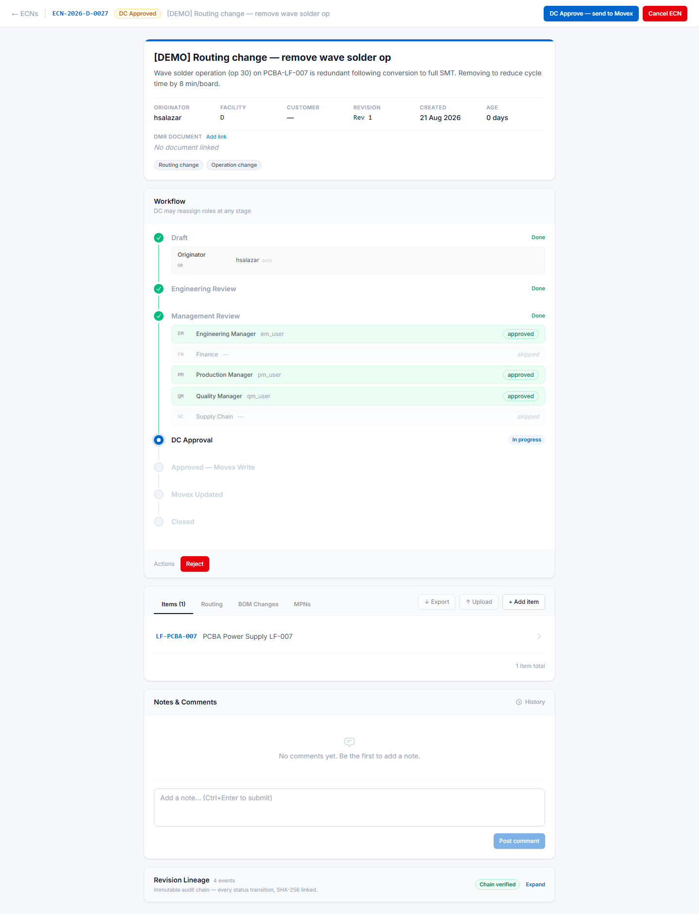
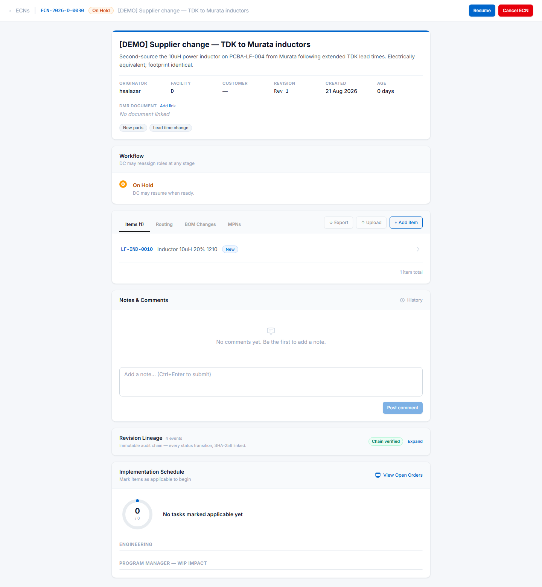

# The Document Controller

The Document Controller is the last human gate before a change reaches Movex, and the only role
that can close an ECN. It is also the only role with hold, resume and recovery powers.

If you are a DC, this chapter is yours — but read
[Approving an ECN](04-approving-an-ecn.md) first, because you are an approver too.

---

## Your two group memberships

A DC needs **both** `ecn-doc-controller` and `ecn-approver`. Oskar checks them independently, so
an account with only the DC group passes the document-control gate but is rejected on ordinary
approvals.

If you can DC-approve but not approve at Management Review, that is the cause. See
[Access and onboarding](12-access-and-onboarding.md).

---

## The DC gate

When everyone required has approved, the ECN reaches **DC Approved** and waits for you.

Your button reads **"DC Approve — send to Movex"**, and it is worth taking that label literally.
Clicking it authorises Oskar to write the change into the ERP. Everything before this point is
reversible; this is the point of no return.

### What to check before you click

- **The approvals are all in.** The Workflow panel shows `approved` or `skipped` against every
  role. Anything still `pending` means the ECN should not have reached you.
- **The content matches the description.** Open each tab that the change scope implies. A "routing
  change" ECN with an empty Routing tab is a mistake someone should catch, and you are the last
  person who can.
- **Customer approval, if required.** If the ECN is flagged as needing customer approval, Oskar
  **will not let you approve** until it is recorded. This is an ISO 13485 requirement and the
  system enforces it rather than trusting memory.
- **Drawing numbers**, if your process expects them. Oskar treats these as optional — it will not
  stop you.

You can also **Reject** from here, with a mandatory reason, exactly as any other reviewer can.

---

## What happens after you approve

Oskar queues the change and writes it into Movex — item master records, BOM lines, routing
operations, MPN aliases — in the correct order, retrying automatically if a write fails.

**When every write succeeds, the ECN advances to "Movex Updated" on its own.** You do not need to
do anything. If it has not advanced after a few minutes, something failed — see
[Recovering a failed write](#recovering-a-failed-write) below.

---

## Closing the ECN

**This is a deliberate action, and only you can take it.** An ECN at "Movex Updated" stays there
until a Document Controller clicks **Close ECN**.

Nothing closes automatically. If your open-ECN list is growing, ECNs sitting at "Movex Updated"
are the likely reason — the change is already live in Movex, and only the paperwork is open.

Before closing, check the **Implementation Schedule** panel if your site uses it. It carries the
post-implementation checklist — engineering tasks and Program Manager WIP impact — with a progress
ring showing how much is done.

Closing is final. A closed ECN is kept for audit and cannot be reopened.

---

## Putting an ECN on hold

Holds are for changes that are genuinely paused — waiting on a supplier report, a customer
decision, a test result — rather than ones that are merely slow.

Only a **DC or an Administrator** can hold or resume. Oskar requires two things and will not
proceed without them:

- **A reason** — visible to everyone, so the originator knows why their change stopped
- **An expected resume date** — so a hold does not quietly become abandonment

A held ECN keeps its place. **Resume** returns it to exactly the status it was in before, with all
approvals intact.

Use hold rather than rejection when the change itself is fine and the timing is not. Rejecting
sends it back to the originator and discards the review progress; holding preserves it.

---

## Recovering a failed write {#recovering-a-failed-write}

Sometimes a Movex write fails — the ERP is down, a field is rejected, a network drops. Oskar
retries automatically on a back-off schedule and alerts you if retries keep failing.

Go to **Admin → Movex Write Recovery**. You will see any writes that failed or were abandoned,
with the error Movex returned.

For each one you can **Retry**, which re-queues it. Retry once the underlying cause is fixed —
retrying against an ERP that is still down just burns another attempt.

**A stuck write is not a silent failure.** Oskar knows the write did not land and will not
advance the ECN. What it cannot do is fix the cause, which is why this screen exists.

If retries do not clear it, the change did not reach Movex and someone needs to look at why.
Escalate rather than closing the ECN — closing it would record a change that never happened.

---

## Reassigning roles

You can change who holds a role on a specific ECN — useful when someone is on leave, has left, or
when the originator legitimately holds the only approving role.

The Workflow panel notes *"DC may reassign roles at any stage"*. Reassignment applies to that ECN
only; it does not change anyone's standing role, which lives in
**Admin → ECN Role Assignments** (see [Admin](05a-admin.md)).

---

## The audit trail

Every ECN carries a **Revision Lineage** panel: every status change, who made it, when, and why,
linked cryptographically so the record cannot be altered after the fact. A **Chain verified**
badge means it is intact.

This is what you show an auditor who asks to see the history of a change. Click **Expand** for the
full sequence.

---

## Your daily summary

You get one email a day listing every open ECN for **your plant**: number, title, status,
originator, age, and who it is waiting on. Melbourne DCs see Melbourne ECNs; Johor Bahru DCs see
Johor Bahru ECNs.

This replaces the old nightly Stargile report. See [Notifications](08-notifications.md).

---

## Things only you can do

| Action | Who else can |
|---|---|
| DC-approve, sending the change to Movex | Nobody |
| Close an ECN | Nobody |
| Place on hold / resume | Administrators |
| Retry a failed Movex write | Administrators |
| Reassign a role on an ECN | Administrators |
| Cancel an ECN | The originator, and Administrators |
