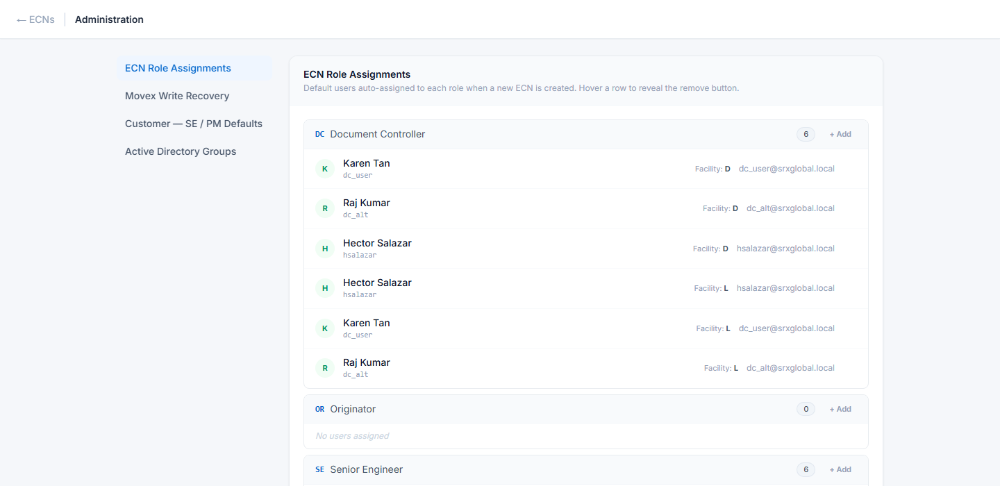

# Admin

For Document Controllers and Administrators. Nobody else needs this chapter — the Admin link does
not appear for other roles.

Reach it from **Admin** in the top navigation.

Four sections down the left:

| Section | What it is for |
|---|---|
| **ECN Role Assignments** | Who holds each role, per plant. The most-used screen here. |
| **Movex Write Recovery** | Retry writes to Movex that failed |
| **Customer — SE / PM Defaults** | Pre-set the Senior Engineer and Production Manager per customer |
| **Active Directory Groups** | Read-only view of who is in which access group |

---

## ECN Role Assignments

This is the **standing** roster: who is the Quality Manager for Melbourne, who are the Document
Controllers for Johor Bahru, and so on. When someone raises an ECN, Oskar fills the approval steps
from this list.

Roles are grouped, each showing its members with their plant and email. To add someone, click
**+ Add** on the role, enter their **AD username** (e.g. `jsmith`), optionally a display name, and
pick the facility.

### Two things to get right

**Facility is not optional in practice.** A user added to Quality Manager for Melbourne (`D`) will
never be assigned to a Johor Bahru ECN. If someone covers both plants, **add them twice** — once
per facility.

**Order matters.** The first person listed for a role at a facility is the **default assignee**.
Later entries are backups who can act but are not auto-assigned. If the wrong person is being
picked, it is because they are first in the list.

### Removing someone

Use **Remove this user from role**. This affects future ECNs only — it does not disturb ECNs
already in flight, and it does not erase their past approvals, which stay in the audit trail
permanently.

**Removing a leaver is not optional housekeeping.** If the only Document Controller for a plant
leaves and is not replaced here, every ECN at that plant stalls at the DC gate with nobody able to
act. Do this as part of offboarding.

### Assignment vs access

This screen decides *who is asked*. It does not decide *who can sign in* — that is Active Directory,
covered in [Access and onboarding](12-access-and-onboarding.md).

Both must be right. Someone on this list but not in the right AD group is assigned work they cannot
action, which looks like a broken ECN rather than an access problem.

---

## Movex Write Recovery

When the Document Controller approves, Oskar writes the change into Movex. If a write fails — the
ERP is down, a field is rejected, the network drops — Oskar retries automatically on a back-off
schedule, and surfaces persistent failures here.

Each entry shows the ECN, the transaction attempted, and the error Movex returned. **Retry now**
re-queues it.

**Fix the cause before retrying.** Retrying against an ERP that is still unreachable just consumes
another attempt. A `Communication link failure` or `CWBCO1004` means the AS/400 is not reachable —
that is an infrastructure problem, not an Oskar one, and retrying will not help until it is fixed.

The ECN stays at **Approved** until every write succeeds. That is deliberate: Oskar will not report
a change as implemented when it has not reached the ERP.

If retries keep failing after the cause is fixed, escalate rather than closing the ECN — closing it
would record a change that never happened.

---

## Customer — SE / PM Defaults

Some customers are always handled by the same Senior Engineer or Production Manager. This screen
pre-sets that, so an ECN raised against that customer is assigned to the right person without the
originator having to know.

Search by customer name or CUNO, then add candidates for **SE** or **PM**. Where several exist, one
is marked **Default**.

Only those two roles support customer defaults. Everything else comes from the standing roster
above.

This is a convenience, not a control. The Document Controller can still reassign on any individual
ECN.

---

## Active Directory Groups

A **read-only** view of the three application groups and their members, read live from AD.

You cannot change anything here — group membership is IT's, not yours. The value is diagnostic:
when someone says "I can't approve", this screen tells you whether they are in `ecn-approver` at
all, without waiting on IT.

The groups are `ecn-initiator`, `ecn-approver` and `ecn-doc-controller`. Remember that a Document
Controller needs **both** `ecn-doc-controller` and `ecn-approver` — a common and confusing
misconfiguration.

You may also see `mes-*` and `pur-*` groups. Those belong to other systems and have no effect in
Oskar.

If this screen shows an error rather than an empty list, the directory is unreachable — that is an
IT problem. An error is not the same as "nobody is in the group", and Oskar deliberately
distinguishes the two.

---

## A note on what admin cannot do

| Not possible here | Why |
|---|---|
| Change AD group membership | IT owns it |
| Edit an ECN's content | Even admins cannot — ask a reviewer to reject it back to the originator |
| Reopen a Closed or Cancelled ECN | Terminal states are final. Raise a new ECN. |
| Undo a Movex write | The change is in the ERP. Correct it with another ECN. |
| Alter the audit trail | It is tamper-evident by design |
