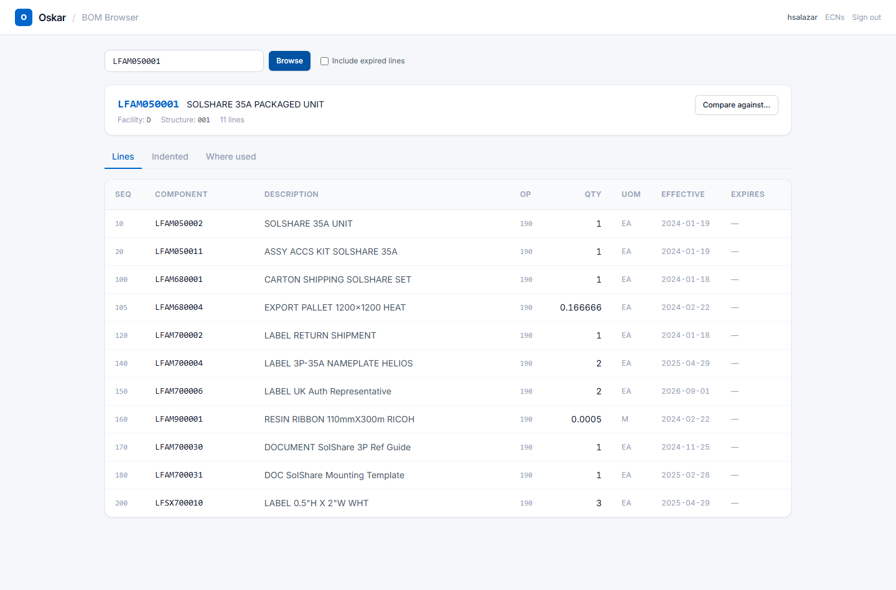
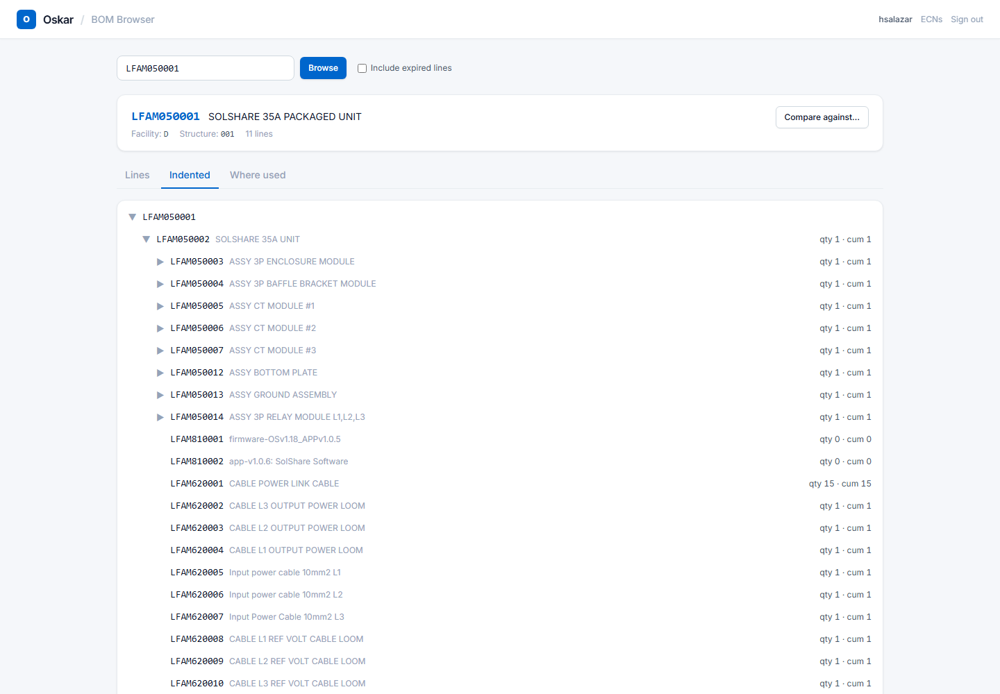
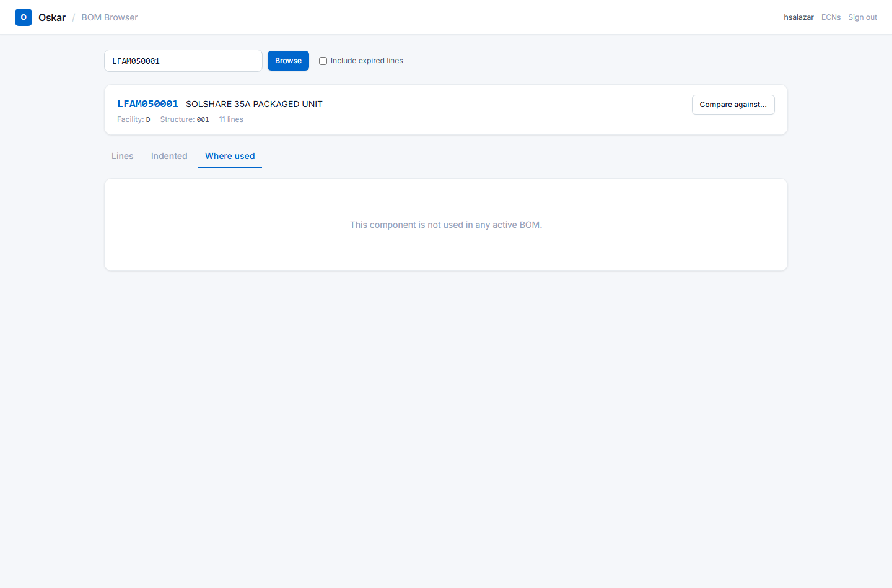
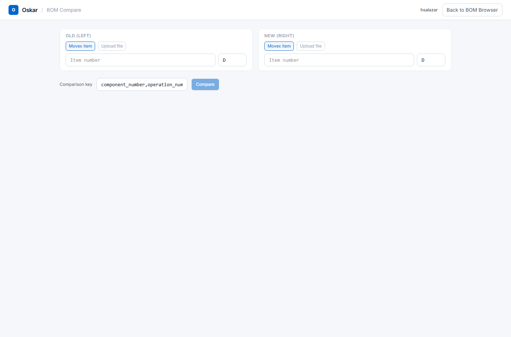
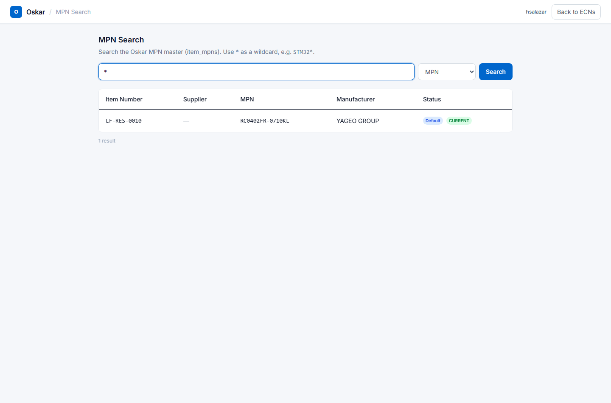

# BOM tools

Three tools sit outside the ECN workflow and can be used at any time, without raising anything:

- **BOM Browser** — look up any assembly's structure, live from Movex
- **BOM Compare** — put two BOMs side by side and see what differs
- **MPN Search** — find which items use a given manufacturer part number

You do not need an ECN open to use any of them. They are reference tools.

---

## BOM Browser

Reach it from **BOM** in the top navigation. Type an item number and click **Browse**.

The header confirms what you are looking at: item number, description, facility, structure type
and line count. Underneath are three tabs.

### Lines — the single-level view

The direct components of this assembly and nothing deeper.

| Column | Meaning |
|---|---|
| **Seq** | Sequence number — the line's position in the BOM |
| **Component** | The part number going in |
| **Description** | What it is |
| **Op** | The operation that consumes it |
| **Qty** | How many per assembly |
| **UOM** | Unit of measure |
| **Effective** | The date this line came into force |
| **Expires** | When it stops applying, or `—` if open-ended |

**Include expired lines** shows superseded lines as well as current ones. Leave it off for
day-to-day work; turn it on when you need to understand what a BOM looked like historically.

### Indented — the full explosion

Every level, not just the first.

Sub-assemblies with their own components carry a **triangle** you can expand. Two quantities are
shown per line:

- **qty** — how many per immediate parent
- **cum** — the cumulative quantity per *top-level* assembly

The distinction matters. A component with `qty 2` inside a sub-assembly used three times has
`cum 6` — that is the number you order.

### Where used — the reverse lookup

Which assemblies consume this part.

This is the question to ask **before changing or obsoleting a component**: if a part appears in
eleven assemblies, an ECN against one of them may not be the whole job.

A top-level assembly like the one above returns nothing, because it is not a component of
anything. That is a correct answer, not an error.

---

## BOM Compare

Reach it from **Compare against…** on the BOM Browser, or from **BOM → Compare** directly.

Two sides, **Old (left)** and **New (right)**. Each can be loaded from either of two sources:

- **Movex item** — a live BOM straight from the ERP. Enter the item number and facility.
- **Upload file** — a spreadsheet, typically a customer's BOM or one exported from CAD

That mix is the point. The common cases are:

| Compare | Against | Answers |
|---|---|---|
| Movex item | Movex item | How do two revisions or two similar assemblies differ? |
| Upload | Movex item | Does what the customer sent match what we actually build? |
| Upload | Upload | Did the customer's new BOM change from their last one? |

### The comparison key

The **Comparison key** decides how lines from the two sides are matched up. The default is
`component_number, operation_number` — two lines are "the same line" when both agree.

That default is right for comparing two Movex BOMs. When comparing against a customer's
spreadsheet, their part numbers may not be yours, so you may need to key on something both sides
share.

### Reading the result

Results come back as **Differences**, **Additions** and **Subtractions**, with a side-by-side
table: the old BOM on the left, the new on the right, and changes highlighted between them.

- **Additions** — lines on the new side only
- **Subtractions** — lines on the old side only
- **Differences** — lines on both sides where something changed (quantity, operation, unit)

You can export the result to `.xlsx` to send on or attach to an ECN.

---

## MPN Search

Reach it from **MPN** in the top navigation.

Search the MPN master by **MPN**, **item number** or **manufacturer** — pick which with the
dropdown beside the search box.

**`*` is the wildcard.** `STM32*` finds every MPN starting with STM32. A bare `*` returns
everything.

### Reading the results

| Column | Meaning |
|---|---|
| **Item Number** | The internal part this MPN belongs to |
| **Supplier** | The supplier, where recorded |
| **MPN** | The manufacturer's own part number |
| **Manufacturer** | Who makes it |
| **Status** | Badges — see below |

Two badges matter:

- **Default** — this is the MPN purchasing buys by default. One per item.
- **CURRENT** / **EOL** / **NRND** — lifecycle. `EOL` means the manufacturer has discontinued it;
  `NRND` means it is still available but should not be designed into anything new.

An `EOL` badge on a default MPN is worth acting on: it means the part you buy by default is going
away.

---

## When to use which

| Question | Tool |
|---|---|
| What goes into this assembly? | BOM Browser → Lines |
| What is the full parts breakdown, all levels? | BOM Browser → Indented |
| What else uses this component? | BOM Browser → Where used |
| Does the customer's BOM match ours? | BOM Compare, upload vs Movex |
| What changed between two revisions? | BOM Compare, Movex vs Movex |
| Who makes this part, and is it still current? | MPN Search |
| Which of our items use this manufacturer part? | MPN Search, by MPN |

---

## These tools are read-only

Nothing here changes anything. Browsing, comparing and searching leave no trace and cannot break
anything — use them freely.

To actually change a BOM you need an ECN. See [Raising an ECN](03-raising-an-ecn.md).
