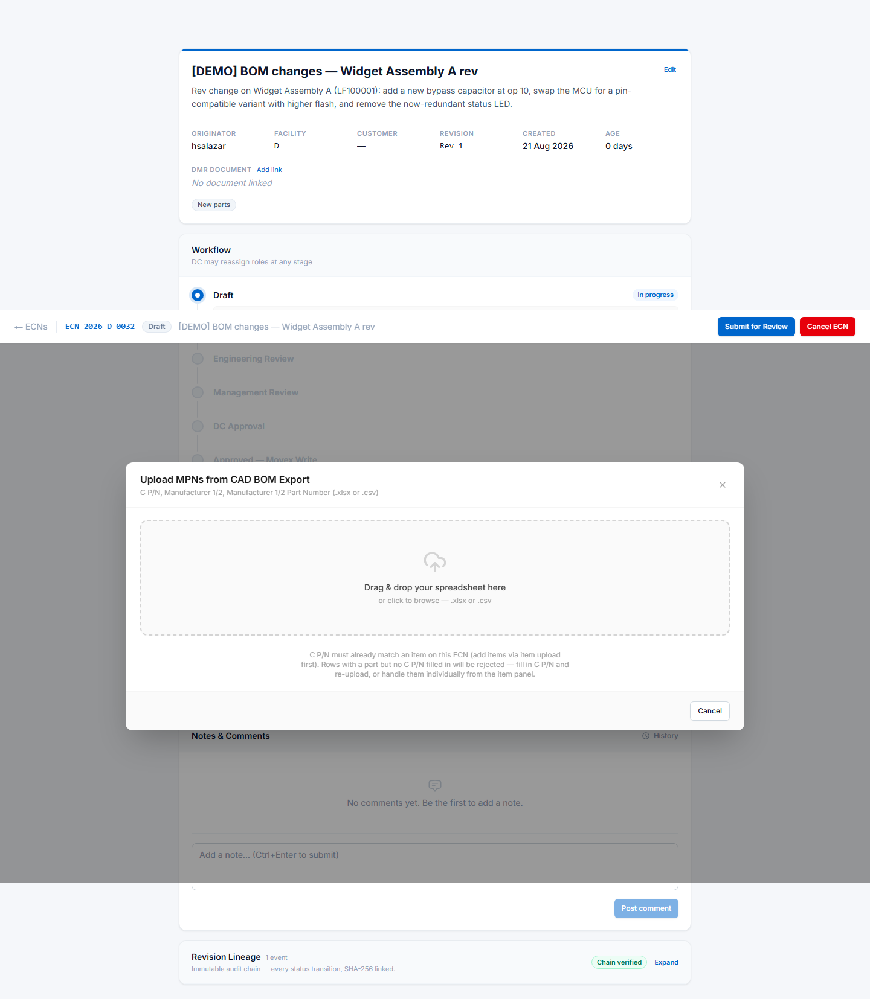

# Bulk uploads

Anything you can add to an ECN one row at a time, you can also upload as a spreadsheet. For an
ECN touching more than a handful of items this is much faster and far less error-prone than
typing.

There are four upload types, one per tab on the ECN detail screen: **Items**, **Routing**, **BOM
Changes** and **MPNs**. They all work the same way.

**Ready-made example files are in the [`templates/`](templates/) folder next to this manual.**
Open the one you need, replace the example rows with your own data, and keep the header row
exactly as it is.

| Upload | Example file |
|---|---|
| Items | [`item-upload-example.csv`](templates/item-upload-example.csv) |
| Routing | [`routing-upload-example.csv`](templates/routing-upload-example.csv) |
| BOM changes | [`bom-changes-upload-example.csv`](templates/bom-changes-upload-example.csv) |
| MPNs | [`mpn-upload-example.csv`](templates/mpn-upload-example.csv) |

---

## How an upload works

1. Open the relevant tab on your ECN and click **Upload ↑**.
2. Drag your file onto the drop zone, or click to browse.
3. Oskar parses the file **in your browser** and shows you a preview — every row it read, with
   any problems marked per row.
4. Fix anything flagged, or confirm.

Nothing is saved until you confirm. If the preview looks wrong, close the drawer and nothing has
changed.

### File requirements

| | |
|---|---|
| Formats | `.xlsx` or `.csv` |
| Maximum size | 1 MB |
| Header row | Must be the first row |
| Column order | Doesn't matter — columns are matched by name |
| Capitalisation | Doesn't matter — `Item No`, `ITEM NO` and `item no` all work |

Extra columns Oskar doesn't recognise are ignored, so you can upload a working spreadsheet with
your own notes in it without stripping them out first. The MPN example file demonstrates this —
it carries `Comment`, `Description` and `Designator` columns straight from a CAD export, and
Oskar simply skips them.

---

## ⚠️ Export is not a template

Every tab has an **Export ↓** button as well as **Upload ↑**. It is natural to assume you can
export, edit, and upload the file back. **You cannot.** The two formats are different, and the
upload will be rejected.

For items, export gives you `Item Description`, `Drawing No` and `Is New Item` — but **omits four
columns that upload requires**:

- `Item Status`
- `Order Type`
- `Lead Free Code`
- `Good Receiving Method`

For BOM changes, export writes `Operation No` where upload expects `Operation Number`.

**Use export for reviewing and sharing. Use the example files in [`templates/`](templates/) for
uploading.**

---

## Items

Adds or updates item master data. Start from
[`item-upload-example.csv`](templates/item-upload-example.csv).

**Required columns**

| Column | Max length |
|---|---|
| `Item No` | 15 |
| `Item Name` | 30 |
| `Item Status` | 2 |
| `Procurement Group` | 3 |
| `Product Group` | 5 |
| `Order Type` | 10 |
| `Lead Free Code` | 10 |
| `Good Receiving Method` | 10 |

**Optional columns**

| Column | Max length |
|---|---|
| `Is New Item` | — (yes/no) |
| `Item Description` | 60 |
| `Drawing No` | 20 |
| `Item Group` | 4 |
| `Unit of Measurement` | 3 |
| `Revision No` | — |
| `Supplier` | — |
| `Responsible` | — |
| `Customer Alias` | 30 |

> Over-length values are the most common upload error. `Item Name` in particular is only 30
> characters — that is Movex's limit, not Oskar's. The item editor shows a live character counter
> for this reason.

---

## Routing

Adds, changes or removes manufacturing operations. Start from
[`routing-upload-example.csv`](templates/routing-upload-example.csv).

**Required columns:** `Item No`, `Operation No`, `Operation Description`, `Work Centre`,
`Run Time`, `Change Type`

**Optional:** `Setup Time`

| Column | Max length | Notes |
|---|---|---|
| `Item No` | 15 | Must already be on the ECN — see below |
| `Operation Description` | 30 | |
| `Work Centre` | 8 | `Work Center` is also accepted |
| `Change Type` | — | `ADD`, `UPDATE` or `DELETE` |

**Two things to know:**

- **Routing upload does not create items.** Every `Item No` must already exist on the ECN. Upload
  your items first, then your routing.
- **The ECN must be in Draft.** Once submitted, routing is locked.

The example file shows a realistic sequence — Kitting, Labelling, Prepping, SMT, X-Ray, ICT,
Functional Test, QC, Packing — across two items in one upload. Note that operation numbers are
spaced in tens, leaving room to insert steps later without renumbering.

---

## BOM changes

Adds, changes or removes components within an assembly. Start from
[`bom-changes-upload-example.csv`](templates/bom-changes-upload-example.csv).

**Required columns:** `Item No`, `Component Number`, `Change Type`

| Column | Max length | Notes |
|---|---|---|
| `Item No` | 15 | The parent assembly. Does **not** have to be an item on the ECN — see below |
| `Component Number` | 15 | The part going into it |
| `Change Type` | — | `ADD`, `CHANGE` or `DELETE` |

**Optional:** `Quantity`, `Unit of Measure` (max 3), `Operation Number`, `Sequence Number`,
`From Date`, `Old From Date`, `Old Quantity`, `Circuit Reference`, `Notes`

> **`CHANGE`, not `UPDATE`.** Routing uses `UPDATE`; BOM changes use `CHANGE`. The two uploads
> genuinely differ here, and using the wrong word fails validation.

**The parent does not need to be on the ECN.** Unlike the routing and MPN uploads, a BOM-change
row whose `Item No` is not an item on this ECN is accepted — the row stands on its own and is
labelled **BOM only**. This means a BOM-change upload can be the *only* thing on an ECN. The
parent must exist in Movex, which Oskar checks on upload.

**`CHANGE` and `DELETE` need `Old From Date`.** Oskar has to know which existing BOM line you
mean, and the same component can appear more than once with different effective dates. Without it
the row is rejected. The example file shows all three change types together, including a `CHANGE`
row carrying both the old and the new quantity.

---

## MPNs

Adds manufacturer part numbers to items. Start from
[`mpn-upload-example.csv`](templates/mpn-upload-example.csv).

This upload takes the **CAD BOM export format** directly — the file your CAD tool already
produces. You do not need to reshape it.

**Required columns:** `C P/N`, `Manufacturer 1`, `Manufacturer 1 Part Number`

**Optional:** `Manufacturer 2`, `Manufacturer 2 Part Number`

| Column | Max length | Meaning |
|---|---|---|
| `C P/N` | 15 | The item number |
| `Manufacturer 1` | 60 | Primary manufacturer |
| `Manufacturer 1 Part Number` | 30 | Becomes the **default** MPN |
| `Manufacturer 2` | 60 | Alternate manufacturer |
| `Manufacturer 2 Part Number` | 30 | Becomes an alternate MPN |

**One row can become two MPN records.** A line with both manufacturers filled in creates the
primary (marked default for purchasing) and the alternate. A line with only Manufacturer 1
creates one. The example file has one of each: an op-amp with a single source, and a resistor
with a Yageo primary and a Vishay alternate.

---

## When an upload is rejected

The preview marks problems per row, so you can usually see immediately what to fix.

| Message | What it means |
|---|---|
| Missing required column | A required header is absent or misspelled. Compare against the example file. |
| Could not parse the file | Not a valid `.xlsx` or `.csv` — often a `.xls` saved with the wrong extension. |
| File exceeds the 1 MB limit | Split it, or save as `.csv`, which is much smaller than `.xlsx`. |
| Unsupported content type | Upload `.xlsx` or `.csv`. Google Sheets and OpenDocument files need exporting first. |
| Duplicate row | The same key appears twice in your file. Oskar checks within the file as well as against the ECN. |
| Value too long | Over the max length for that column — see the tables above. |

If a row is rejected and you can't see why, the row number in the preview matches the row number
in your spreadsheet, counting the header as row 1.

Still stuck? See [When things go wrong](10-troubleshooting.md).
