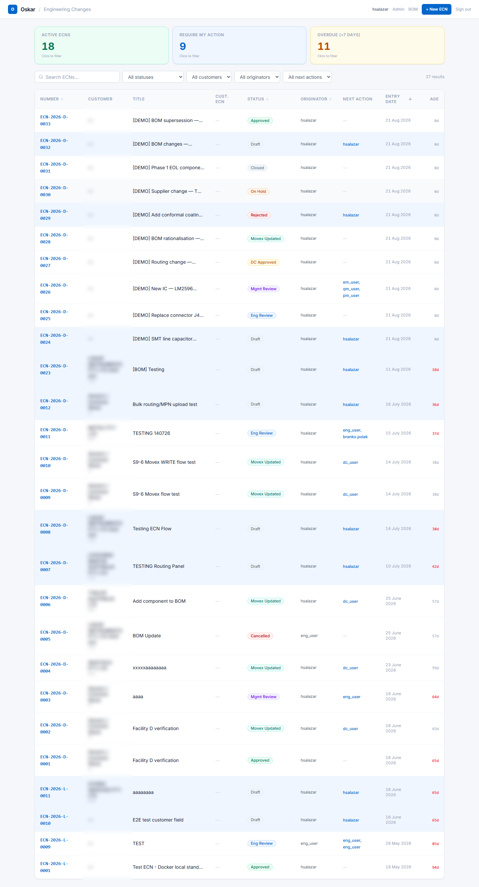

# Finding ECNs

The ECN list is more capable than it first looks. Learning it properly is the difference between
"where is that change?" taking ten seconds or ten minutes.

*(Customer names are blurred in this manual, not on the real screen.)*

---

## Start with the cards

The three cards are **toggles**, not just counters. Click one to filter; click again to clear.

| Card | Shows |
|---|---|
| **Active ECNs** | Everything not Closed or Cancelled |
| **Require my action** | ECNs waiting on **you** specifically |
| **Overdue (>7 days)** | Open more than seven days, whoever they are waiting on |

**Require my action** is the one to use daily. It answers "what do I need to do?" without opening
anything.

**Overdue** counts from when the ECN was *raised*, not from when it arrived with the current
person. An ECN eight days old that reached you yesterday still counts as overdue — it measures the
change's total age, which is usually what matters to a customer waiting on it.

Terminal ECNs are never counted as overdue, however old.

---

## Then narrow it down

Four dropdowns and a search box sit above the table. **They all combine**, so you can be quite
specific in a couple of clicks.

| Control | Filters on |
|---|---|
| **Search ECNs…** | ECN number and title |
| **All statuses** | A single workflow status |
| **All customers** | One customer |
| **All originators** | Who raised it |
| **All next actions** | Who it is waiting on |

Useful combinations:

- **All next actions = your name** — same as the *Require my action* card, but you can add a status
  on top, e.g. only the ones sitting at Management Review.
- **Status = Approved** — ECNs mid-Movex-write. If any are more than a few minutes old, a write has
  probably failed. See [When things go wrong](10-troubleshooting.md).
- **Status = Movex Updated** — changes already live in the ERP but not yet closed. For a Document
  Controller this is the "paperwork to finish" list.
- **Originator = someone on leave** — what to pick up while they are away.

The result count sits to the right of the filters, so you can see at a glance how much you have
narrowed things.

---

## Sorting

Click any column header carrying an arrow. **Entry date** and **Age** are the useful ones — oldest
first shows what has been waiting longest.

---

## Reading the table

| Column | What it tells you |
|---|---|
| **Number** | `ECN-2026-D-0026` — the `D` is Melbourne, `L` is Johor Bahru |
| **Customer** | Who the change is for, if customer-driven |
| **Title** | What the change is |
| **Cust. ECN** | The customer's own reference |
| **Status** | Where it is in the workflow |
| **Originator** | Who raised it |
| **Next action** | **Who it is waiting on.** Blank means nobody — finished or paused. |
| **Entry date / Age** | When raised, and how long open. Over a week turns red. |

**Next action is the most useful column on the screen.** It is computed from the ECN's live state,
not typed by anyone, so it cannot be stale. If it is blank on an open ECN, the ECN is either On
Hold or waiting on the system rather than a person.

---

## Finding a change after it is finished

Closed ECNs are kept permanently and remain searchable — just clear the **Active** filter, or set
**Status = Closed**.

This is how you answer *"when did we change this, and who approved it?"*, which is exactly what an
auditor asks.

Open the ECN and look at **Revision Lineage** at the bottom: every status change, who made it,
when, and why. Click **Expand** for the full sequence. The **Chain verified** badge means the
record has not been altered since it was written.

For a specific part rather than a specific ECN, the **BOM Browser** and **MPN Search** are usually
the faster route — see [BOM tools](06-bom-tools.md).

---

## Exporting

Each ECN's tabs have **Export ↓** buttons for its items, routing, BOM changes and MPNs — useful for
sharing a change with someone who does not use Oskar.

Two limits worth knowing:

- **Export format is not upload format.** You cannot export, edit and re-upload. See
  [Bulk uploads](07-bulk-uploads.md).
- **BOM change export is only available once the ECN reaches Movex Updated.** Before that the
  change is not final, and Oskar will not produce a document implying it is.
