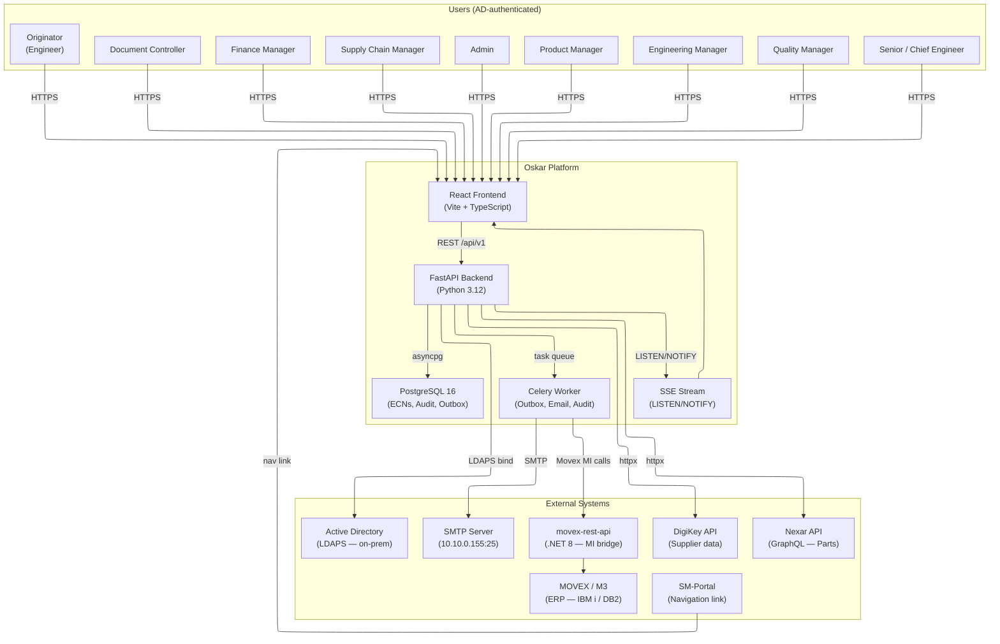
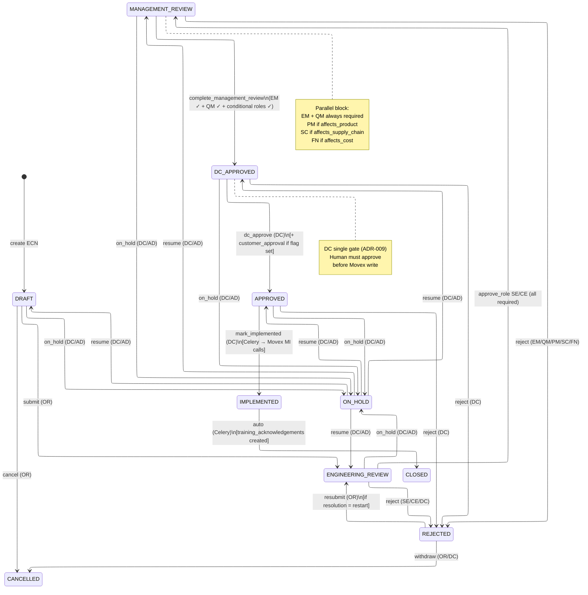
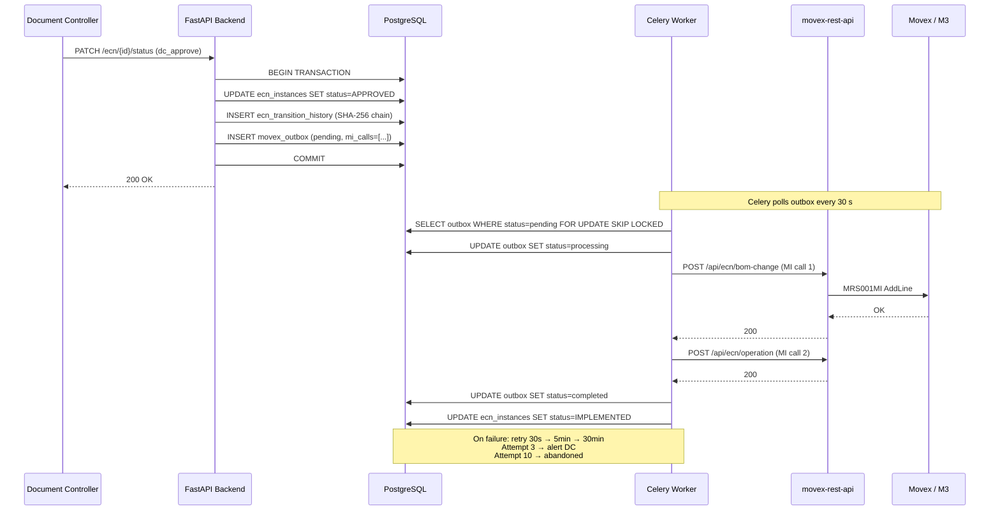
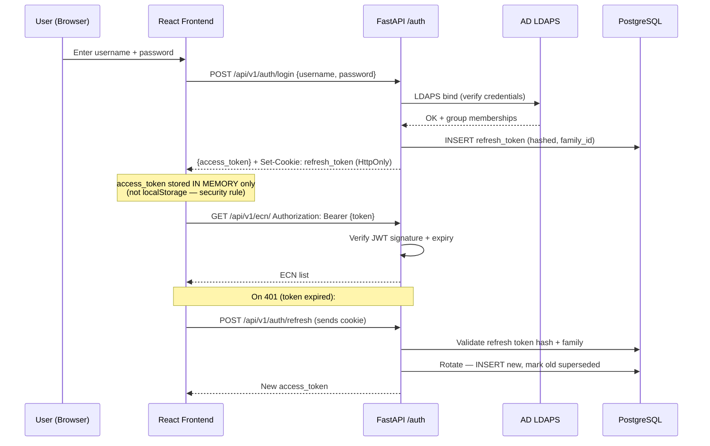
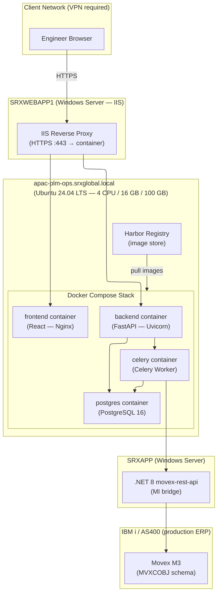
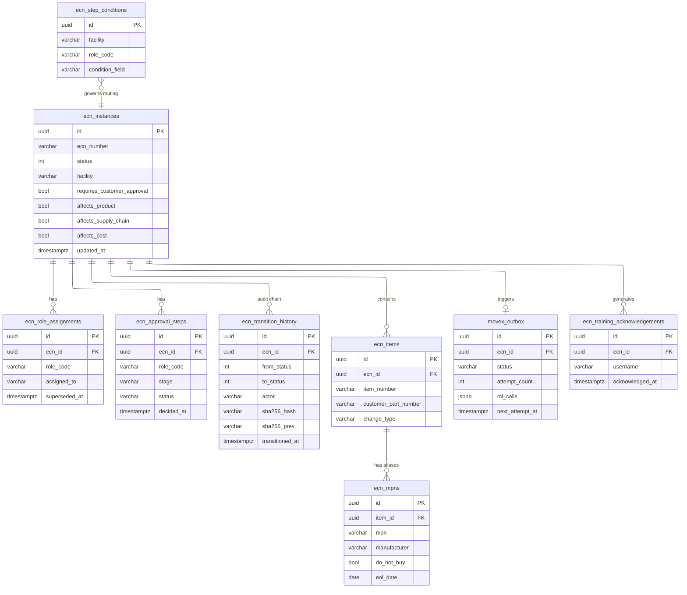

# Oskar — Workshop Architecture Diagrams

All diagrams use the workspace standard Mermaid config block.

---

## 1. System Context

> Who uses Oskar, what does it touch, and what sits outside it?

---

## 2. ECN Workflow State Machine

> Every possible status and the transitions between them. Arrows are labelled with the trigger action.

---

## 3. Transactional Outbox — Event Flow

> How an approval becomes a Movex write without losing data if anything crashes.

---

## 4. Authentication Flow

> How a user goes from browser login to an authorized API call.

---

## 5. Deployment Architecture

> How the stack is deployed on the Scanfil APAC infrastructure.

---

## 6. Data Model — Entity Relationships

> Key tables and how they relate. Focus on the ECN lifecycle.

